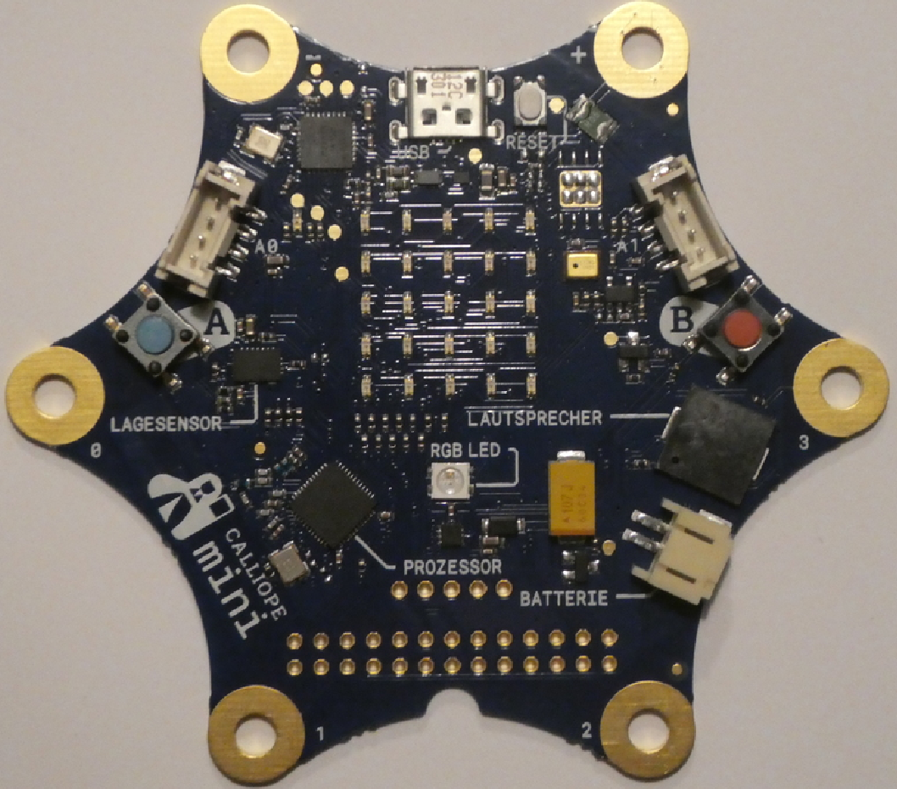
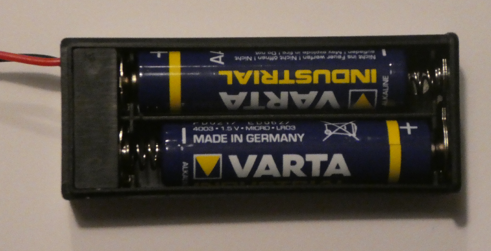

# Auspacken des Calliope und Erkunden

## Auspacken des Calliope

Das Paket enthaelt

* Den Calliope Mini selbst
* Ein Micro-USB-Kabel
* Ein Batterie-Fach
* 2 Batterien
* 2 Krokodil-Klemmen
* 2 LEDs
* Eine Anleitung

## Der Calliope Mini selbst

* Der Calliope, ausgepackt

## Calliope Mini : Was ist dran

* Der Calliope Mini, ausgepackt

## Batteriefach 

* Batterie einlegen 

* und Batteriefach zumachen
* Schalter ausschalten 

## Batterie anschliessen

* Das Kabel der Batterie anschliessen

## Anschluss - Nut

* Auf die Anschluss-Nut achten.

## Kabel-Nase in Anschluss - Nut

* Auf die Anschluss-Nut achten, die Nase des Kabels muss nach oben zeigen.

## Einschalten und Spielen

* Den Calliope mit dem Schalter am Batteriefach einschalten
* Etwas warten
* Vier verschiedene Spiele stehen zur Auswahl

    * Taste B : Spiel-Nr erhoehen
    * Taste A : Spiel-Nr verringern 
    * Calliope schuetteln : Spiel auswählen
    * Im Spiel : Beide Tasten drücken => Zurueck zum Menu

* Spiele-Auswahl
  
    * Mini-Orakel
    * Schere Stein Papier
    * Funkt‘s
    * Snake

* Beschreibung im Beilag-Heftchen

