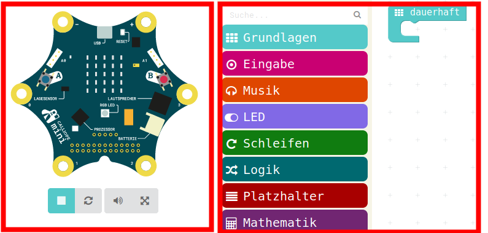
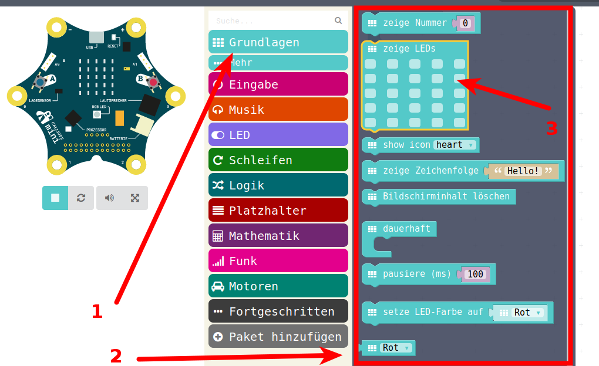
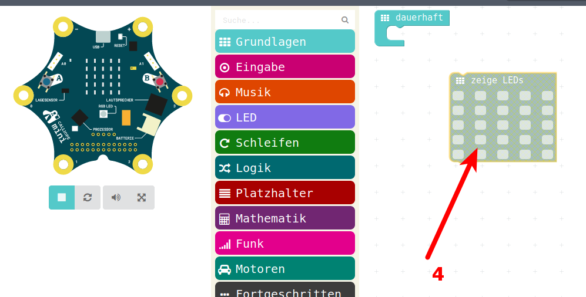
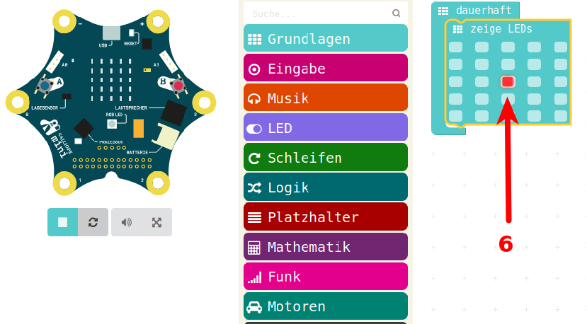
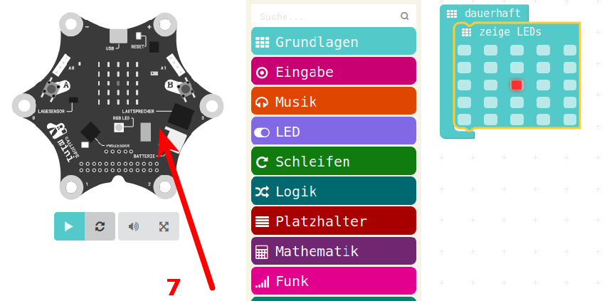
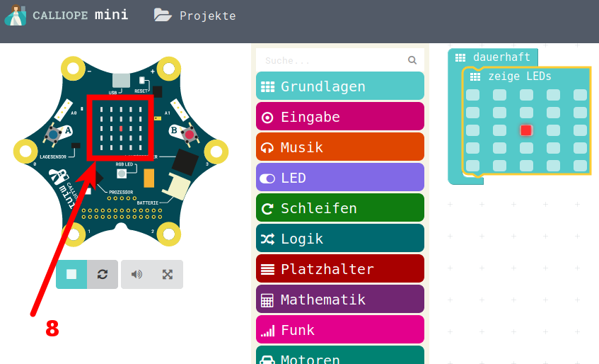

# Start Simulator und Bearbeiten

## Starten des Editors im Web-Browser 

Aufruf von <http://pxt.calliope.cc>

## Der Arbeits-Bereich 

Links Simulator-Bereich  
Simuliert den Calliope

Rechts der Arbeits-Bereich zum Bearbeiten/Programmieren

## Bearbeiten von Programmen

* Ein Klick auf Grundlagen
* Oeffnet ein Menu mit grundlegenden Befehlen
* Hier klickt man z.B. mit der Maus auf "zeige LEDs" und schiebt das ICON in den Arbeitsbereich, 
* Dazu mit der linken Maustaste auf das ICON gehen, die Maustaste NICHT loslassen und dann das ICON nach rechts in den Arbeitsbereich schieben 
 
# Arbeiten im Arbeitsbereich

* Im Arbeitsbereich landet das Icon "zeige LEDs"

# Einhaengen der Symbole in die Arbeits-Schleife

* Dieses kann man nun in die vorhandene Schleife "dauerhaft" einklicken
* Auch dazu das ICON mit der linken Maustaste anklicken und die Maustaste gedrueckt halten 
* Mit gedrueckter Maustaste in die Schleife schieben

# Bearbeiten des Programm-Stuecks

* Nun kann man einzelne Leds im Arbeitsbereich an und ausschalten
* Einfach mit der linken Maustaste die LED anklicken zum Ein und
* nocheinmal Anklicken um die LED wieder auszuschalten 

# Uebersetzen in Computer-Sprache  

* Im Hintergrund wird das Programm neu "uebersetzt" und in den Simulator geladen
* Der Simulator ist grau, kann nicht genutzt werden

# Das Programm laeuft im Simulator

* Das Programm ist in Calliope-Computer-Sprache uebersetzt und in den Simulator geladen

