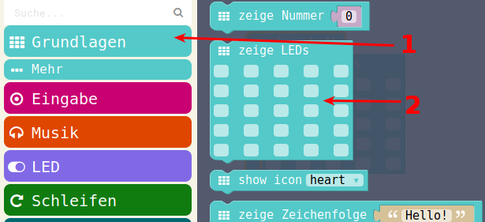

# LED anzeigen

## Auswahl aus Menu



## PXT-Code


## JavaScript-Code

<details>
 <summary>Java-Script-Code</summary>

```js
basic.forever(() => {
    basic.showLeds(`
        . # . # .
        . . . . .
        # . . . #
        . # # # .
        . . . . .
        `)
})
```
</details>

## Download Hex-Code


## Erweiterung mit Warten


Einheit: 

* ms ist MilliSekunden, das ist eine tausendstel Sekunde
* 1000 Millisekunden sind 1 Sekunde
* Wenn man mehrere verschiedene LED-Anzeigen haben will, ca 1 Sekunde = 1000 ms dazwischen


## PXT-Code


## JavaScript-Code

<details>
 <summary>Java-Script-Code</summary>

```js
basic.forever(() => {
    basic.showLeds(`
        . # . # .
        . . . . .
        # . . . #
        . # # # .
        . . . . .
        `)
    basic.pause(1000)
    basic.showLeds(`
        . # . # .
        . . . . .
        . . . . .
        . # # # .
        # . . . #
        `)
    basic.pause(1000)
})

```
</details>

## Download Hex-Code


