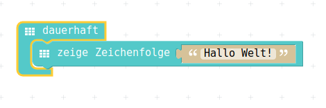

# Texte anzeigen

In der Computer-Sprache nennt man Texte auch "Zeichenketten", eine 'Verkettung' von einzelnen Zeichen.  
Man trifft auch sehr oft auf die englische Bezeichnung "String".  

Darum, wenn man einen Text anzeigen will : => Zeichenketten !

## Auswahl aus Menu


## PXT-Code

In der Computer-Welt, wenn man eine neue Programmier-Sprache lernt, ist üblicherweise das erste Programm ein "Hallo Welt."
Diese Programm gibt genau diese Zeichenfolge auf dem Bildschirm aus.  
Unser "Bildschirm" ist die LED-Anzeige.
Wenn der Text nicht auf den Bildschirm (die LED-Anzeige) passt, dann wird ein Lauftext erstellt.  



## JavaScript-Code

<details>
 <summary>Java-Script-Code</summary>

```js
basic.forever(() => {
    basic.showString("Hallo Welt!")
})
```
</details>

## Download Hex-Code


