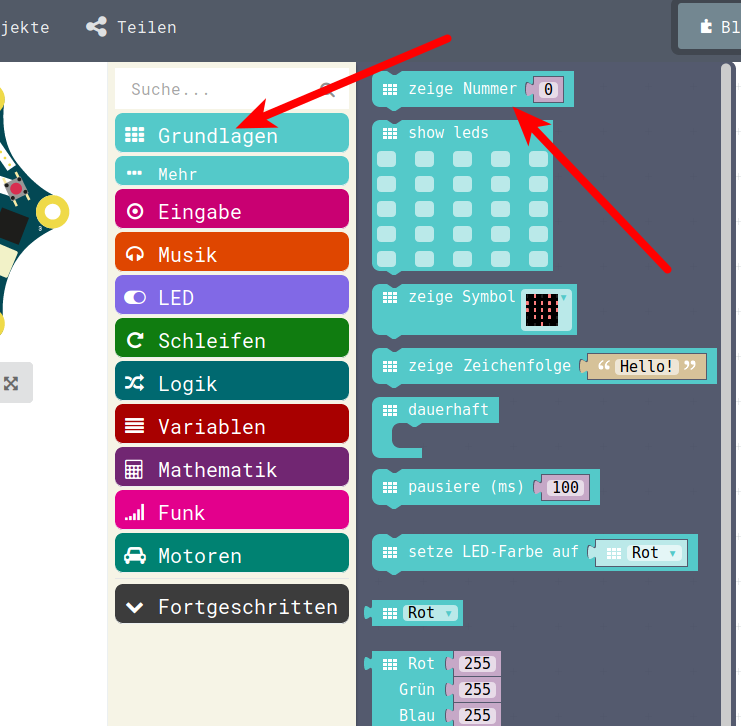
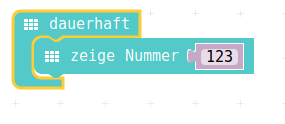
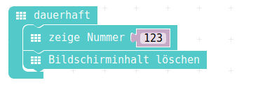

# Zahlen/Nummern anzeigen

In der Computer-Sprache unterscheidet man die Zeichenketten/Strings vom vorherigen Kapitel zu den Nummern/Zahlen.
Zeichenketten kann man anzeigen (und auch noch anders verändern) aber Nummern/Zahlen eignen sich zum Rechnen. 
Darum wird unterschieden zwischen Texten und Nummern. 

Wenn man Nummern, mit denen man später rechnen will, anzeigen will : => Nummern 


## Auswahl aus Menu



## PXT-Code

Im ersten Schritt wollen wir nur eine einzelne Nummer anzeigen. 
In weiteren Schritten zeigen wir dann Zahlen an, die nicht am Stück auf das Display passen und schauen uns an, wie das angezeigt wird.

- Kleiner Tipp : Mit einem gelöschten Bildschirm (zeige LEDs ) und evt noch einen Pause ( pausiere ms ) lässt sich das dann besser identifizieren, was angezeigt wird.








## JavaScript-Code

<details>
 <summary>Java-Script-Code</summary>

```js
basic.forever(() => {
    basic.showNumber(123)
    basic.clearScreen()
    basic.pause(1000)
})
```
</details>

## Download Hex-Code


