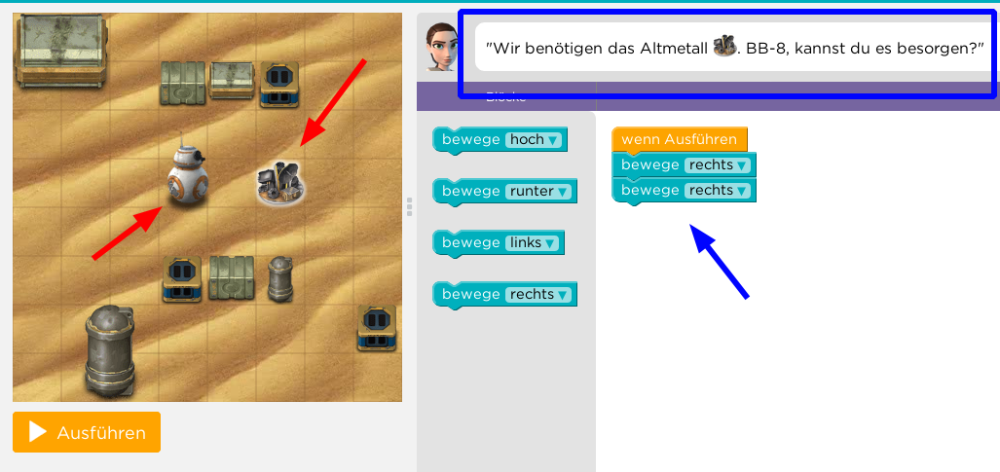

# Programmieren / Calliope 

## Was ist Programmieren?

* Wer hat schonmal selbst programmiert ?
* Welche Programmiersprachen ?
* Wer hat schonmal ein EXCEL-Macro/Funktion erstellt

* Ist ein ferngesteuertes Auto fahren Programmieren ?

## Was passiert beim Programm ausführen? 

* Was macht der Mensch ?
* Was macht der Computer, der das Programm ausführt?

* Vergleich : 

   * Computer führt Programm aus
   * Mensch benutzt ein Rezept um zu backen

## Vergleich Programm <=> Backen mit Rezept

|                          | __REZEPT__             | __PROGRAMM__                                    |
| ------------------------ | ---------------------- | ----------------------------------------------- |
| Programmierer            | Rezept-Autor           | Programmierer                                   |
| Ausführender             | Koch / Köchin          | Computer                                        |
| Detailgrad der Anweisung | Wissen des Kochs       | "Höhe" der Programmiersprache                   |
| Reaktion auf Ereignisse  | Selbständig durch Koch | Muss durch Programmierer vorher überlegt werden |
| Fehlerbehandlung         | Selbständig durch Koch | Muss durch Programmierer vorgesehen werden      |

## Erste Schritte

## Kurze Demo Simples Programm

* Guter Start für Programmier-Anfänger
* Schon ab ca 6 Jahren möglich

[Hour of Code: Starwars](https://studio.code.org/s/starwarsblocks/stage/1/puzzle/1)

## Abstraktions-Level 

- Ein Computer kann am Ende nur 0 und 1 unterscheiden
- Das was wir programmieren muss noch weiter ausdetailliert werde
- Vergleiche eine Koch-Anweisung für eine Koch und für ein Kind
  (der Computer ist das "Kind", versteht nur ja und nein...)
- Das Aus-Detaillieren passiert bei uns im Hintergrund 
  (und wird "übersetzen", "interpretieren","compilieren" genannt)

## Zusammenfassung

* Programmieren ist ein Anleitung schreiben
* Die Anleitungs-Sprache ist die Programmiersprache
* Die Sprache die wir sprechen ist "höher" als das was der Computer versteht
* Darum muss übersetzt werden
* Die Ausführung macht der Computer/Microcontroller

## Calliope Mini : Warum ?

{ height=80% }

* Mehr Details kommen noch am zweiten Tag
* Der Calliope Mini, ausgepackt

## Batteriefach 

* Batterie einlegen 

{ height=30% }

* und Batteriefach zumachen

{ height=30% }

## Batterie anschliessen

{ height=50% }

* Das Kabel der Batterie anschliessen

## Anschluss - Nut

{ height=50% }

* Auf die Anschluss-Nut achten.

## Kabel-Nase 

{ height=50% }

* Auf die Anschluss-Nut achten, die Nase des Kabels muss nach oben zeigen.

## Einschalten und Spielen

* Den Calliope mit dem Schalter am Batteriefach einschalten
* Etwas warten
* Vier verschiedene Spiele stehen zur Auswahl

    * Taste B : Spiel-Nr erhoehen
    * Taste A : Spiel-Nr verringern 
    * Calliope schuetteln : Spiel auswählen
    * Im Spiel : Beide Tasten drücken => Zurueck zum Menu

* Spiele-Auswahl
  
    1 Mini-Orakel
    2 Schere Stein Papier
    3 Funkt‘s
    4 Snake

* Beschreibung im Beilag-Heftchen

## Das Start-Programm 

Wenn Ihr im Verlauf des Programmier-Kurses das ursprüngliche Programm mit Euerem eigenen überschrieben habt (was ich hoffe), dann gibt es hier das ursprüngliche eingebaute Programm zum Download: [Original-Start-Programm](code/calliope-demo-combined.hex)

### Herunterladen von HEX-Files aus dieser Plattform

Die Seite auf der Ihr Euch gerade befindet, ist eigentlich zum Austausch und Weiterentwicklen von Programmen gemacht, nicht als Plattform für Lern-Inhalte.   
Darum ist der Download der HEX-Files etwas komplizierter als gewöhnlich...
Wenn Ihr auf einen der Links auf ein HEX-File klickt, sieht das so aus:

 

Dort muss man nun auf den RAW-Button klicken um anschliessend dann folgende Ansicht zu bekommen, von der aus man das HEX-File mit einem Klick der rechten Maustaste herunterladen kann, mittels "Seite speichern"

 

Dazu speichert man die Seite am Besten z.B. als __ORIGINAL_START.HEX__ oder ähnlich.

Was man dann mit dem heruntergeladenen HEX-File anfangen kann, sehen wir in Teil 4 des heutigen Kurs-Tages.

### Der Source-Code

Wer Interesse daran hat, kann sich das auch selbst generieren, dazu sind aber andere Programmierwerkzeuge notwendig, wie die die wir im Kurs verwenden:
<https://github.com/calliope-mini/calliope-demo.git>

## Navigation

* [Hoch zur Übersicht](../index.html)  
* [Weiter ](../01_02_Start_Simulator/index.html)

## Lizenz/Copyright-Info
Für alle Bilder auf dieser Seite gilt:

*  Autor: Jörg Künstner
* Lizenz: CC BY-SA 4.0
