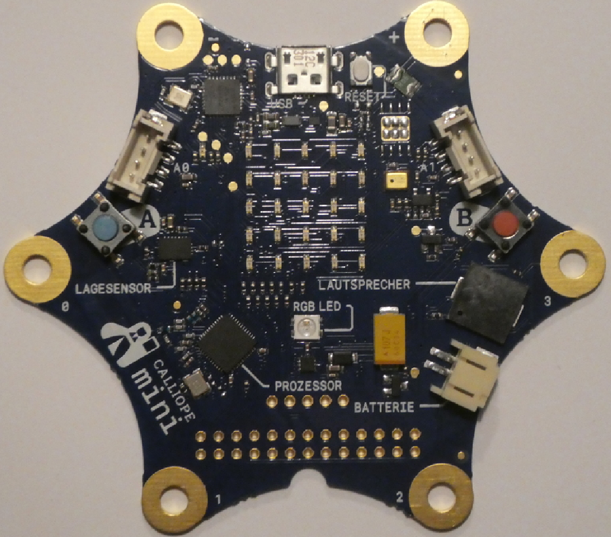
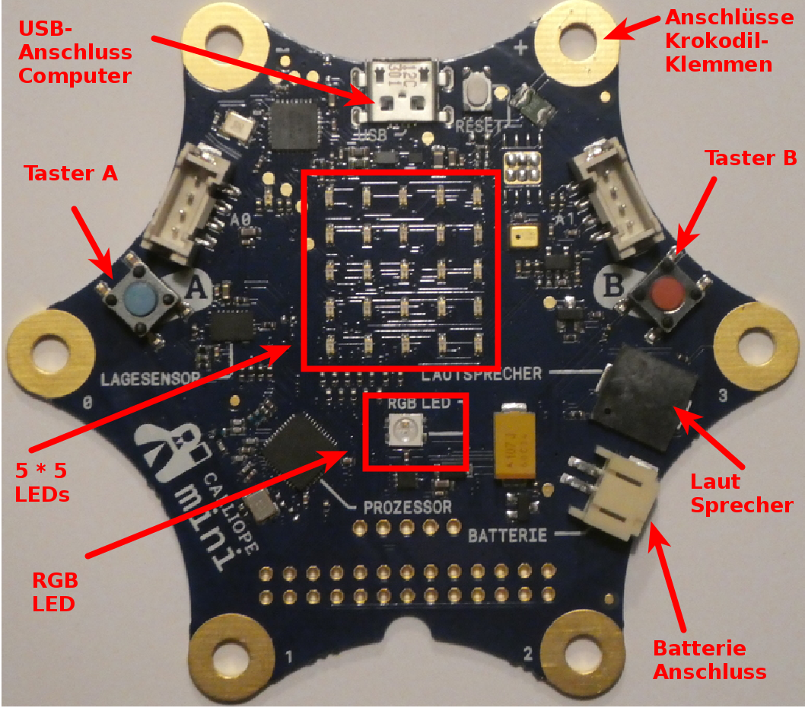
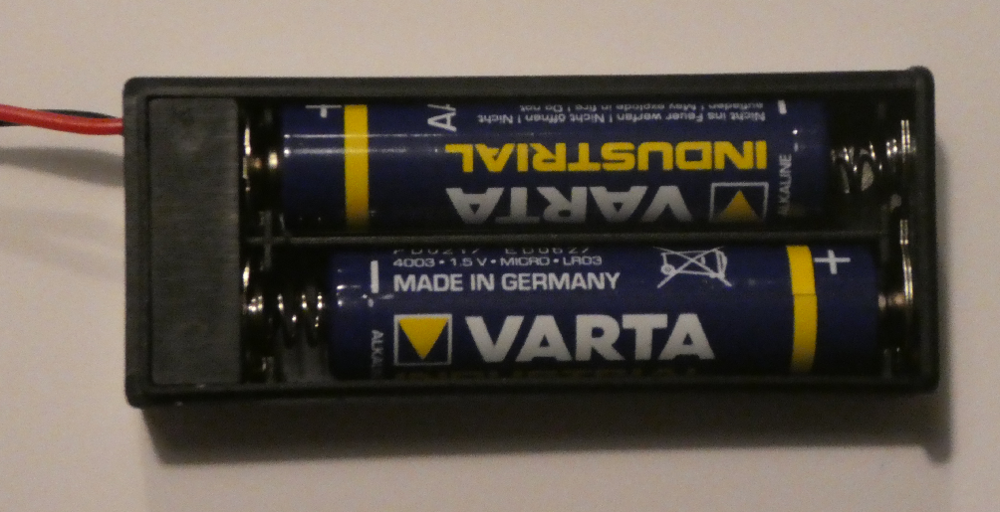
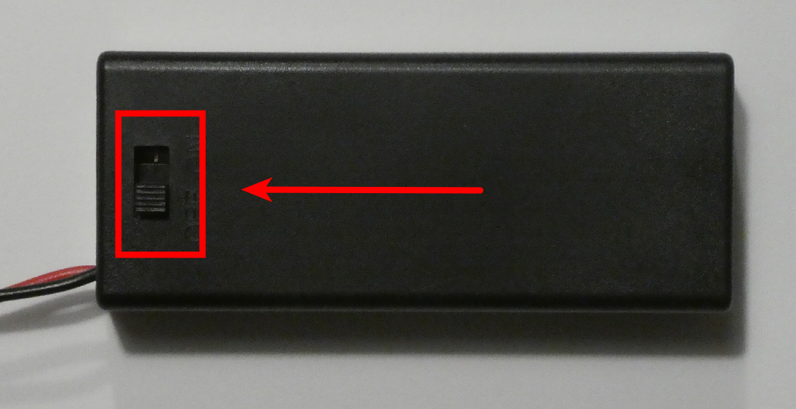
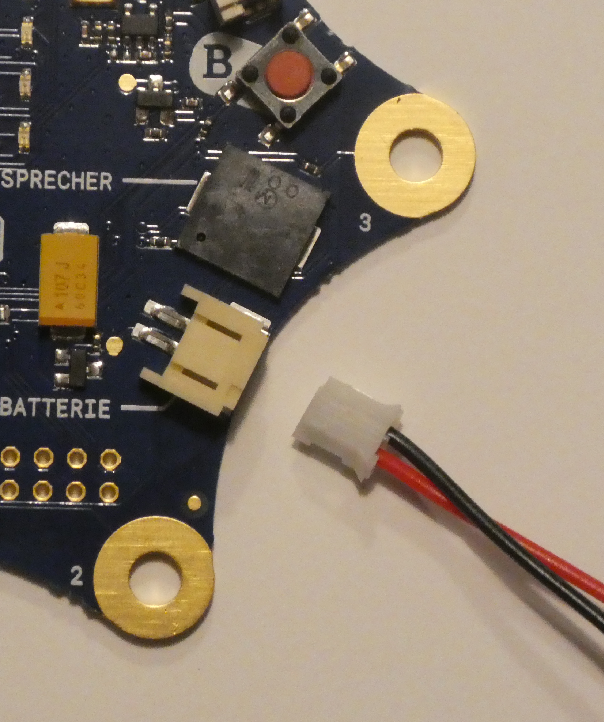
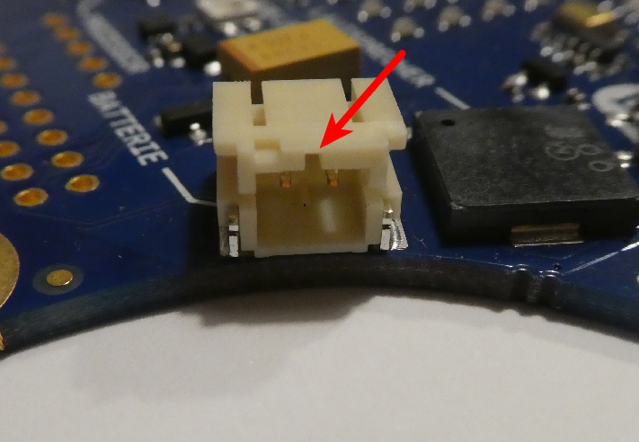
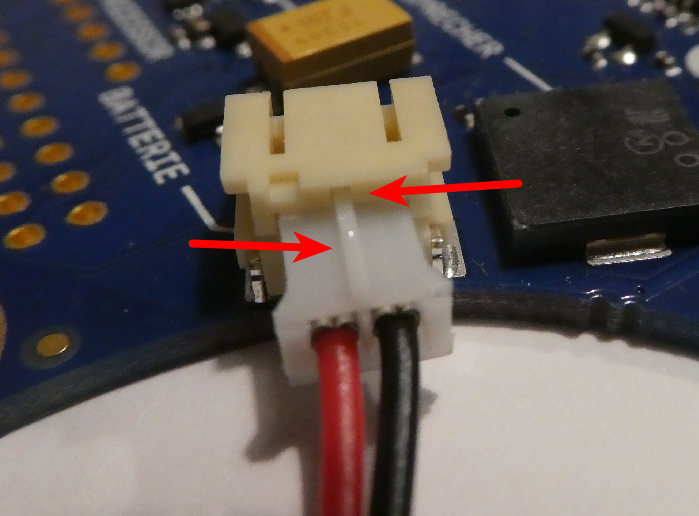

# Auspacken des Calliope und Erkunden

## Auspacken des Calliope

Das Paket enthaelt

* Den Calliope Mini selbst
* Ein Micro-USB-Kabel
* Ein Batterie-Fach
* 2 Batterien
* Eine Anleitung

## Der Calliope Mini selbst

{ height=80% }

* Der Calliope-Mini, ausgepackt

## Calliope Mini : Was ist dran

{ height=80% }

* Der Calliope Mini, ausgepackt

## Batteriefach 

* Batterie einlegen 

{ height=30% }

* und Batteriefach zumachen

{ height=30% }

## Batterie anschliessen

{ height=50% }

* Das Kabel der Batterie anschliessen

## Anschluss - Nut

{ height=50% }

* Auf die Anschluss-Nut achten.

## Kabel-Nase 

{ height=50% }

* Auf die Anschluss-Nut achten, die Nase des Kabels muss nach oben zeigen.

## Einschalten und Spielen

* Calliope mit Schalter am Batteriefach einschalten und etwas warten
* Vier verschiedene Spiele stehen zur Auswahl

    * Taste B : Spiel-Nr erhoehen
    * Taste A : Spiel-Nr verringern 
    * Calliope schütteln : Spiel auswählen
    * Im Spiel : Beide Tasten drücken => Zurück zum Menu

* Spiele-Auswahl

1. Mini-Orakel

2. Schere Stein Papier
3. Funkt‘s
4. Snake

* Beschreibung im Beilag-Heftchen

## Das Start-Programm 

Wenn Ihr im Verlauf des Programmier-Kurses das ursprüngliche Programm mit Euerem eigenen überschrieben habt (was ich hoffe), dann gibt es hier das ursprüngliche eingebaute Programm zum 

Download: [Original-Start-Programm hier klicken](code/calliope-demo-combined.hex)

Wir lernen später, was wir damit anfangen, können.

Merkt Euch einfach an dieser Stelle, dass es hier das Programm zum Herunterladen gibt.

## Lizenz/Copyright-Info
Für alle Texte und Bilder auf diesen Folien gilt:

* Autor: Jörg Künstner
* Lizenz: CC BY-SA 4.0

