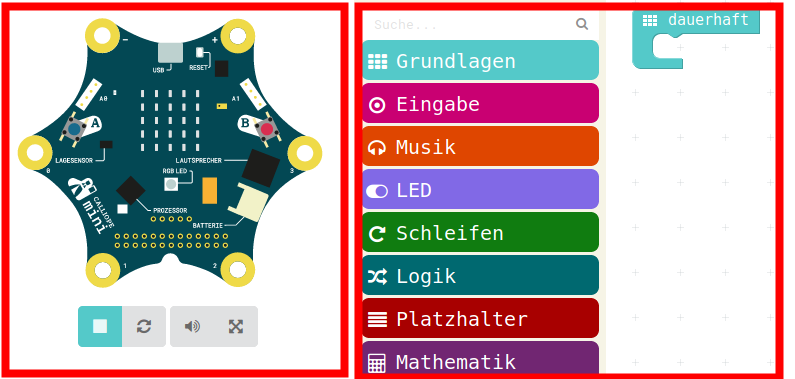
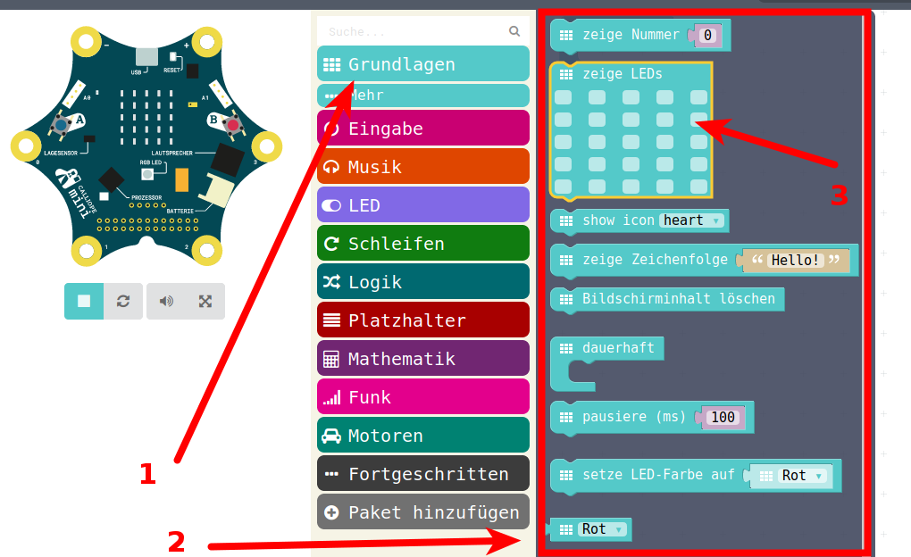
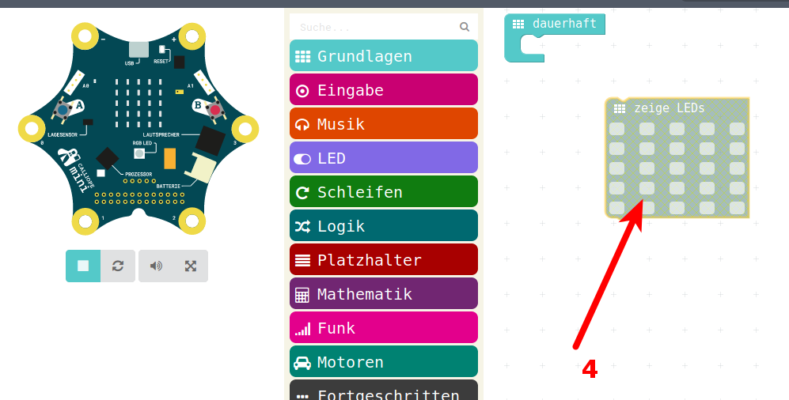
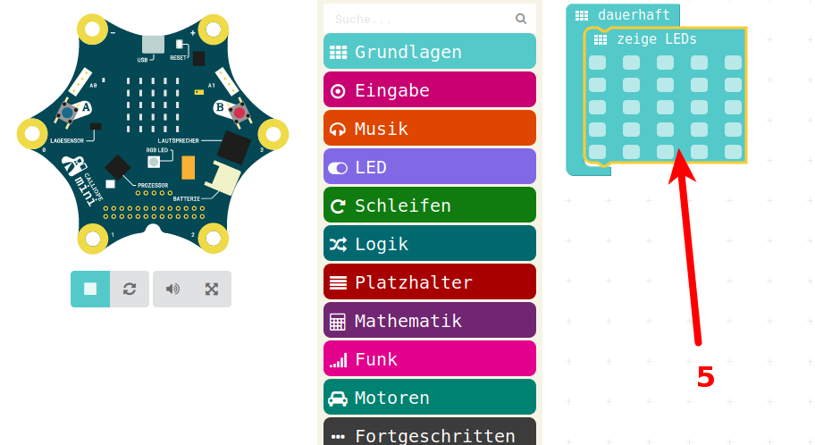
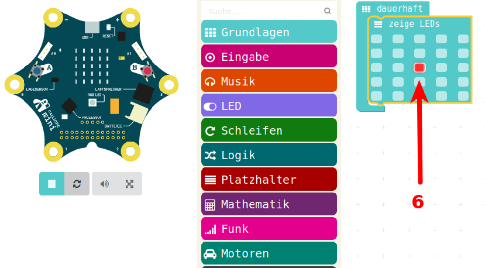
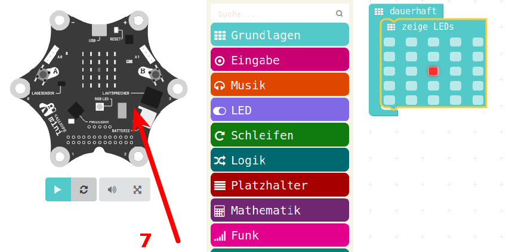

# Start Simulator und Bearbeiten

## Starten des Editors im Web-Browser 

Aufruf von <https://makecode.calliope.cc>

## Der Arbeits-Bereich 

Links Simulator-Bereich  
Simuliert den Calliope

{ height=60% }

Rechts der Arbeits-Bereich zum Bearbeiten/Programmieren

## Bearbeiten von Programmen

{ height=40% }

* Ein Klick auf Grundlagen
* Öffnet ein Menu mit grundlegenden Befehlen
* Hier klickt man z.B. mit der Maus auf "zeige LEDs" und schiebt das ICON in den Arbeitsbereich, 
* Dazu mit der linken Maustaste auf das ICON gehen, die Maustaste NICHT loslassen und dann das ICON nach rechts in den Arbeitsbereich schieben 
 
## Arbeiten im Arbeitsbereich

{ height=60% }

* Im Arbeitsbereich landet das Icon "zeige LEDs"

## Einhängen der Symbole in die Arbeits-Schleife

{ height=50% }

* Dieses kann man nun in die vorhandene Schleife "dauerhaft" einklicken
* Auch dazu das ICON mit der linken Maustaste anklicken und die Maustaste gedrückt halten 
* Mit gedrückter Maustaste in die Schleife schieben

## Bearbeiten des Programm-Stücks

{ height=50% }

* Nun kann man einzelne Leds im Arbeitsbereich an und ausschalten
* Einfach mit der linken Maustaste die LED anklicken zum Ein und
* nocheinmal Anklicken um die LED wieder auszuschalten 

## Übersetzen in Computer-Sprache  

{ height=60% }

* Im Hintergrund wird das Programm neu "übersetzt" und in den Simulator geladen
* Der Simulator ist grau, kann nicht genutzt werden

## Das Programm läuft im Simulator

{ height=60% }

* Das Programm ist in Calliope-Computer-Sprache übersetzt und in den Simulator geladen

## Navigation

* [Zurück](../01_01_Auspacken-Einschalten/README.md)  
* [Hoch zur Übersicht](../README.md)  
* [Weiter ](../01_03_LED_Anzeigen/README.md)

## Lizenz/Copyright-Info
Für alle Bilder auf dieser Seite gilt:

*  Autor: Jörg Künstner
* Lizenz: CC BY-SA 4.0
