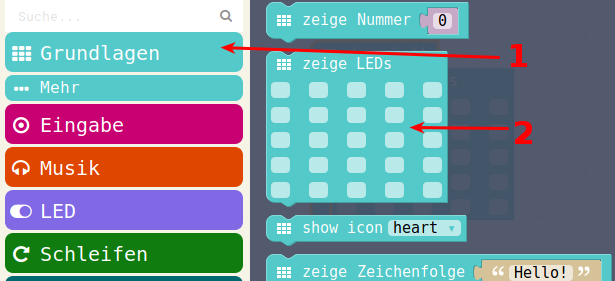
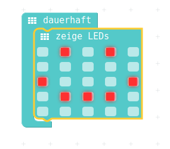
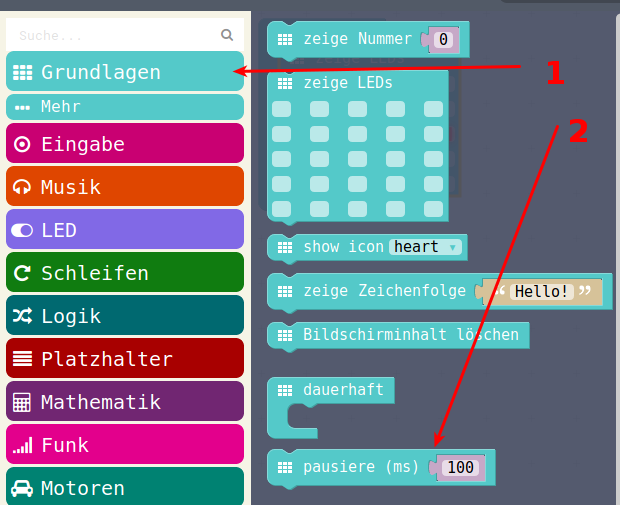
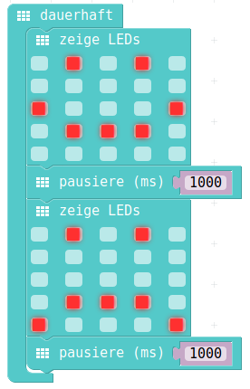

# LED anzeigen

## Auswahl aus Menu

{ height=70% }

## PXT-Code

{ height=70% }


## JavaScript-Code / Hex-Code
### JavaScript-Code

<details>
 <summary>Java-Script-Code</summary>

```js
basic.forever(() => {
    basic.showLeds(`
        . # . # .
        . . . . .
        # . . . #
        . # # # .
        . . . . .
        `)
})
```
</details>

### Download Hex-Code

[Hex-code](code/mini-LedAnzeigen.hex)

## Erweiterung mit Warten

{ height=50% }


Einheit: 

* ms ist MilliSekunden, das ist eine tausendstel Sekunde
* 1000 Millisekunden sind 1 Sekunde
* Wenn man mehrere verschiedene LED-Anzeigen haben will, ca 1 Sekunde = 1000 ms dazwischen


## PXT-Code

{ height=70% }


## JavaScript-Code / Hex-Code
### Javascript
<details>
 <summary>Java-Script-Code</summary>

```js
basic.forever(() => {
    basic.showLeds(`
        . # . # .
        . . . . .
        # . . . #
        . # # # .
        . . . . .
        `)
    basic.pause(1000)
    basic.showLeds(`
        . # . # .
        . . . . .
        . . . . .
        . # # # .
        # . . . #
        `)
    basic.pause(1000)
})

```
</details>

### Download Hex-Code

[Hex-code](code/mini-LedAnzeigenMitPause.hex)

## Navigation


* [Zurück](../01_02_Start_Simulator/README.md)  
* [Hoch zur Übersicht](../README.md)  
* [Weiter ](../01_04_Programm_Auf_Calliope_Laden/README.md)


## Lizenz/Copyright-Info
Für alle Bilder auf dieser Seite gilt:

*  Autor: Jörg Künstner
* Lizenz: CC BY-SA 4.0
