# Programm auf den Calliope laden

## Simulator 

Bislang haben wir alles "nur" im Browser gesehen, Code und Simulator.
Nun wollen wir aber unseren ersten Code auf dem Calliope laufen lassen.

## Namen vergeben

Dazu müssen wir als erstes unserem ersten Programm einen sinnvollen Namen geben:

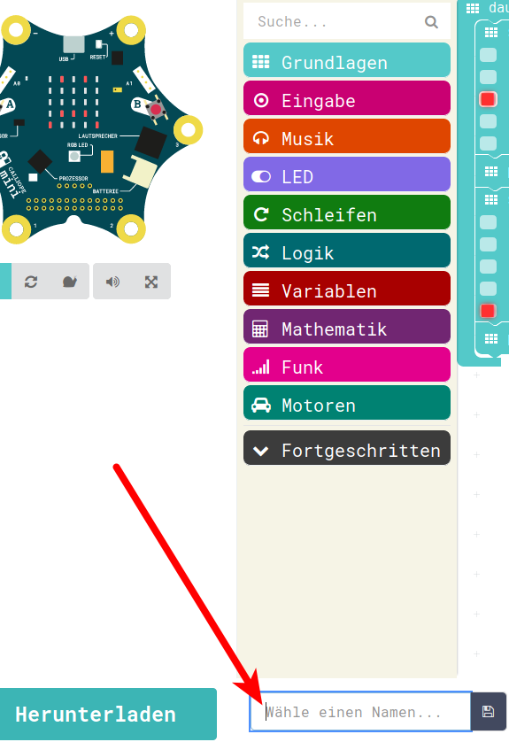{ height=60% }

(Das haben wir in der neuen Version des Editors schon beim Anlegen gemacht) 

## Speichern (1)

Nach der Eingabe eines sinnvollen Namens und klick auf das Disketten-Symbol 
(wer kennt noch Disketten?) 

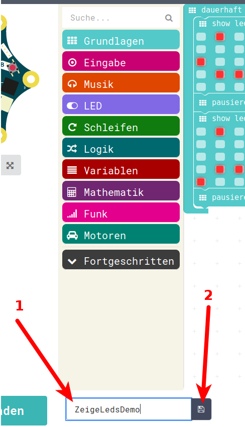{ height=60% }

## Speichern (2)

öffnet sich je nach Betriebs-System ein Speichern-Dialog, der es ermöglicht, das Programm als HEX-Datei auf der Festplatte abzulegen.
Die meisten Browser sind so konfiguriert, dass die Dateien in einem Ordner namens "Downloads" abgelegt werden

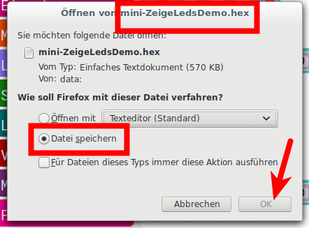{ height=60% }

## Speicher-Ort finden (1)

Da wir das aber nicht sicher wissen, kann man auch den Browser anweisen, einen zum Ort der heruntergeladenen Dateien zu führen.

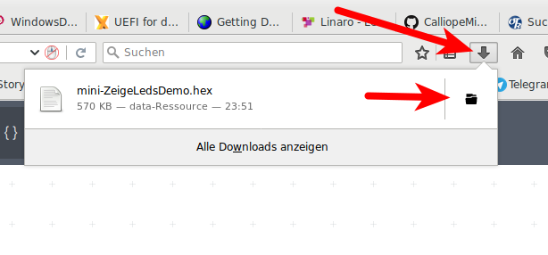{ height=60% }

## Speicher-Ort finden (2)

In diesem Beispiel wurde die HEX-Datei im Verzeichnis "Downloads" des Benutzers "Jogi" abgelegt.

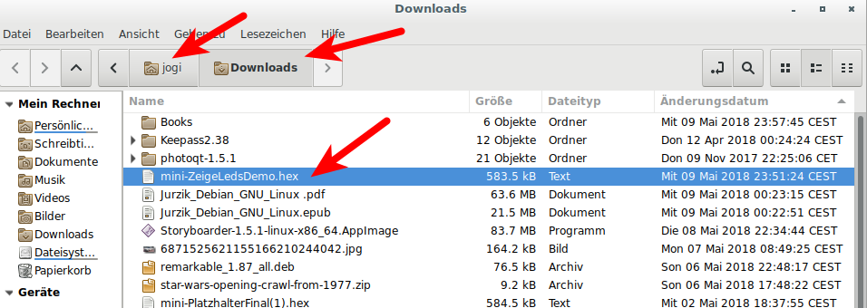{ height=60% }

## Calliope Mini anstecken (1)

__ACHTUNG__

Vor Anstecken des Calliopes an einen USB-Port des Computers die Batterie-Spannung abschalten.
Besser noch die Batterien abstecken.
Der Calliope darf nicht gleichzeitig von den Batterien gespeist werden und am USB-Port des Computers per Kabel hängen!

## Calliope Mini anstecken (2)

Nach Anschluss des USB-Kabels an den Mini

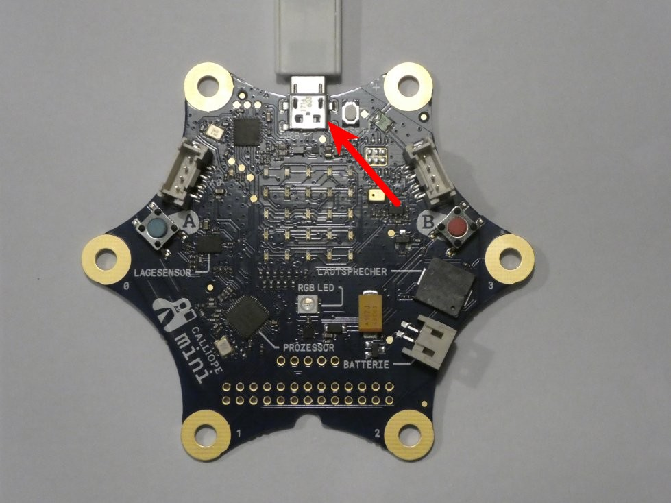{ height=70% }

## Calliope Mini anstecken (3)

und an einen USB-Port des Computers erscheint der Calliope Mini als USB-Speicher am Computer.

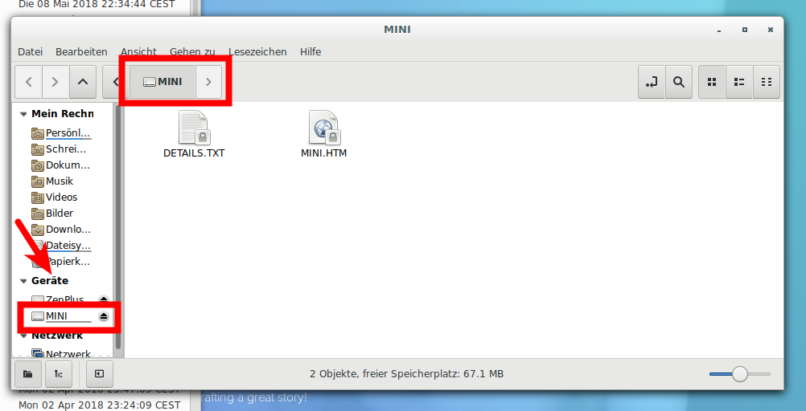{ height=70% }

## Calliope Mini Rev 2.0 anstecken

wer einen Calliope Mini Rev 2.0 hat, da sieht das Bild anders aus:

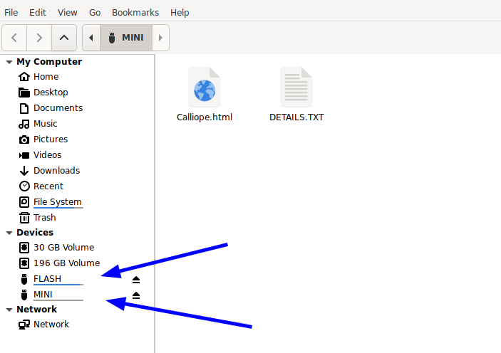{ height=50% }

Das sehen wir uns weiter hinten noch genauer an, jetzt ignorieren die Rev 2.0-Besitzer das **FLASH** 

## HEX-Datei auf den Mini laden (1)

Nun kann man die Datei entweder mit der Maus per Drag and Drop auf den Mini ziehen:

* Datei mit der linken Maustaste anklicken, 
* Maustaste festhalten
* Datei auf das Ziel, also in unserem Fall den MINI
* ziehen und jetzt die Maustaste loslassen

## HEX-Datei auf den Mini laden (2)

oder aber mit Kopieren/Einfügen (Maus) 

* Datei einmal mit der linken Maustaste anklicken, die Datei ist angewählt
* rechte Maustaste auf die Datei klicken
* Kopieren anwählen
* in einen freien Bereich im Ziel-Laufwerk mit der linken Maustaste klicken
* rechte Maustaste klicken, es erscheint ein Menu
* Einfügen wählen

## HEX-Datei auf den Mini laden (3)

oder aber mit Kopieren/Einfügen (Tastatur) 

* Datei einmal mit der linken Maustaste anklicken, die Datei ist angewählt
* STRG -Taste festhalten, C drücken (C wie Copy)
* in einen freien Bereich im Ziel-Laufwerk mit der rechten Maustaste klicken
* STRG-Taste festhalten, V drücken (V weil es direkt neben C ist)
* Das fügt die kopierte HEX-Datei auf das Laufwerk

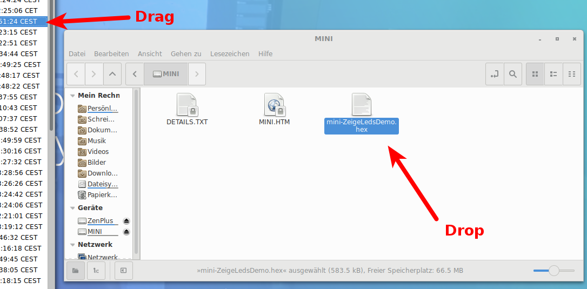{ height=50% }

## Das Programm wird "geflasht"

Vom USB Speicher-Bereich des Calliopes wird es automatisch in den internen Programm-Bereich geflasht.
Das erkennt man an der blinkenden gelben LED

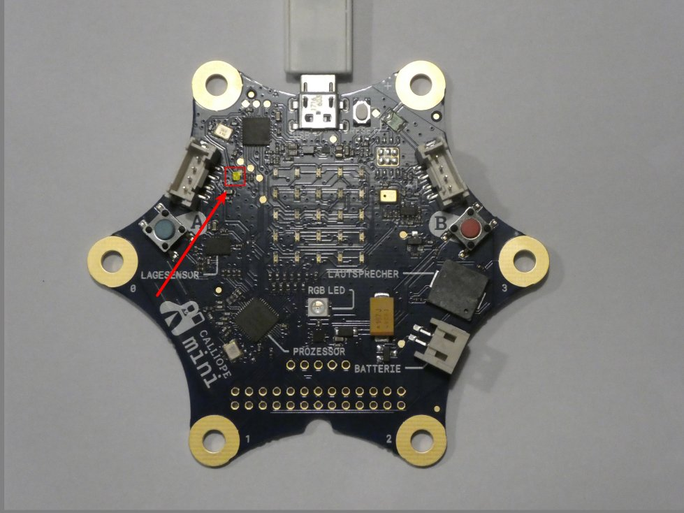{ height=60% }

## Das Programm läuft

Wenn das Programm fertig geflasht ist, 

* dann resetet sich der Calliope automatisch, 
* er verschwindet kurz als USB-Laufwerk vom Computer 
* er erscheint wieder als USB-Laufwerk am Computer, aber das Programm ist verschwunden 
* dafür wurde es in den internen Programm-Speicher übertragen und 
* wird nun ausgeführt

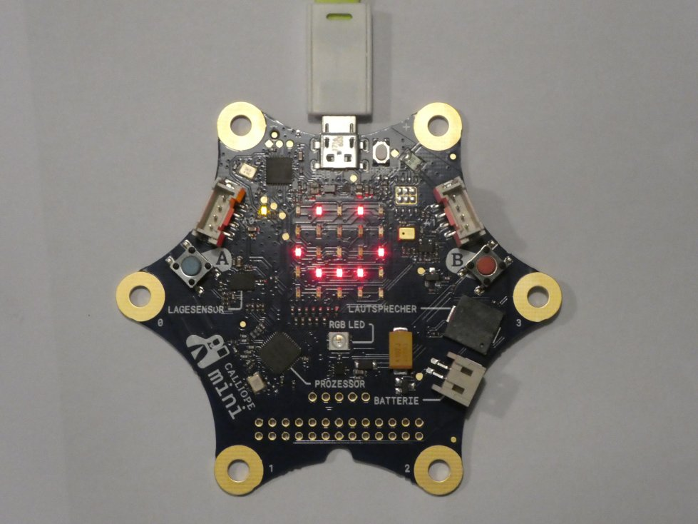{ height=50% }

## Unterschied Calliope Mini Rev 1.3 und 2.0 (1)

Wer einen Rev 2.0 Calliope hat, da sieht das Bild beim Anstecken des Calliope Mini an den PC wie oben schon geschrieben ja etwas anders aus:

{ height=70% }

## Unterschied Calliope Mini Rev 1.3 und 2.0 (2)

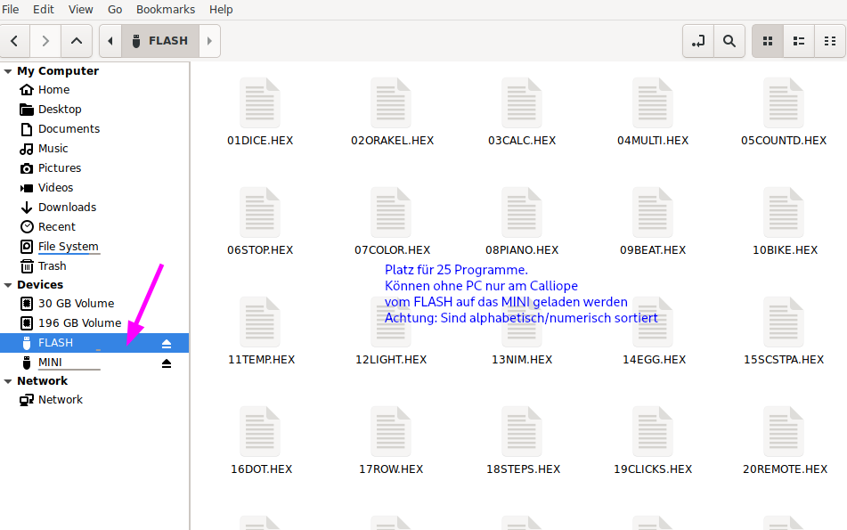{ height=70% }

## Unterschied Calliope Mini Rev 1.3 und 2.0 (3)

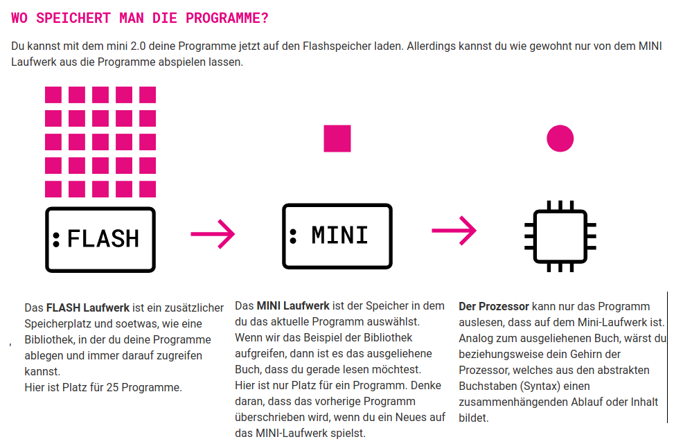{ height=70% }

## Unterschied Calliope Mini Rev 1.3 und 2.0 (4)

* Der Calliope Rev 2.0 hat zusätzlich zum MINI-Speicher noch einen FLASH-Speicher.

* Auf diesen kann man bis zu 25 Programme laden

* Achtung : Namen nur max **8** Zeichen und in **GROSS**-Buchstaben (auch .HEX!) 

* Dateien werden alphabetisch / numerisch sortiert 

* Sortierung muss man sich merken 

* Löschen 01DICE.HEX rutscht ALLE Programme einen Platz nach vorne!

* Auswahl eines Programmes: 

  * Reset - Taste lange drücken 
  * dann mit A / B vorwärts rückwärts
  * A und B wählt aus 
  * Achtung vorheriges Programm in MINI wird damit überschrieben!

