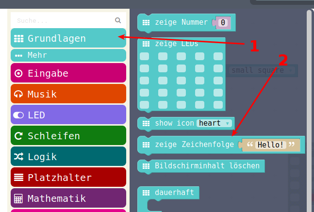
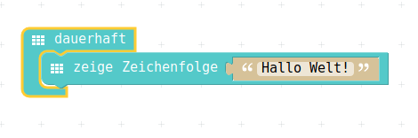

# Texte anzeigen

## Zeichenketten

In der Computer-Sprache nennt man Texte auch "Zeichenketten", eine 'Verkettung' von einzelnen Zeichen.  
Man trifft auch sehr oft auf die englische Bezeichnung "String".  

Darum, wenn man einen Text anzeigen will : => Zeichenketten!

## Auswahl aus Menu

{ height=70% }

## PXT-Code

In der Computer-Welt, wenn man eine neue Programmier-Sprache lernt, ist üblicherweise das erste Programm ein "Hallo Welt."
Diese Programm gibt genau diese Zeichenfolge auf dem Bildschirm aus.  
Unser "Bildschirm" ist die LED-Anzeige.
Wenn der Text nicht auf den Bildschirm (die LED-Anzeige) passt, dann wird ein Lauftext erstellt.  

{ height=60%}

## JavaScript-Code / Download HEX
### JavaScript-Code

<details>
 <summary>Java-Script-Code</summary>

```js
basic.forever(() => {
    basic.showString("Hallo Welt!")
})
```
</details>

### Download Hex-Code

[Hex-code](code/mini-ZeichenketteAnzeigen.hex)


## Navigation


* [Zurück](../01_04_Programm_Auf_Calliope_Laden/index.html)  
* [Hoch zur Übersicht](../index.html)  
* [Weiter ](../01_06_Zahlen_Anzeigen/index.html)


## Lizenz/Copyright-Info
Für alle Bilder auf dieser Seite gilt:

*  Autor: Jörg Künstner
* Lizenz: CC BY-SA 4.0
