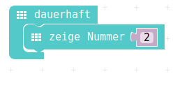
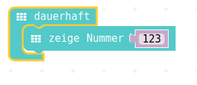
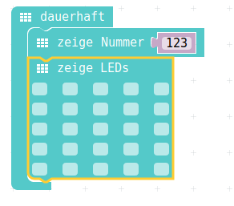
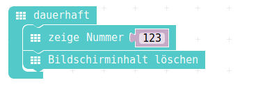
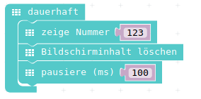
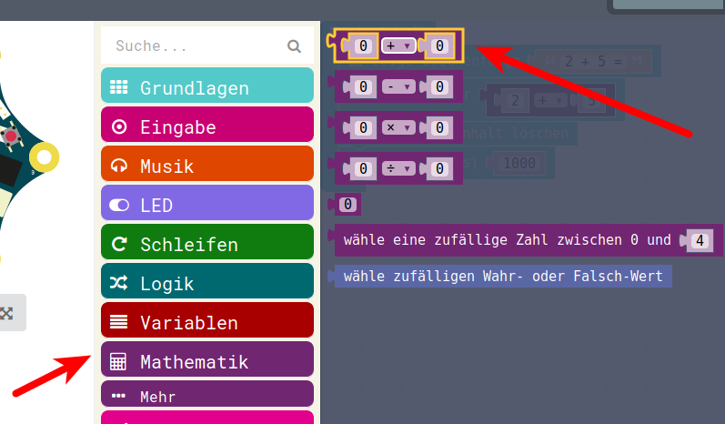
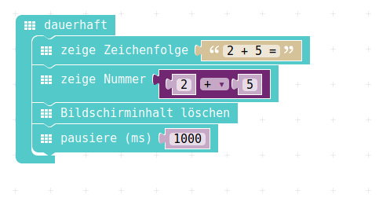

# Zahlen/Nummern anzeigen

## Zahlen / Nummern

In der Computer-Sprache unterscheidet man die Zeichenketten/Strings (im vorherigen Kapitel) von den Nummern/Zahlen.  
Zeichenketten kann man anzeigen (und auch noch anders verändern) aber Nummern/Zahlen eignen sich zum Rechnen.  
Darum wird unterschieden zwischen Texten und Nummern. 

* Wenn man reine Texte hat: => Zeichenkette
* Wenn man Nummern (mit denen man rechnet) anzeigen will: => Nummern 

## Auswahl aus Menu

{height=70%}

## PXT-Code

Im ersten Schritt wollen wir nur eine einzelne Nummer anzeigen. 
In weiteren Schritten zeigen wir dann Zahlen an, die nicht am Stück auf das Display passen und schauen uns an, wie das angezeigt wird.

- Kleiner Tipp : Mit einem gelöschten Bildschirm (zeige LEDs ) und evt noch einen Pause ( pausiere ms ) lässt sich das dann besser identifizieren, was angezeigt wird.

## Einzelne Ziffer

{height=40%}


## Grosse Zahlen 

{height=40%}


## Grosse Zahlen mit Löschen

{height=70%}


## Grosse Zahlen mit Löschen

{height=40%}

* Dieses "__Bildschirminhalt löschen__" bewirkt das Gleiche wie vorher die LED-Matrix mit nicht angeklickten LEDs
* Es wird aber schneller durchgeführt
* Und es braucht weniger Platz auf unserem Arbeitsbereich
* Man findet es unter __"Grundlagen->Mehr"__ ganz unten 

## Grosse Zahlen mit Löschen und Warten

{height=40%}

- Wenn man noch eine Pause einführt, dann sieht man besser was passiert
- Pausen heissen : __pausiere (ms)__ und finden sich auch im Menu: __Grundlagen__

## Additions-Ergebnis einfügen

Vorher hatte ich gesagt, dass sich der Befehl __zeige Nummer__ eignet, um Zahlen anzuzeigen, mit denen man auch richtig rechnen kann.

Das wollen wir ausprobieren, wir wollen nun direkt das Ergebnis einer Plus-Rechnung, einer Additon sehen

{height=50%}

- Im Menu __Mathematik__ findet man eine Additions-Puzzleteil, dieses ziehen wir nun in unser __zeige Nummer__ rein.


## Additions-Ergebnis anzeigen

* Wir ziehen die Additon über die Zahl __123__ im Befehl __zeige Nummer__ drüber, die Zahl wird dann einfach entfernt. 
* Für die Addition ersetzen wir noch von Hand die beiden 0 durch Zahlen (hier 2 und 5)
* Unser Calliope (oder unser Simulator) berechnet das Ergebnis und zeigt es an..

{height=50%}


## Additions-Ergebnis schöner anzeigen

- Nun können wir nochmal eine Zeichenkette vorher eintragen, um unseren kleinen "Taschenrechner" zu verschönern.
- Wir holen uns wieder aus dem Menu Grundlagen den Befehl __zeige Zeichenfolge__ 
- Klicken ihn über der Berechnung in unsere __dauerhaft__ - Schleife ganz oben ein.
- Und schreiben unsere Berechnung als Text hin

{height=50%}


## JavaScript-Code

<details>
 <summary>Java-Script-Code</summary>

```js
basic.forever(() => {
    basic.showString("2 + 5=")
    basic.showNumber(2 + 5)
    basic.clearScreen()
    basic.pause(1000)
})
```
</details>


