# Platzhalter / Variablen 

## Variablen

Bis jetzt haben wir nur Dinge angezeigt, die wir genau so eingegeben haben. Nun wollen wir aber "Bewegung" und "Veränderung" in die Dinge bringen, die wir anzeigen wollen.  
Dazu müssen wir  ein wichtiges Element beim Programmieren kennen lernen:   

__Platzhalter__ : 

Anstatt den Programm-Code immer abzuändern um unterschiedliche Zahlen anzuzeigen brauchen wir sogenannte Platzhalter.  
__Platzhalter__ nennt man beim Programmieren auch __Variablen__, weil die Platzhalter __unterschiedliche Werte__, variable Werte aufnehmen kann.  
Das kann man sich z.B. beim einfachen Zählen mit zwei Händen vorstellen:  

## Hände als Variablen
- Jede Hand ist ein Platzhalter.  
- Jede Hand kann in diesem Fall Werte bis 5 "aufnehmen" (Wertebereich des Platzhalters von 0-5)
- Die beiden Hände können unterschiedliche Werte "aufnehmen"
- Nachdem beiden Händen Werte "zugewiesen" wurden, kann man mit den Platzhaltern rechnen.
- Linke_Hand + Rechte_Hand = Gesuchte_Summe
- In der Programmierung wird das ganze dann umgedreht :
- Gesuchte_Summe = Linke_Hand + Rechte_Hand  

## Die Hände

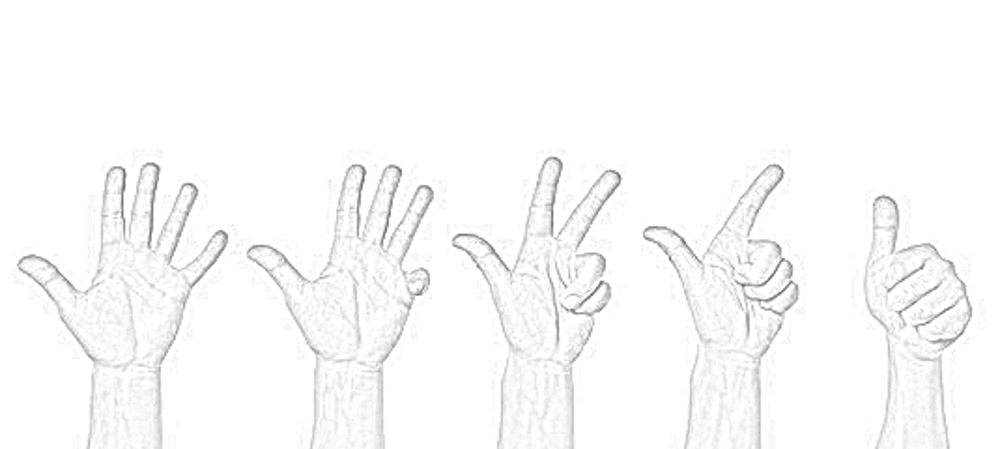{height=35%}

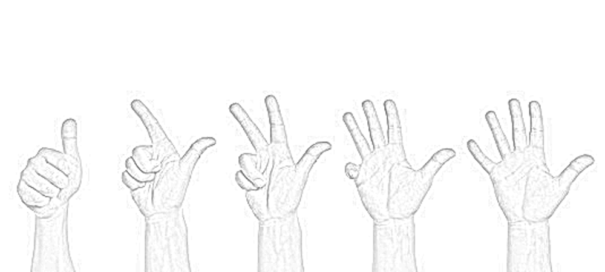{height=35%}

## Zuweisung

Damit Platzhalter Werte aufnehme können, werden ihnen Werte zugewiesen.  
Das geschieht in der Programmierung mit dem Gleichheitszeichen.  
Dieses Gleichheitszeichen ist nicht zu verwechseln mit dem Gleichheitszeichen in der Mathematik.  
Das Gleichheits-Zeichen beim Programmieren bedeutet, dass dem Platzhalter auf der linken Seite der Wert auf der rechten Seite des Gleichheits-Zeichens zu gewiesen wird.

## Beispiel 1: 

Linke_Hand = 3  

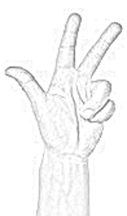{height=60%}

heisst : Ab jetzt hat der Platzhalter __Linke_Hand__ den Wert 3.

## Beispiel 2:

Rechte_Hand = 5 

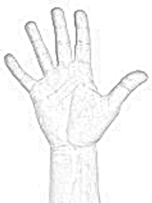{height=60%}

heisst : Ab jetzt hat der Platzhalter __Rechte_Hand__ den Wert 5.

## Addition mit Platzhaltern (1)

Anstatt 3 + 5 heisst unsere Rechnung nun:

Linke_Hand + Rechte_Hand = Gesuchte_Summe

Um daraus einen Programmiervorschrift zu machen, dreht man die beiden Teile um das Gleichheits-Zeichen herum, also:

## Addition mit Platzhaltern (2)

Gesuchte_Summe = Linke_Hand + Rechte_Hand 

Diese eine __Berechnungs-Anweisung / Formel__ ist unser __"Programm"__ und ist für völlig verschiedene Werte von Rechte_Hand und Linke_Hand durchführbar.  
Man kann die Zuweisungen irgendwann beim Programm-Start machen und erst viel später (wenn man als Mensch schon lange die Werte vergessen hat) die beide Platzhalter addieren.

## Eine Variable anlegen

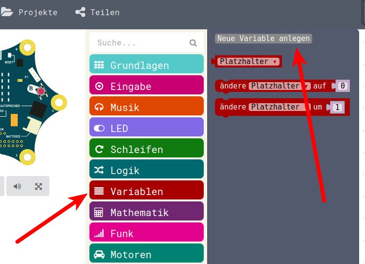{height=70%}

## Variable benennen

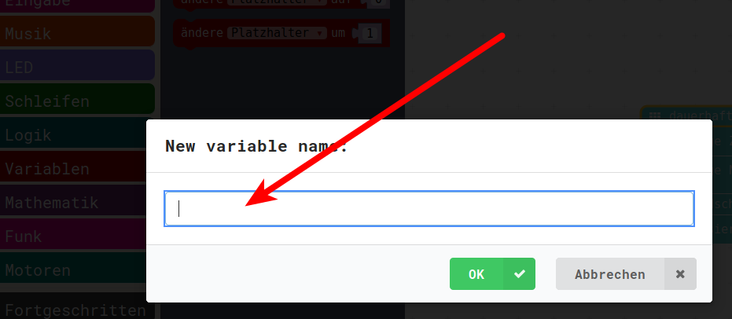{height=60%}

## Wichtig : Variablen-Namen

Beim Benennenn der Variablen sollte man ein paar Dinge beachten:

* Variablen sollten __keine Leerzeichen__ enthalten
* Variablen dürfen Zahlen enthalten, aber __nicht mit Zahlen anfangen__.
* Variablen sollten __keine Sonderzeichen__ enthalten, dazu zählen auch ä,ö und ü (ersetzen durch ae,oe und ue) , ebenso kein Bindestrich/Minus-Zeichen

Darum wird aus unserer Rechnung oben:

* Gesuchte Summe = Linke Hand + Rechte Hand
* GesuchteSumme = LinkeHand + RechteHand            oder
* Gesuchte_Summe = Linke_Hand + Rechte_Hand       oder
* gesuchteSumme = linkeHand + rechteHand               usw ...

## Variablen-Namen eingeben

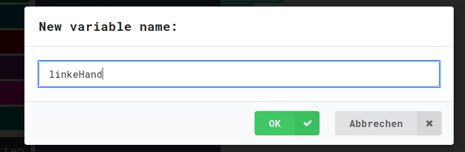{height=70%}

## Zuweisung und Benutzung (1)

Wir haben oben in Texten die Namen der Variablen hingeschrieben: 

* __linkeHand__ = 3
* rechteHand = 5
* gesuchteSumme = __linkeHand__ + rechteHand 

Wir haben hier zweimal die Variable __linkeHand__ stehen, einmal auf der linken Seite des __=__ - Zeichens einmal auf der rechten Seite.

Im einen Fall belegen wird die Variable __linkeHand__ mit einem Wert (3), das andere Mal benutzen wir den Wert, wir "fragen" die Variable, welchen Wert sie denn enthält.

## Zuweisung und Benutzung (2)

Unsere Calliope-Programmiersprache unterscheidet/muss unterscheiden, ob man einer Variablen einen bestimmten Wert zuweist, oder ob man die Variable/den Platzhalter benutzen will.

Wenn man der Variable einen Wert __zuweisen__ will, dann muss man diesen ganzen Block verwenden:   

{height=10%}

Wenn man die Variable abfragen will, man will sie __benutzen__ , dann kann man folgenden Block verwenden, das Puzzleteilchen:

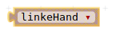{height=10%}

(Siehe dazu auch den Refresh in Tag3 zum Thema Variablen)

## Zuweisung und Benutzung (3)

Hat man nun mit obigem Befehl eine neue Variable angelegt, dann ist sie im __Menu Variablen__ als Puzzle-Teilchen vorhanden, sprich man kann sie __benutzen/abfragen__.

Aber eine Zuweisung wie bei der Variable namens __Platzhalter__ ist nicht vohanden: 

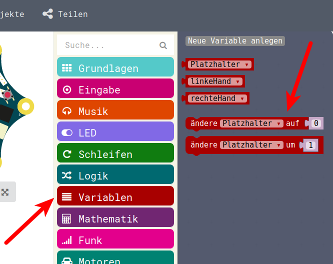{height=60%}

## Neue Variable belegen

Lösung des Problems:

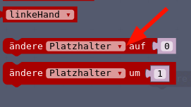{height=25%}

Das kleine Dreieck bei Platzhalter bietet ein Auswahlmenu aller angelegten Variablen.

Dazu ziehen wir den Baustein auf die Arbeitsfläche:

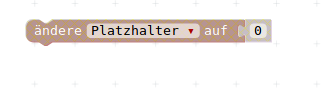{height=10%}

und klicken anschliessend auf das kleine Dreieckchen. Dann öffnet sich ein Auswahlmenu, in welchem wir die Variable auswählen können:

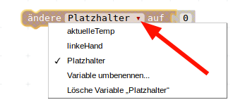{height=25%}

