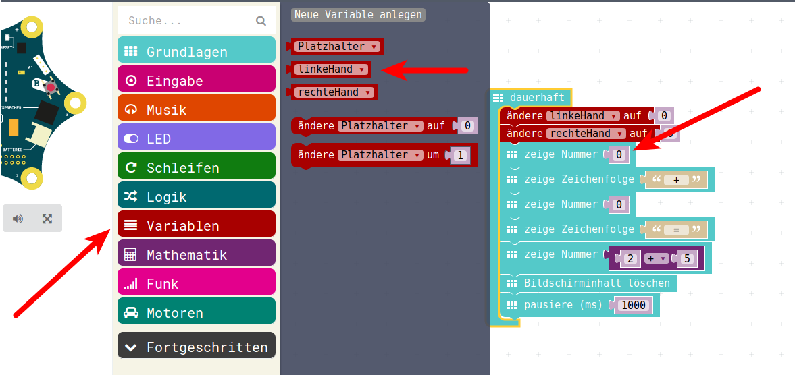
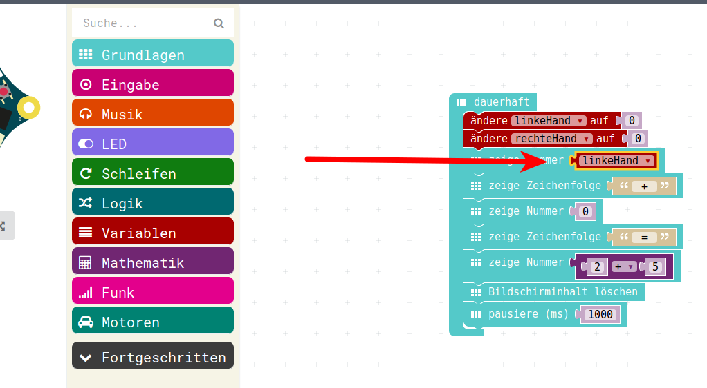
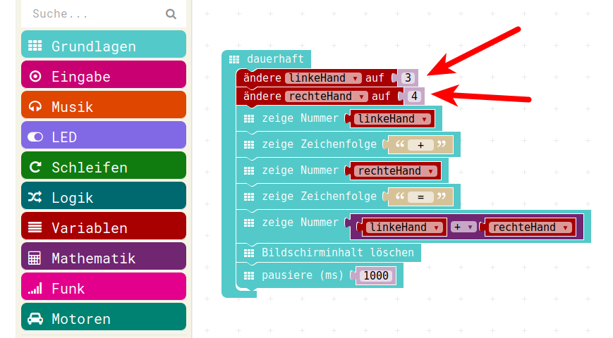

# Platzhalter / Variablen 

## Erklärung (1)

Wenn man den Taschenrechner etwas universeller haben will, dann muss man mehr Flexibilität haben.  
D.h man muss mit verschiedenen, unterschiedlichen Werten arbeiten können.  
Anstatt den Programm-Code immer abzuändern und die Berechnung jedesmal neu zu übersetzen, brauchen wir sogenannte Platzhalter.
Platzhalter nennt man beim Programmieren auch Variablen, weil die Platzhalter unterschiedliche Werte, variable Werte aufnehmen kann.  
Das kann man sich z.B. beim einfachen Zählen mit zwei Händen vorstellen:  

## Erklärung (2)
- Jede Hand ist ein Platzhalter.  
- Jede Hand kann in diesem Fall Werte bis 5 "aufnehmen" (Wertebereich des Platzhalters von 0-5)
- Die beiden Hände können unterschiedliche Werte "aufnehmen"
- Nachdem beiden Händen Werte "zugewiesen" wurden, kann man mit den Platzhaltern rechnen.
- Linke_Hand + Rechte_Hand = Gesuchte Summe
- In der Programmierung wird das ganze dann umgedreht :
- Gesuchte Summe = Linke_Hand + Rechte_Hand  

## Die Hände

{height=35%}

{height=35%}

## Zuweisung

Damit Platzhalter Werte aufnehme können, werden ihnen Werte zugewiesen.  
Das geschieht in der Programmierung mit dem Gleichheitszeichen.
Dieses Gleichheitszeichen ist nicht zu verwechseln mit dem Gleichheitszeichen in der Mathematik.  
Das Gleichheits-Zeichen beim Programmieren bedeutet, dass dem Platzhalter auf der linken Seite der Wert auf der rechten Seite des Gleichheits-Zeichens zu gewiesen wird.

## Beispiel 1: 

Linke Hand = 3  

{height=60%}

heisst : Ab jetzt hat der Platzhalter Linke Hand den Wert 3.

## Beispiel 2:

Rechte Hand = 5 

{height=60%}

heisst : Ab jetzt hat der Platzhalter Rechte Hand den Wert 5.

## Addition mit Platzhaltern (1)

Anstatt 3 + 5 heisst unsere Rechnung nun:

Linke Hand + Rechte Hand = Gesuchte Summe

Um daraus einen Programmiervorschrift zu machen, dreht man die beiden Teile um das Gleichheits-Zeichen herum, also:

## Addition mit Platzhaltern (2)

Gesuchte Summe = Linke Hand + Rechte Hand 

Diese eine Berechnungs-Anweisung / Formel ist unser "Programm" und ist für völlg verschiedene Werte von Rechte Hand und Linke Hand durchführbar.
Man kann die Zuweisungen irgendwann beim Programm-Start machen und erst viel später (wenn man als Mensch schon lange die Werte vergessen hat) die beide Platzhalter addieren.


## Auswahl aus Menu (1)

{height=70%}


## Auswahl aus Menu (2)

{height=70%}


## Auswahl aus Menu (3)

{height=70%}


## Auswahl aus Menu (4)

{height=70%}


## Auswahl aus Menu (5)

{height=70%}

## Verwendung des Platzhalters 

{height=70%}

Verwendung der Variablen Ausgaben und Berechnungen anstatt fester Werte.

## Benutzung Platzhalter

{height=70%}

Dazu zieht man die Variable/den Platzhalter genau an die Stelle an der vorher feste Werte benutzt wurden.


## PXT-Code

Finales simples Taschenrechner-Programm.  
Immernoch muss Programm-Code geändert werden um eine neue Berechnung durchzuführen, aber die Werte für die Berechnung müssen nur an einer zentralen Stelle geändert werden.
Dank Verwendung von Platzhaltern/Variablen passt sich die Ausgabe jeweils entsprechend an.





## JavaScript-Code / HEX-Code
### JavaScript-Code

<details>
 <summary>Java-Script-Code</summary>

```js
let rechteHand = 0
let linkeHand = 0
basic.forever(() => {
    linkeHand = 3
    rechteHand = 4
    basic.showNumber(linkeHand)
    basic.showString(" + ")
    basic.showNumber(rechteHand)
    basic.showString(" = ")
    basic.showNumber(linkeHand + rechteHand)
    basic.clearScreen()
    basic.pause(1000)
})
```
</details>

### Download Hex-Code

[Hex-code](mini-PlatzhalterFinal.hex)

## Navigation


* [Zurück](../01_06_Zahlen_Anzeigen/README.md)  
* [Hoch zur Übersicht](../README.md)  
* [Weiter ](../01_08_TastenEingabe/README.md)


## Lizenz/Copyright-Info
Für alle Bilder auf dieser Seite gilt:

*  Autor: Jörg Künstner
* Lizenz: CC BY-SA 4.0

