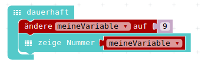
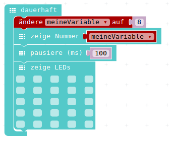
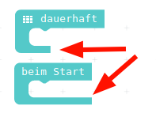
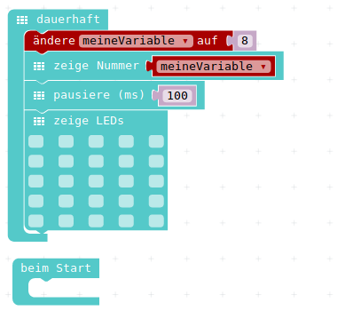
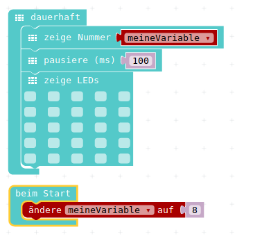

# Variablen nutzen / BeimStarten 

## Variablen nutzen

Nun wollen wir unser neues Wissen über Variablen in einem einfachen Programm ausprobieren.

* In der __dauerhaft__-Schleife: 

* Wir belegen eine Variable __meineVariable__ mit einem beliebigen Zahlenwert 

* Wir lassen uns diese Variable __meineVariable__ als Zahl anzeigen

## Erstes Programm mit Variablen

{height=20%}

oder damit sich wenigstens ein bisschen was bewegt:
(__pausiere__ und __zeige LEDs__ sind beide im Grundlagen-Menu)

{height=50%}

## Beim Start

Bislang haben wir alle unsere Programm-Teile in die Schleife mit dem Namen __dauerhaft__ reingezogen. Diese Schleife läuft - wie Ihr Name vermuten lässt - die ganze Zeit "im Kreis".

Es werden also alle Befehle immer wieder ausgeführt.

Eine paar andere Möglichkeit, Programmteile zu starten, werden wir gleich sehen.

Eine ist eine ähnlich aussehender Block, die sich __beim Start__ nennt und auch im __Grundlagen__-Menu zu finden ist.

Dieser Block wird - wie zu erwarten - nur ein einziges Mal, beim Start des Calliope bzw beim Start des Simulators durchgeführt.

Das wollen wir nun mal ausprobieren, wir holen uns den __beim Start__ Block zusätzlich auf die Arbeitsfläche.

## Beim Start 

Unterschied : Schleife vs Einmal Ausführen 

{height=25%}

Unser neues Programm:

{height=50%}  

## Beim Start mit Funktion

Das einmalige Belegen der Variable __meine Variable__ können wir nun aus der __dauerhaft__-Schleife rausziehen und in den __beim Start__ - Block einfügen.

__Hinweis__ : Man kann immer nur ganze Programm-Teile nach __unten__ wegziehen, d.h.

* den gesamten Programm-Block aus der __dauerhaft__-Schleife rausziehen
* alles unterhalb __ändere meineVariable__ wieder in die Schleife reinziehen
* __ändere meineVariable__ nun in den __beim Start__-Block einklicken

## Beim Start mit Funktion

{height=50%}

## Vorbereitung 

* Wenn wir unser Programm nun anschauen, hat sich eigentlich nichts geändert.

* Aber wir haben eine neue Möglichkeit kennengelernt, um Befehle ausführen zu lassen, wenigstens einmalig beim Start
* Und wir haben unser Programm vorbereitet, fü die nächsten Schritte...

## Navigation

* [Zurück](../01_06_Zahlen_Anzeigen/index.html)  
* [Hoch zur Übersicht](../index.html)  
* [Weiter ](../01_08_TastenEingabe/index.html)

## Lizenz/Copyright-Info
Für alle Bilder auf dieser Seite gilt:

*  Autor: Jörg Künstner
* Lizenz: CC BY-SA 4.0

