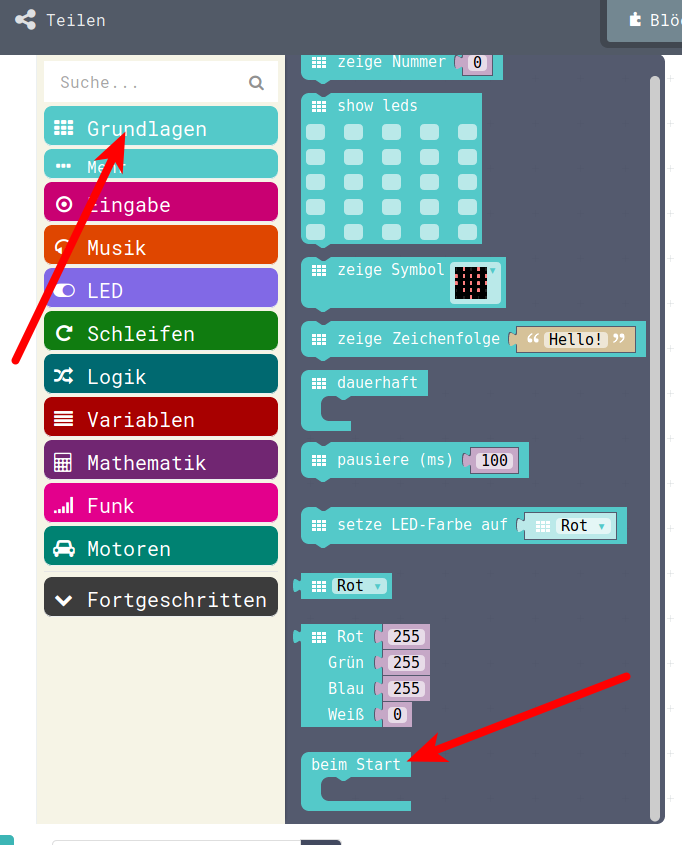
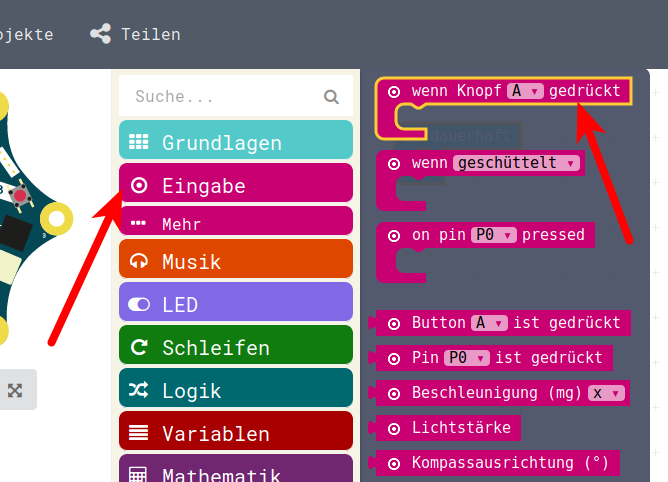
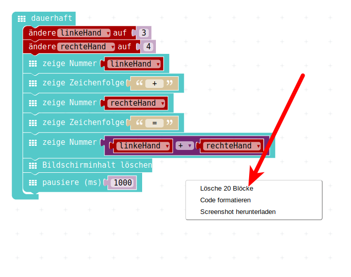
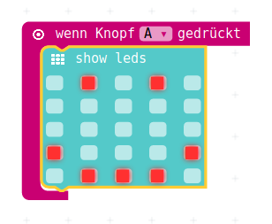
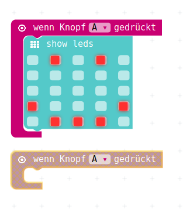
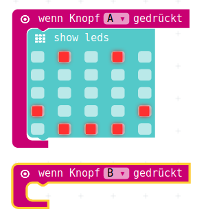
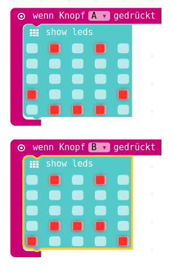

# Eingabe mit Tasten 

## Starten unseres Programmes 

Bislang haben wir nur Berechnungen durchgeführt und Werte aund Texte ausgegeben.  
Wenn man dem Taschenrechner auch Werte eingeben/verändern können will, dann muss man auch Eingaben machen können.

Dazu schauen wir uns nochmal kurz an, wie bislang unser Programm gestartet wurde:


D.h unser Programmcode wurde ständig, dauerhaft wiederholt.

Es gibt auch noch andere Möglichkeiten, wie unser Programm-Code aufgerufen wird:

 


D.h. unser Programmcode wird nur einmal beim Starten ausgeführt.
(Anmerkung: Bei unserem bisherigen Programm ohne Spezialitäten ist das Ergebnis das Gleiche, das kann gerne mal ausprobiert werden...)


## Starten Programm-Teile via Tastendruck

Nun gibt es auch die Möglichkeit, Programm-Teile dann ausführen zu lassen, wenn ein Taste gedrückt wird.
Dazu holen wir uns die entsprechende "Klammer" um unser Programm herum aus dem Bereich "Eingabe"



Das wird nun auf einen geleerten Bereich gezogen.
Den Programm-Bereich leert man mit einem Rechts-Klick in einen freien Bereich.
(Keine Sorge, wenn das HEX-File für den Calliope heruntergeladen wurde, kann man unser Programm daraus wieder herstellen)
 


Nun noch eine Reaktion auf den Tastendruck, z.B. ein LED-Gesicht:



Damit haben wir ein erstes Programm, das auf Eingabe reagiert.


## Reaktion auf zweite Taste

Möchte man nun noch eine zweite Reaktion auf eine andere Taste programmieren, dann holt man sich wieder aus dem Bereich Eingabe die "Klammer"  
"Wenn Knopf A gedrückt"
Sobald diese Klammer auf der Programm-Oberfläsche liegt, verliert sie Ihre Farbe, wird "ausgegraut".  



Warum?  

Wir haben nun ein zweite "Klammer" angelegt, die ausgeführt werden soll, wenn Knopf A gedrückt wird.
Das ist nicht möglich. Es kann immer nur eine Klammer als Reaktion auf einen Tastendruck im Programm-Bereich geben.

Sobald wir nun den Knopf auf Knopf B wechseln:


bekommt die Klammer Ihre ursprüngliche Farbe wieder und kann sinnvoll verwendet werden.



z.B. durch Anzeige eines anderen Gesichts




## Unterschied Start und Dauerhaft

Mit diesem Grundgerüst kann man nun auch sehr einfach ausprobieren, was der Unterschied im Programm-Verhalten ist, wenn man "dauerhaft" oder "Beim Start" anwählt.
Dazu aber sinnvollerweise kleine Pausen mit einbauen, sonst wird die Ausgabe schwer verständlich.


## JavaScript-Code

Finales Eingabe-Kontroll-Programm.  
Zeigt anhand von ICONs/Gesichtern das Verhalten des Programms bei Eingaben, bei Start und Dauerhaft.

<details>
 <summary>Java-Script-Code</summary>

```js
input.onButtonPressed(Button.A, () => {
    basic.showLeds(`
        . # . # .
        . . . . .
        . . . . .
        # . . . #
        . # # # .
        `)
    basic.pause(1000)
})
input.onButtonPressed(Button.B, () => {
    basic.showLeds(`
        . # . # .
        . . . . .
        . . . . .
        . # # # .
        # . . . #
        `)
    basic.pause(1000)
})
basic.showLeds(`
    . # # # .
    . # . # .
    . . . # .
    . . # . .
    . . # . .
    `)
basic.pause(1000)
basic.forever(() => {
    basic.showLeds(`
        . # . # .
        . . . . .
        . . . . .
        # # # # #
        . . . . .
        `)
    basic.pause(1000)
})
```
</details>

## Download Hex-Code


## Lizenz/Copyright-Info
Für alle Bilder auf dieser Seite gilt:

*  Autor: Jörg Künstner
* Lizenz: CC BY-SA 4.0
