# Der Taschenrechner 

## Bisher gelernt (1)

Bis jetzt haben wir gelernt:

* Zeichen auf den LEDs anzeigen 
* Zahlen auf den LEDs anzeigen 
* Erster Umgang mit Platzhaltern
* Einfache Berechnung (+)
* Ausführen von Programm-Teilen einmalig beim Start
* Ausführen von Programm-Teilen immer
* Reaktion auf Tasten-Drücke

## Bisher gelernt (2)

Damit sollten wir eigentlich nun in der Lage sein, einen sehr einfachen Taschenrechner zu bauen.
Er soll: 

* Beim Start zwei Platzhalter mit 0 belegen
* Beim Drücken der linken Taste den einen Platzhalter um eins erhöhen
* Beim Drücken der rechten Taste den anderen Platzhalter um eins erhöhen
* Dauerhaft die Addition der zwei Platzhalter anzeigen 


## Beim Start 


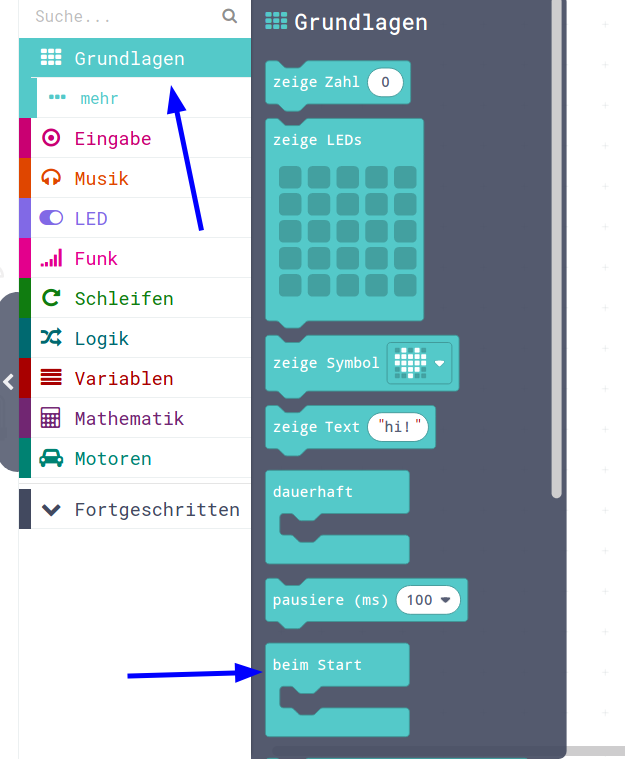{height=50%}


## Variable setzen AUF  


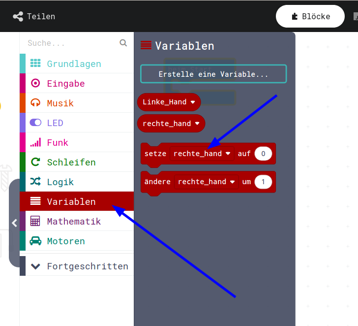{height=50%}


## Zweimal und dann ändern 

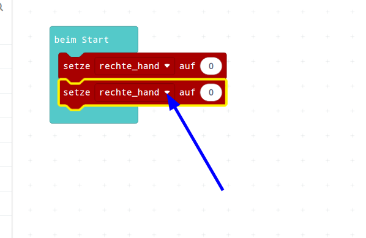{height=50%}


## Andere Variablen auswählen 

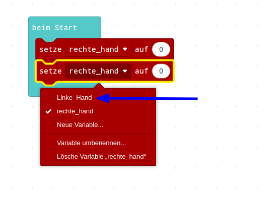{height=50%}


## Dauerhaft-Schleife (aus Grundlagen) 

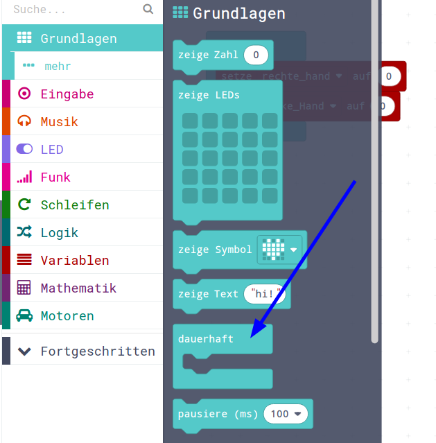{height=50%}


## Zeige Zahl (aus Grundlagen) 

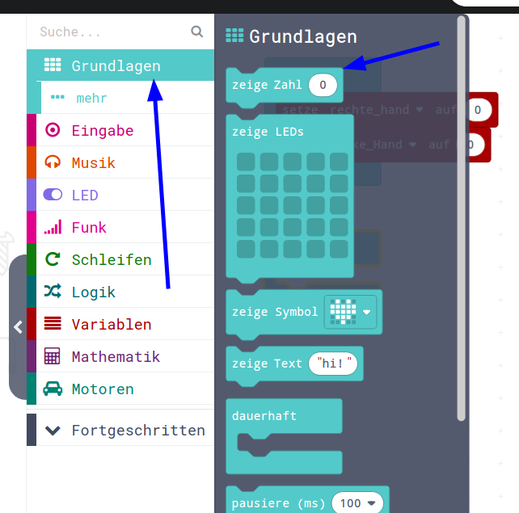{height=50%}

## Zeige Zahl in Dauerhaft-Schleife 

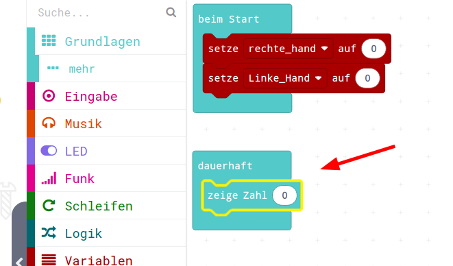{height=50%}

## 

## Variablen zum Anzeigen holen 

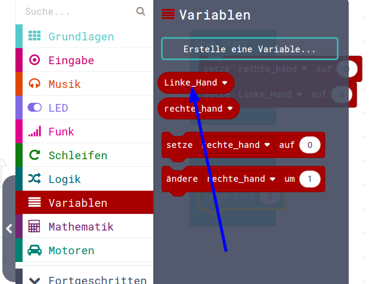{height=50%}


## Variable über die "0" fallen lassen 

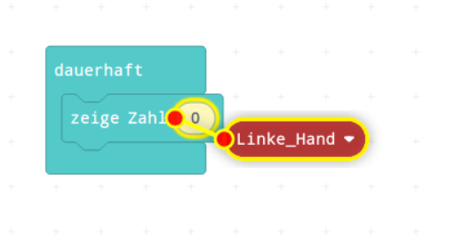{height=50%}


## Zeige Text (aus Grundlagen) 

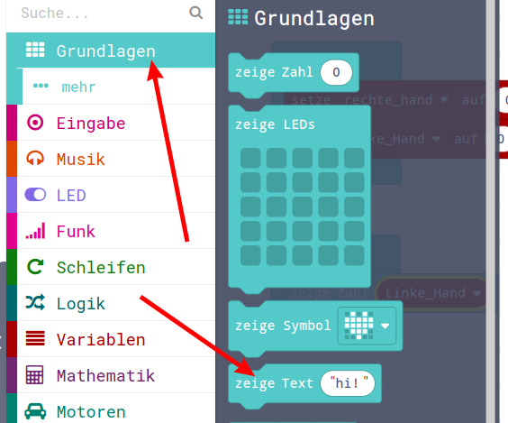{height=50%}

## Die Dauerhaft-Schleife 

* Wir holen dreimal "zeige Zahl" und zweimal "zeige Text"
* Und ordnen es entsprechend an

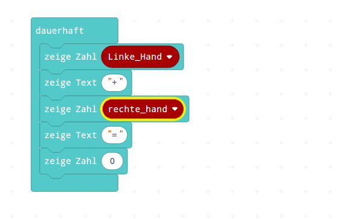{height=50%}


## Die Addition (aus dem Menu Mathematik) 

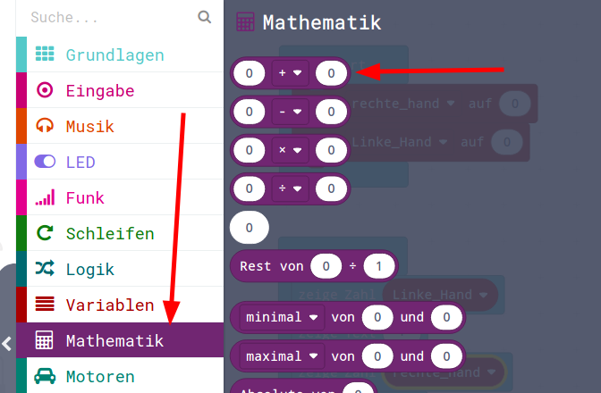{height=50%}


## Als Ergbnis-Anzeige einer Berechnung 

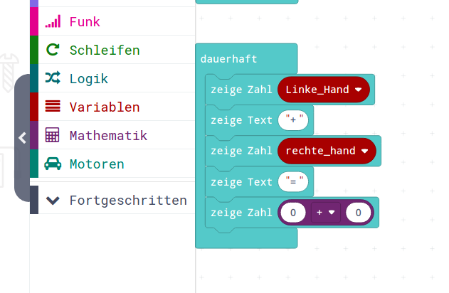{height=50%}


## Beide Variablen holen

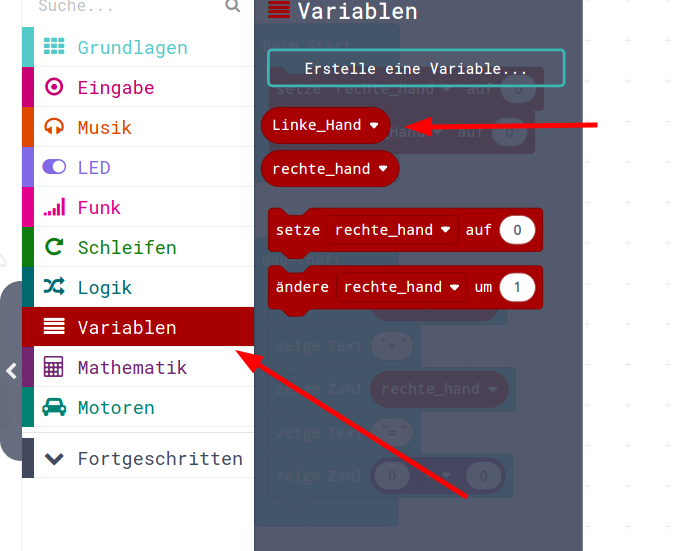{height=50%}


## Und über den "0" der Addition einrasten 

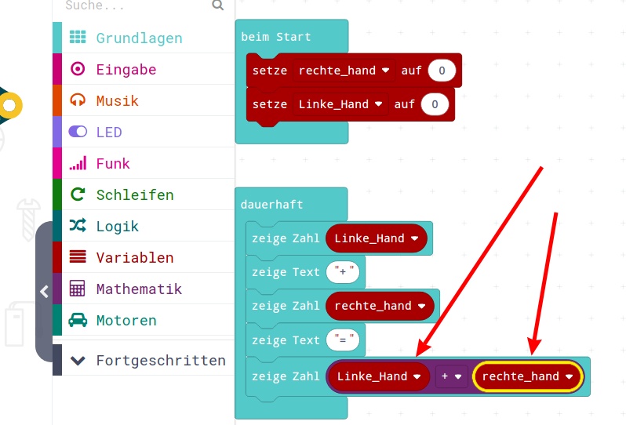{height=50%}


## Bildschirm löschen (Grundlagen-Mehr) 

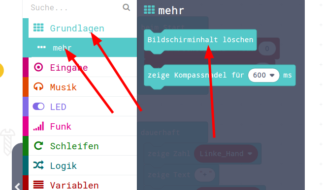{height=50%}


## Pausieren (Menu Grundlagen) 

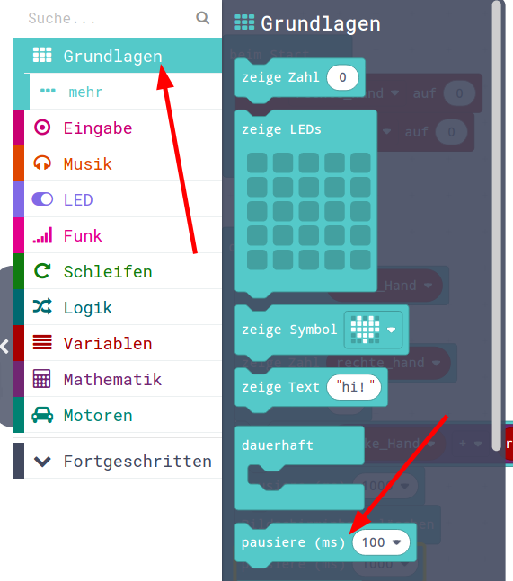{height=50%}


## "Verschönern" 

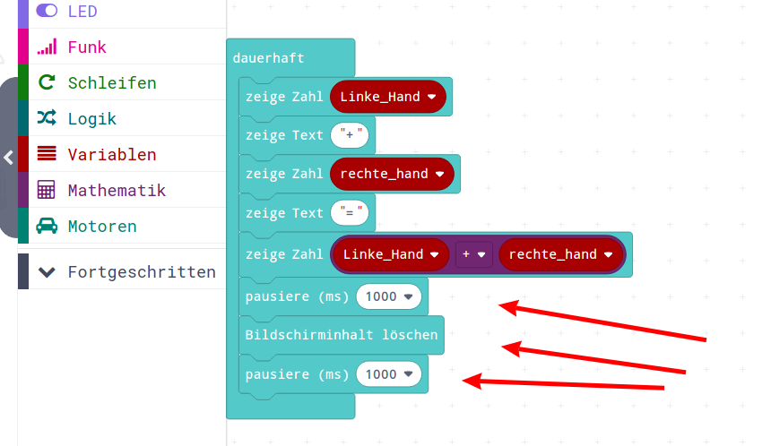{height=50%}


## Knopf-Drücken (aus Menu Eingabe)

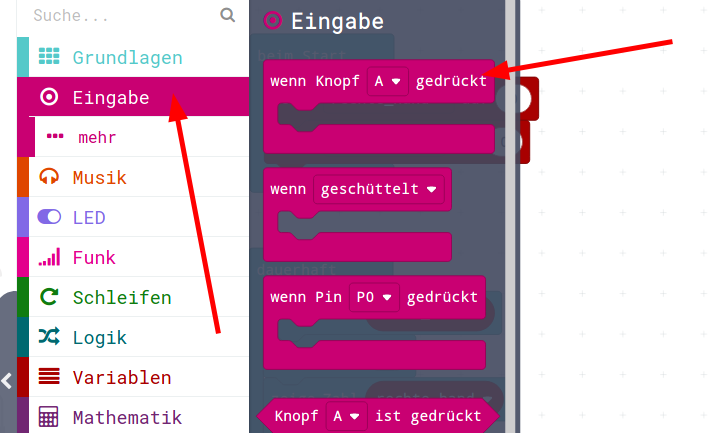{height=50%}


## Dreimal rausgeholt und... 

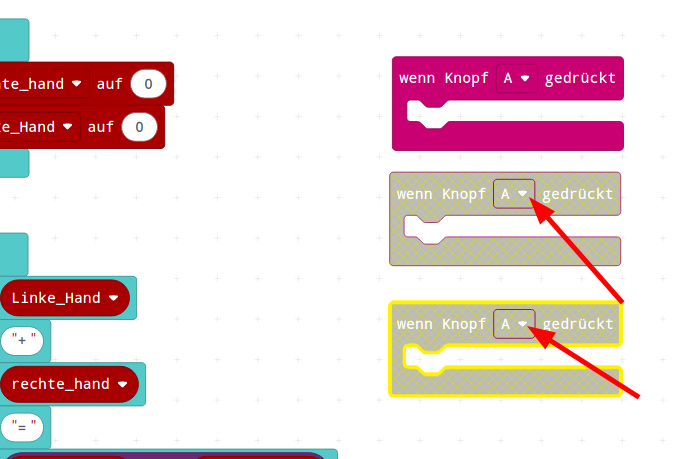{height=50%}


## ... auf A, B und A+B geändert 

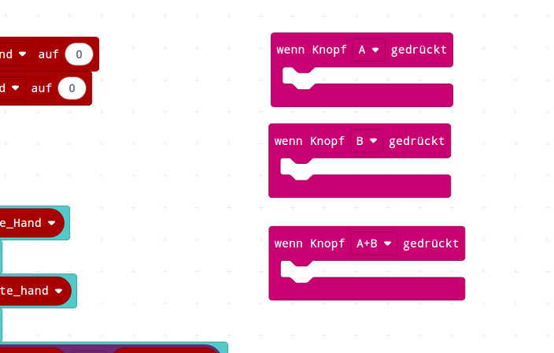{height=50%}

## Variablen Ändern (aus Menu Variablen)

* **setze** Variable **auf**  xx
* **ändere** Variable **um** xx
* Achtung, werden leicht verwechselt!
* Wir brauchen Variablen-Änderung für A, B

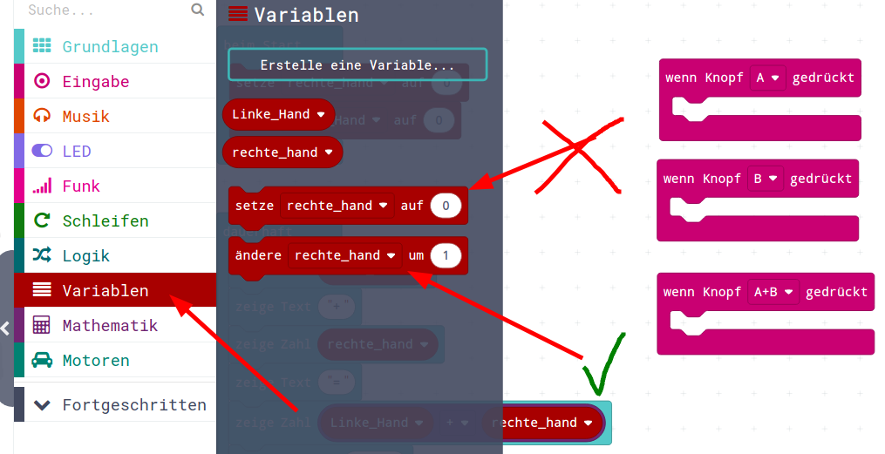{height=50%}

## Variablen auf 0 setzen

* wenn A+B gedrückt wird, wollen wir die Variablen auf 0 schreiben
* hier also "**setze** Variable **auf** xxx" 

{height=50%}


## Beim Start 

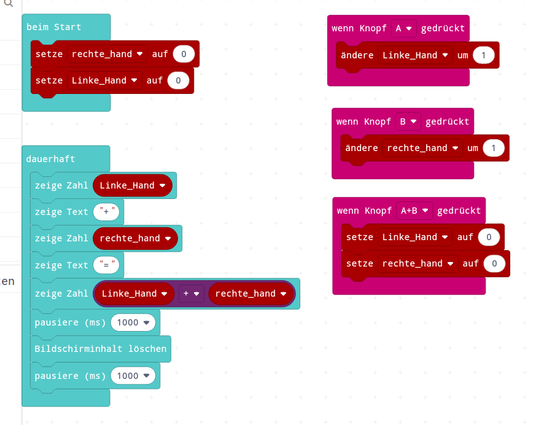{height=50%}


## Testen im Simulator: A+B drücken 

Da man im Simulator nur einen Maus-Zeiger hat und damit nicht gleichzeitig die beiden Tasten A+B klicken kann, blendet der Simulator bei Notwendigkeit eine zusätzliche "A+B"-Taste ein. 
Diese gibt es nur im Simulator, auf dem echten Calliope drückt man einfach beide Tasten gleichzeitig.

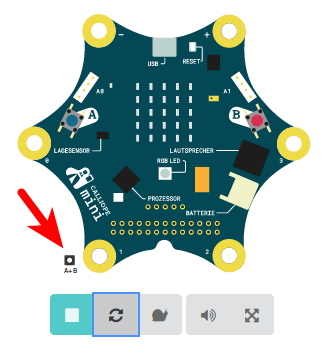{height=50%}


## Bitte einprägen! Platzhalter / Variablen

Bei den Variablen befinden sich zwei sehr ähnlich klingende Befehle:
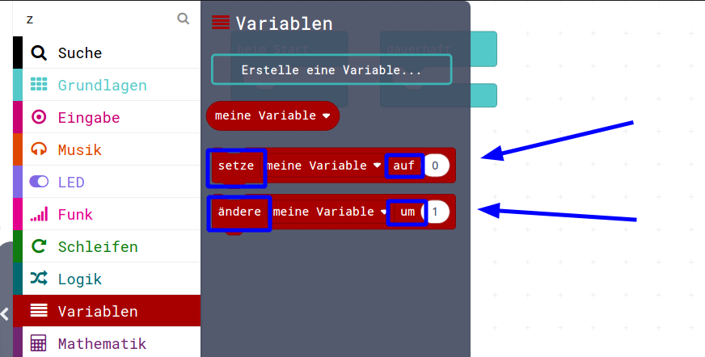{height=50%}

* Der eine ist für die Belegung zum Beispiel beim Starten zuständig, er belegt die Variable mit einem konkreten Wert, er initialisiert die Variable __AUF__ den angegebenen Wert.
* Der andere Befehl nimmt den Wert in der Variable und ändert ihn __UM__ den angegebenen Wert, er führt also eine Berechnung mit dem Wert durch. Diesen Befehl brauchen wir beim Drücken der Tasten.


## JavaScript-Code

Finales Taschenrechner-Programm.   

<details>
 <summary>Java-Script-Code</summary>

```js
input.onButtonPressed(Button.A, function () {
    Linke_Hand += 1
})
input.onButtonPressed(Button.AB, function () {
    Linke_Hand = 0
    rechte_hand = 0
})
input.onButtonPressed(Button.B, function () {
    rechte_hand += 1
})
let Linke_Hand = 0
let rechte_hand = 0
rechte_hand = 0
Linke_Hand = 0
basic.forever(function () {
    basic.showNumber(Linke_Hand)
    basic.showString("+")
    basic.showNumber(rechte_hand)
    basic.showString("=")
    basic.showNumber(Linke_Hand + rechte_hand)
    basic.pause(1000)
    basic.clearScreen()
    basic.pause(1000)
})

```
</details>

## Download Hex-Code

[Hex-code](code/mini-Taschenrechner.hex)

