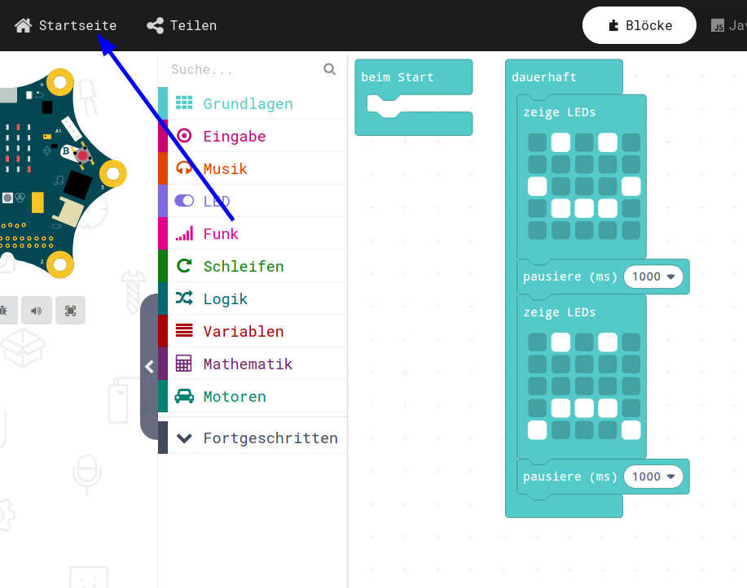
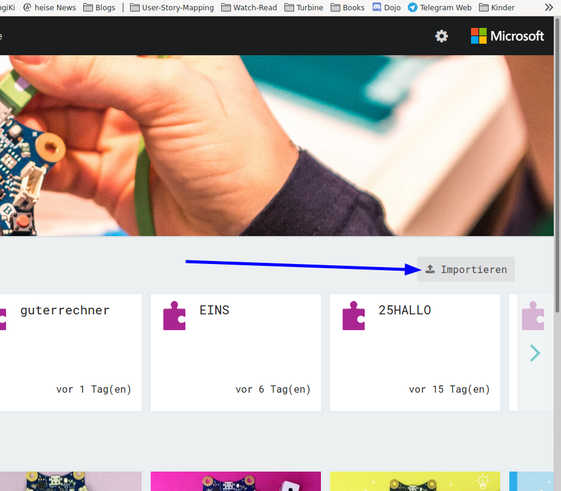
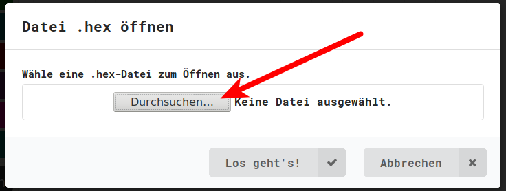
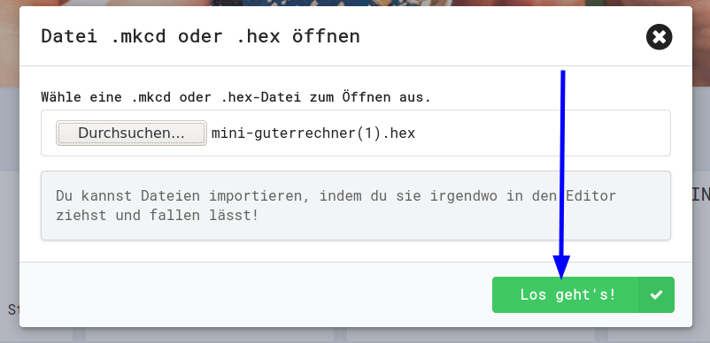

## HEX-Files in Simulator

* Die HEX-Files, die man im Simulator runterlädt um sie in den Calliope zu programmieren, können anstatt dessen auch wieder in den Simulator geladen werden um dort weiter bearbeitet zu werden.
* Das wollen wir nun mal ausprobieren.

## Projekte 

{height=70%}

## Importieren

{height=50%}

## Durchsuchen

{height=40%}

## Durchsuchen

Das alte Programm (HEX-Datei) suchen und anklicken.
{height=70%}

## Laden

{height=40%}

## Altes Programm ist geladen

{height=70%}

(Dieses Programm haben wir noch nicht programmiert, aber es geht hier ja ums Prinzip)

## Navigation

* [Zurück](../01_08_TastenEingabe/index.html)  
* [Hoch zur Übersicht](../index.html)  

## Lizenz/Copyright-Info
Für alle Bilder auf dieser Seite gilt:

*  Autor: Jörg Künstner
* Lizenz: CC BY-SA 4.0

