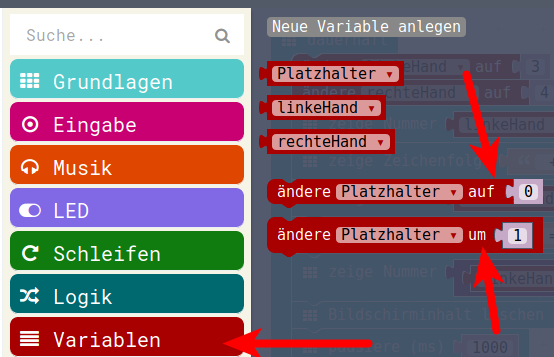

# Der Zähler 

## Bisher gelernt (1)

Bis jetzt haben wir gelernt:

* Zeichenketten (Texte) auf den LEDs als Laufschrift anzeigen 
* Zahlen auf den LEDs anzeigen 
* Erster Umgang mit Platzhaltern/Variablen
* Einfache Berechnung (+)
* Ausführen von Programm-Teilen einmalig beim Start
* Ausführen von Programm-Teilen immer
* Reaktion auf Tasten-Drücke : __Knopf A__ und __Knopf B__

## Bisher gelernt (2)

Damit sollten wir eigentlich nun in der Lage sein, einen sehr einfaches Zählprogramm zu bauen.
Es soll: 

* Beim Start: einen Platzhalter (z.B. mit Namen __Zaehler__) mit 0 belegen
* Beim Drücken der linken Taste (__Knopf A__): vom  __Zaehler__ eine 1 abziehen
* Beim Drücken der rechten Taste (__Knopf B__): den __Zaehler__ um 1 erhöhen
* Dauerhaft: Den Wert der Variablen  __Zaehler__ anzeigen  

## Erweitern des Programms 

Wir können nun unsere "Gesichter" nach links in den Mülleimer ziehen.

Dann aktivieren wir wieder die ausgegrauten Teile von davor, indem wir sie wieder in Ihre ursprünglichen Starter einziehen:

{height=50%}

Die restliche Programm-Logik ist oben beschrieben und wurde schon vorher gezeigt,  darum an dieser Stelle nur noch ein/zwei Hinweise und dann eine "Musterlösung".

## Platzhalter/Variablen , Achtung

__Hinweis 1:__ Bei den Variablen befinden sich zwei sehr ähnlich klingende Befehle:
{height=50%}

* Der eine ist die Zuweisung an eine Variable, wie wir es schon gesehen haben.
  Er belegt die Variable mit einem konkreten Wert, er initialisiert die Variable __AUF__ den angegebenen Wert.
* Der andere Befehl nimmt den Wert in der Variable und ändert ihn __UM__ den angegebenen Wert, er führt also eine Berechnung mit dem Wert durch. Diesen Befehl können wir zum Beispiel beim Drücken der rechten Taste benutzen.

## Platzhalter/Variablen minus 1

**Hinweis 2:** Man kann einen Platzhalter um eins verringern durch folgende Rechnung:
Platzhalter = Platzhalter - 1

Das ist eine "normale" mathematische Berechnung und findet sich in der Mathematik.

{height=60%}

## "Musterlösung"

Eine mögliche "Musterlösung" mit Benutzung von 2 verschiedenen Möglichkeiten für die linke und die rechte Taste ist hier

{height=70%}

## Lizenz/Copyright-Info
Für alle Texte und Bilder auf diesen Folien gilt:

* Autor: Jörg Künstner
* Lizenz: CC BY-SA 4.0

