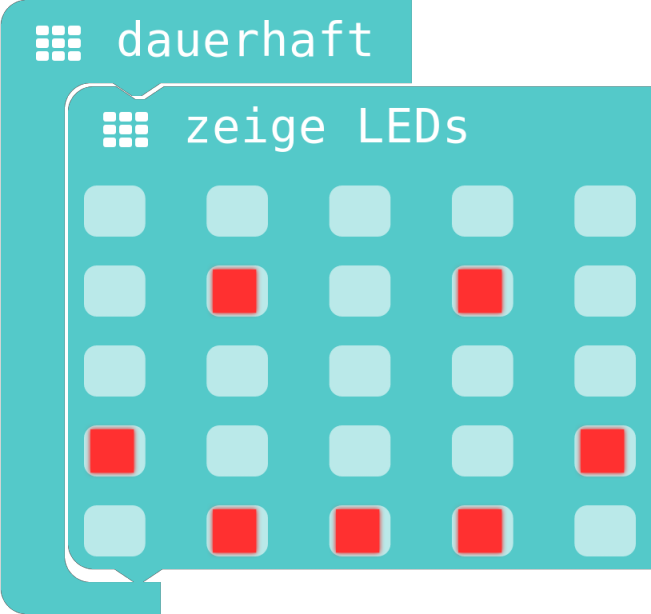
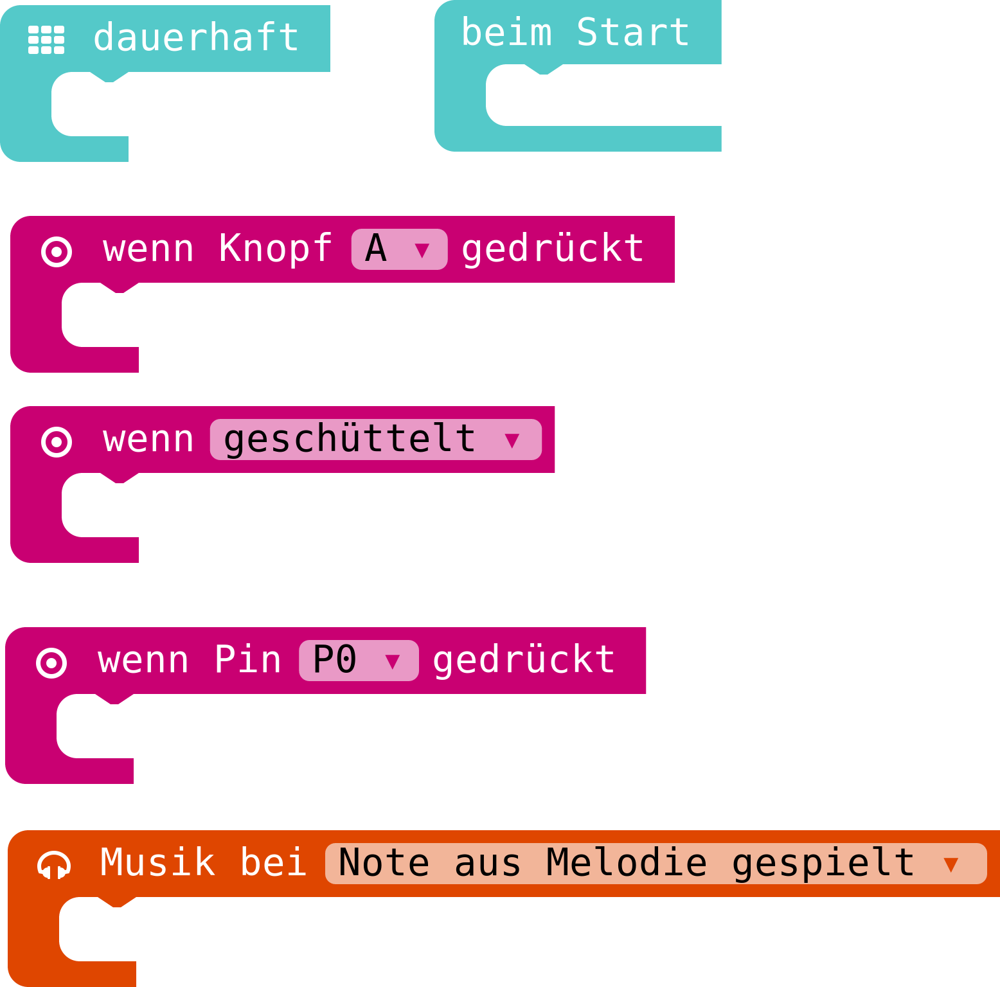
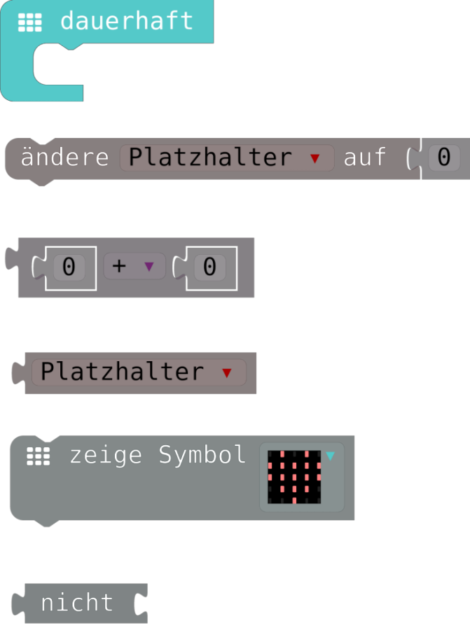
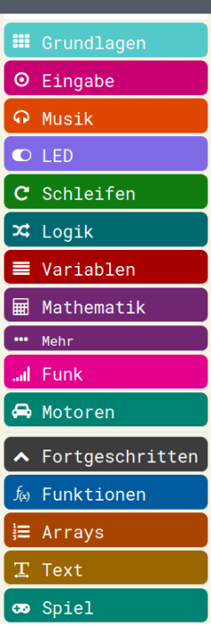
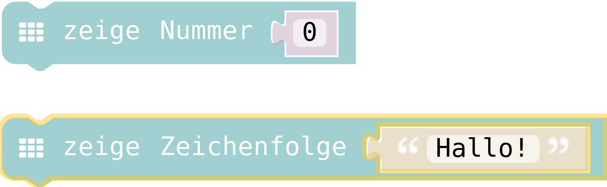
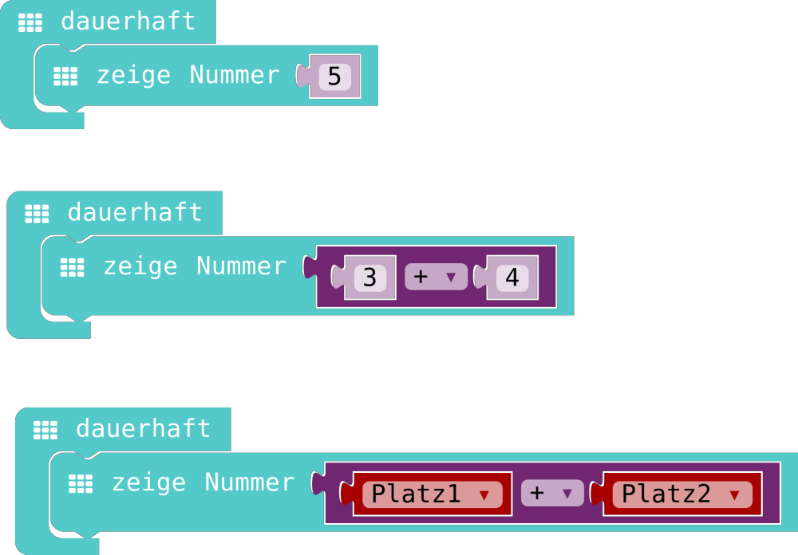
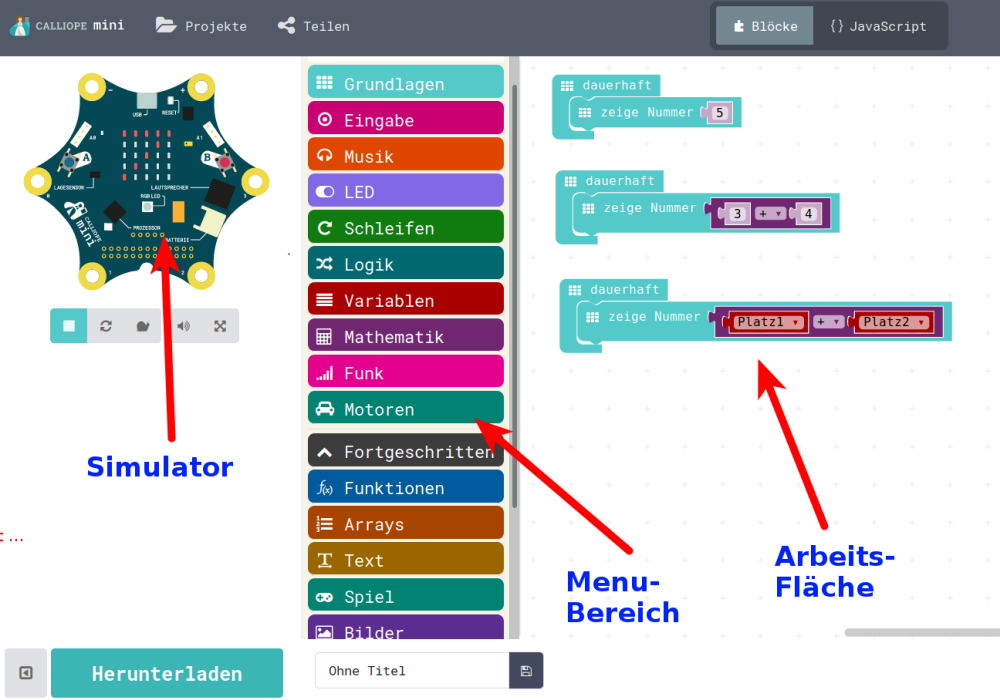
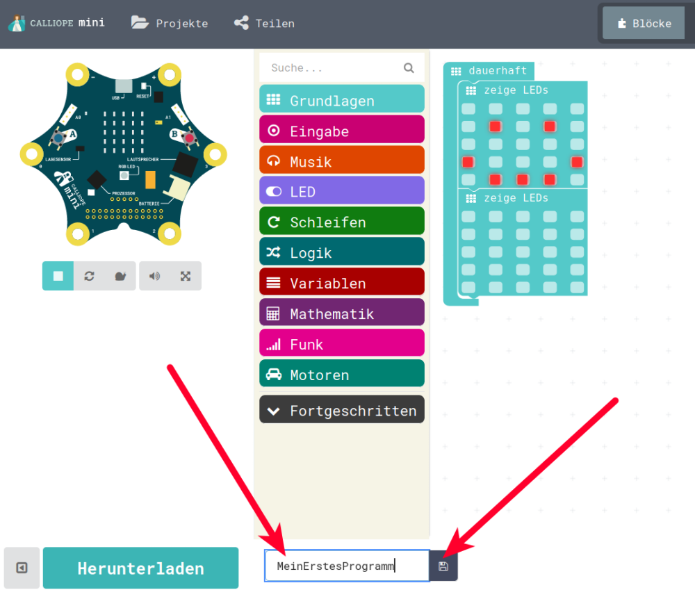
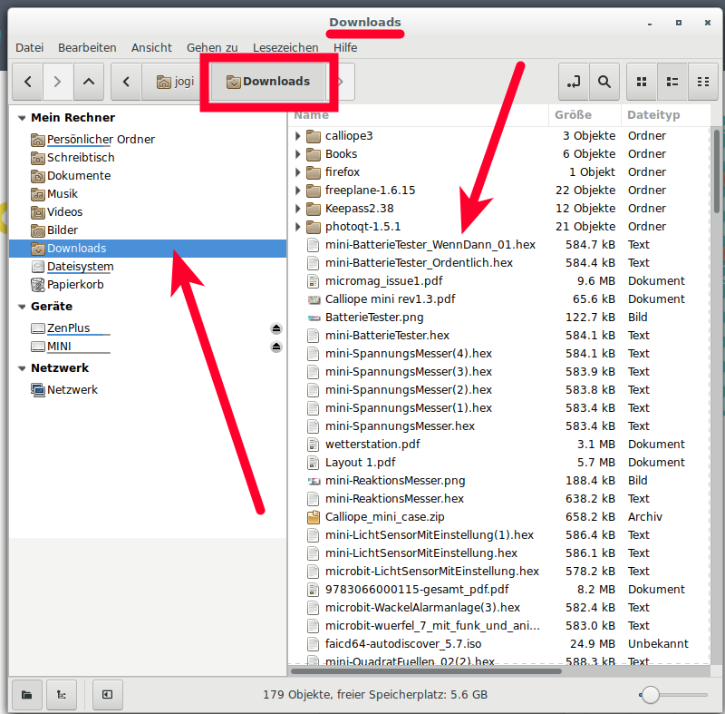

# Wiederholung / Auffrischen 

## Die Endlosschleife 

Die Endlos-Schleife, wird wie Ihr Name auch schon sagt, dauerhaft oder endlos ausgeführt. 

{height=40%}

Sie ist normalerweise das Programm-Teil, in dem man das Programm komplett einhängt. 
__Aber Achtung:__
Wenn am Anfang der Endlosschleife z.B. Zahlen festgelegt werden und diese Zahlen sich weiter unten im Programm ändern, dann werden diese Zahlen beim nächsten Ausführen der Schleife wieder überschrieben. 

## "Ausgegraut"

* Blöcke die nicht funktionieren, weil sie in keiner "Ausführ-Klammer" eingeklickt sind,  sind "ausgegraut ".  
* Sie werden nicht ausgeführt.
* Sobald ein Block in einer "Ausführklammer" eingeklickt ist, erhält er seine normale Farbe und wird dann auch ausgeführt.

{height=50%}

 
## Andere Startmöglichkeiten (1)

Neben der Endlos/Dauerhaft-Schleife gibt es noch einige andere Möglichkeiten, Programm-Blöcke zu starten/ausgeführen.

__Gemeinsamkeit__ :

* Alle sind als "Klammern" dargestellt, sie umklammern die Programm-Blöcke die ausgeführt werden.  
* Aber Achtung: Nur bei der Dauerhaft-Endlos-Schleifen-Klammer, werden die Programm-Teile dauerhaft ausgeführt.  
* Bei allen anderen Start-Möglichkeiten, werden die Programmblöcke nur einmal ausgeführt.

## Andere Startmöglichkeiten (2)

{height=70%}

## Puzzleteile: Nicht alles passt

\colA{6cm}

* Wenn man sich die Programm-Blöcke etwas genauer anschaut, 
* dann sehen die ein bisschen aus wie Puzzleteile. 
* Das ist Absicht und soll zeigen, 
* dass nicht alle Programm-Blöcke an allen Stellen "eingeklickt" werden können.

\colB{6cm}

{height=80%}
 
\colEnd

## Arbeitsbereich : Menu

\colA{8cm}

* In der Mitte des Bildschirms ist das Menu.
* Von dort schiebt man sich die Blöcke nach rechts auf den Arbeitsbereich.
* Im Menu gibt es unterschiedliche Kategorien, diese sind unterschiedlich gekennzeichnet.
* Die Programm-Blöcke in diesen Menus haben auch immer die Farbe der jeweiligen Kategorie. 

\colB{4cm}

{height=80%}

\colEnd

## Zeichenfolgen <=> Zahlen

* Beim Ausgeben auf unserem Mini-Bildschirm können wir unterscheiden zwischen Zeichenfolgen und Zahlen.  
* Mit Zeichenfolgen kann man Buchstaben, Wörter oder auch ganze Sätze ausgeben. 
* Man kann auch einzelne Zahlen ausgeben
* Grosser Unterschied:
     * Mit den Zahlen kann man rechnen
     * Mit den Zeichenfolgen kann man nicht rechnen

{height=30%}

## Zahlen = Mathematik

     
Die Rechnungen, die wir benutzen ( Addition und Subtraktion) befinden sich alle unter :   
__Mathematik__ 

{height=50%}

Die Art der Rechnung kann man im Nachhinein auch immernoch durch Klick in das Dreieck ändern!

## Platzhalter (1)

* Erste Rechnungen (aus der Mathematik) mit festen Werten.
* Die verwendeten Zahlen sind dabei festgelegt:  __fest__ , __konstant__.
* d.h. Wenn das Programm etwas anderes berechnen soll, dann muss ein neues Programm geschrieben werden.
* da das Übersetzen "nebendran" erfolgt, fällt das gar nicht so auf. 
* Wenn das Programm aber jeweils auf den Calliope übertragen werden soll, merkt man das
* Man kann den Calliope dann auch nur mit __EINEM__ Programm, mit einer Berechnung mitnehmen.
* Vergleich : Taschenrechner, der nur eine Berechnung kann, für jede andere Berechnung muss man einen neuen kaufen...

## Platzhalter (2)

* __Platzhalter__ lösen dieses Problem.
* Sie können unterschiedliche Werte annehmen
* Sie sind damit __veränderbar__
* Veränderbar = __variabel__
* => Platzhalter = __Variable__

## Platzhalter (3)

{height=70%}

## Die Entwicklungs-Umgebung  
 

* Unterscheidung __Simulation__ und echter Calliope
* Der simulierte Calliope ist links in der Entwicklungs-Umgebung
* Bei Download des Programms (als Hex-Datei) wird diese - wie eine Datei aus dem Internet - im __Downloads-Ordner__ gespeichert 
* Der Calliope ist wie ein USB-Stick
* Beim Anstecken wird ein Datei-Explorer geöffnet
* Dann kann man die Datei, das HEX-Programm, vom Download-Ordner in den Calliope kopieren. 

## Der Arbeits-Bereich 

{height=70%}

## Speichern und Übertragen auf Calliope (1)

* Das erstellte Programm läuft automatisch im Simulator.
* Soll es im echten Calliope laufen, muss es zuerst heruntergeladen werden
* So wie Filme/Bilder/Texte etc die im Browser aus dem Internet herunter geladen werden, landet auch die __HEX__-Datei im Verzeichnis __Downloads__
* Beim Anstecken des Calliope wird dieser vom Computer wie ein USB-Stick behandelt, er taucht wie ein USB-Stick im Datei-Explorer auf
* Um das erstellte Programm auf den Calliope zu bringen, um dort ausgeführt zu werden, muss die HEX-Datei vom Download-Verzeichnis auf dem Computer auf den "USB-Stick" namens __MINI__ kopiert werden. 

## Speichern und Übertragen auf Calliope (2)

{height=70%}

## Speichern und Übertragen auf Calliope (3)

{height=70%}

## Speichern und Übertragen auf Calliope (4)

{height=70%}

## Lizenz/Copyright-Info
Für alle Texte und Bilder auf dieser Seite/Folien gilt:

* Autor: Jörg Künstner
* Lizenz: CC BY-SA 4.0
