##  Beim Start

\colA{6cm}

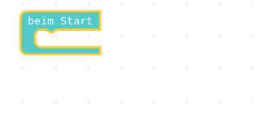{height=90%}

\colB{6cm}

__Beim Start__

\colEnd

##  Zeige Zeichenfolge

\colA{6cm}

{height=90%}

\colB{6cm}

__Zeige Zeichenfolge__

\colEnd

##  Speichern unter

\colA{6cm}

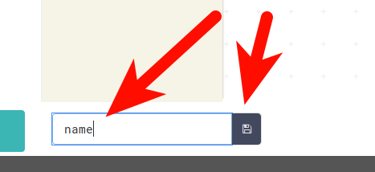{height=90%}

\colB{6cm}

__Speichern unter__

\colEnd

##  Safe File 

\colA{6cm}

{height=90%}

\colB{6cm}

__Safe File __

\colEnd

##  Dateimanager

\colA{6cm}

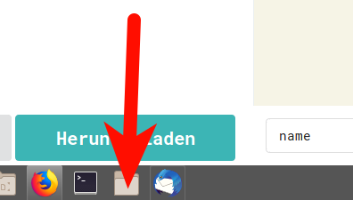{height=90%}

\colB{6cm}

__Dateimanager __

\colEnd

##  Downloads Verzeichnis

\colA{6cm}

{height=90%}

\colB{6cm}

__Verzeichnis Downloads__

\colEnd

##  Dauerhaft

\colA{6cm}

{height=90%}

\colB{6cm}

* Aus dem __Grundlagen__- Menu 
* Holen wir uns einen __Dauerhaft__-Start-Block
* und holen uns dazu ein __zeige Zeichenfolge__ 
* und schreiben einen zweiten Text, z.B. __"turbine "__ rein

\colEnd

##  Speichern Turbine

\colA{6cm}

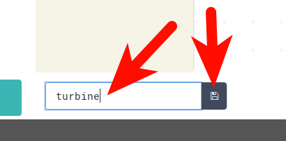{height=90%}

\colB{6cm}

* Wir __Speichern__ das Programm unter dem Namen  __Turbine__
* und __laden__ es in den __Calliope__

\colEnd

##  Knopf A 

\colA{6cm}

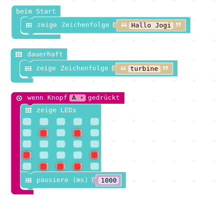{height=90%}

\colB{6cm}

__Knopf A : Zeige LEDs__

\colEnd

##  Speichern Knopf A

\colA{6cm}

{height=90%}

\colB{6cm}

* __Speichern__ des Programms als  __KnopfA__
* und in den __Calliope laden__

\colEnd

##  Knopf B 

\colA{6cm}

{height=90%}

\colB{6cm}

__Knopf B : Zeige LEDs__

\colEnd

##  Speichern Knopf B

\colA{6cm}

{height=90%}

\colB{6cm}

* __Speichern__ des Programms als __KnopfB__
* Und in den __Calliope laden__

\colEnd

##  Aufräumen : Mülleimer

\colA{6cm}

{height=90%}

\colB{6cm}

* da wir __ALLES__ gesichert haben
* und wissen wie wir das wieder herstellen können
* (Siehe Tag 1 __Kapitel 11__)
* Können wir das __ALLES__
* in den __Mülleimer__ ziehen 

\colEnd

##  Dauerhaft-Schleife

\colA{6cm}

{height=90%}

\colB{6cm}

* Aus dem Menu __Grundlagen__
* Holen eines __Dauerhaft__ - Start-Blocks

\colEnd

##  Dauerhaft

\colA{6cm}

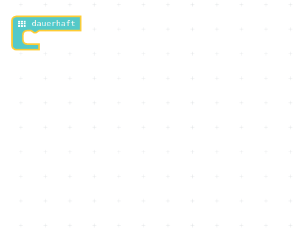{height=90%}

\colB{6cm}

* __Dauerhaft__ auf dem leeren Arbeitsbereich

\colEnd

##  Zeige Nummer 

\colA{6cm}

{height=90%}

\colB{6cm}

__Zeige Nummer__

\colEnd

##  Variablen anlegen

\colA{6cm}

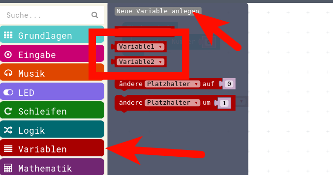{height=90%}

\colB{6cm}

__Variablen anlegen__

\colEnd

##  Variable in Arbeitsbereich

\colA{6cm}

{height=90%}

\colB{6cm}

__Variable in Arbeitsbereich__

\colEnd

## Variable in Start-Block

\colA{6cm}

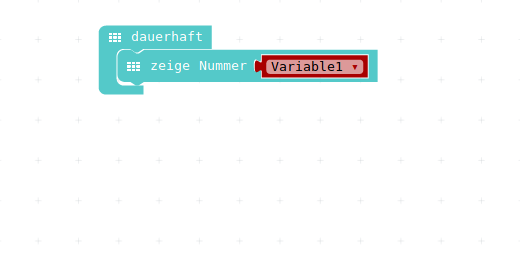{height=90%}

\colB{6cm}

__Variable in StartBlock__

\colEnd

##  Speichern als Variable1

\colA{6cm}

{height=90%}

\colB{6cm}

__Speichern Variable 1__

\colEnd

## Zeichenfolge 

\colA{6cm}

{height=90%}

\colB{6cm}

__zeige Zeichenfolge aus Menu__

\colEnd

## + - Zeichen 

\colA{6cm}

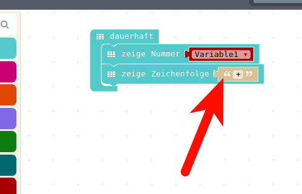{height=90%}

\colB{6cm}

__+ Zeichen machen__

\colEnd

## Duplizieren rechte Maustaste

\colA{6cm}

{height=90%}

\colB{6cm}

__Duplizieren rechte Maustaste__

\colEnd

##  Variable umbenennen "Dreieck"

\colA{6cm}

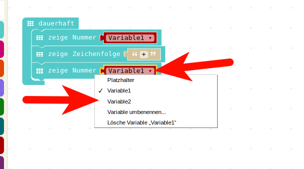{height=90%}

\colB{6cm}

__Variable umbenennen mit Dreieck rechts des Variablen-Namens__

\colEnd

## "pausiere ms" holen  

\colA{6cm}

{height=90%}

\colB{6cm}

* __pausiere ms__ holen und auf den __Arbeitsplatz__ legen
* Wert auf __500 ms__ ändern

\colEnd

##  Zeichenfolge = 

\colA{6cm}

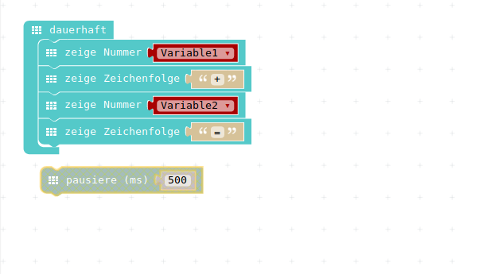{height=90%}

\colB{6cm}

* __Zeichenfolge__ entweder aus obigem "+" kopieren
* oder aus Menu __Grundlagen__ holen
* Auf __Gleichheits-Zeichen__ "=" abändern
* unten __einklicken.__

\colEnd

##  "pausiere ms" 4 mal Duplizieren 

\colA{6cm}

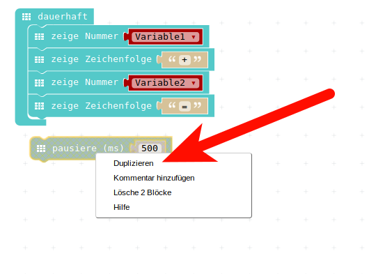{height=90%}

\colB{6cm}

* Mit __rechter Maustaste__ auf "__pausiere ms 500__"

* __4 mal kopieren__

\colEnd

##  4 mal kopiert

\colA{6cm}

{height=90%}

\colB{6cm}

* __Pausieren__ ist 4 mal __kopiert__

\colEnd

## 4 mal eingefügt

\colA{6cm}

{height=90%}

\colB{6cm}

* __Pausieren__ ist 4 mal __eingefügt__

\colEnd

##  Addition holen aus Mathematik 

\colA{6cm}

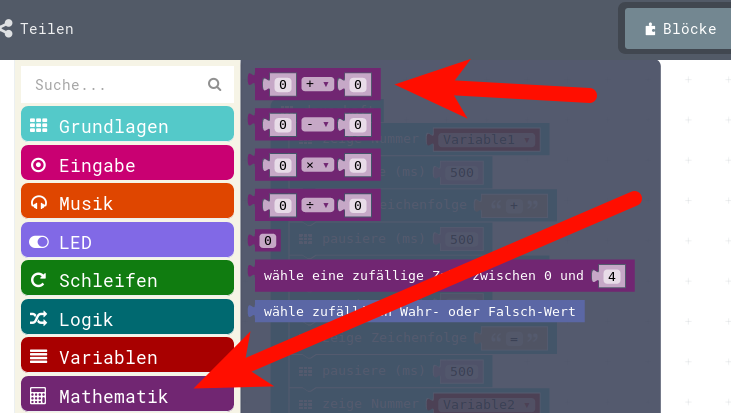{height=90%}

\colB{6cm}

* Aus dem Menu __Mathematik__
* Holen einer __Addition__

\colEnd

## Addition auf Arbeitsbereich

\colA{6cm}

{height=90%}

\colB{6cm}

* __Addition__ liegt auf dem Arbeitsbereich

\colEnd

## Zeige Nummer (Grundlagen-Menu)

\colA{6cm}

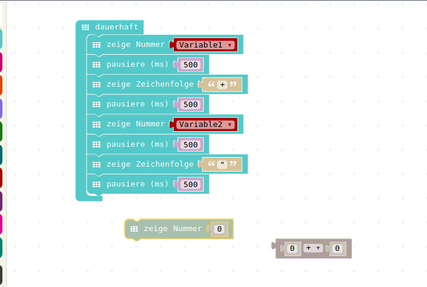{height=90%}

\colB{6cm}

* __Zeige Nummer__ aus dem __Grundlagen__-Menu holen 
* und auf Arbeitsbereich legen

\colEnd

## Zwei Variablen anlegen 

\colA{6cm}

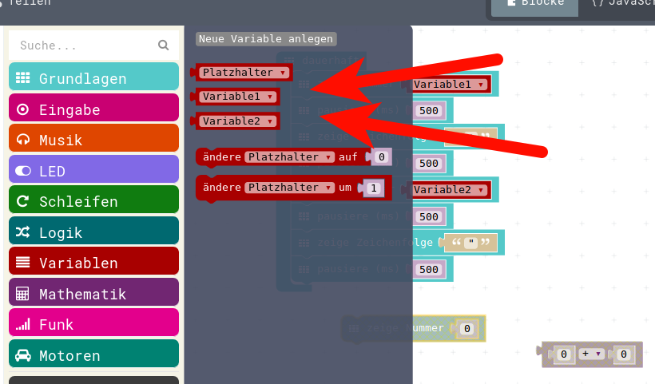{height=90%}

\colB{6cm}

* Im Menu __Variablen__ zwei Variablen : 
* __Variable1__ und 
* __Variable2__ anlegen

\colEnd

## Variablen im Arbeitsbereich

\colA{6cm}

{height=90%}

\colB{6cm}

* Beide __Variablen__ 
* sind in den __Arbeitsbereich__ gezogen

\colEnd

## Variablen in die Addition eingezogen

\colA{6cm}

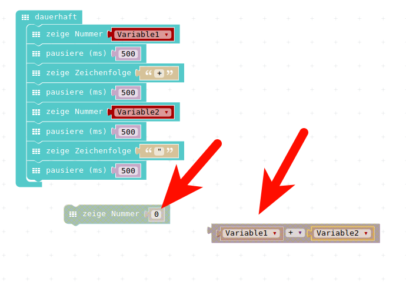{height=90%}

\colB{6cm}

* Beide __Variablen__ 
* wurden in die __Addition__ reingezogen

\colEnd

## Addition in "Zeige Nummer"

\colA{6cm}

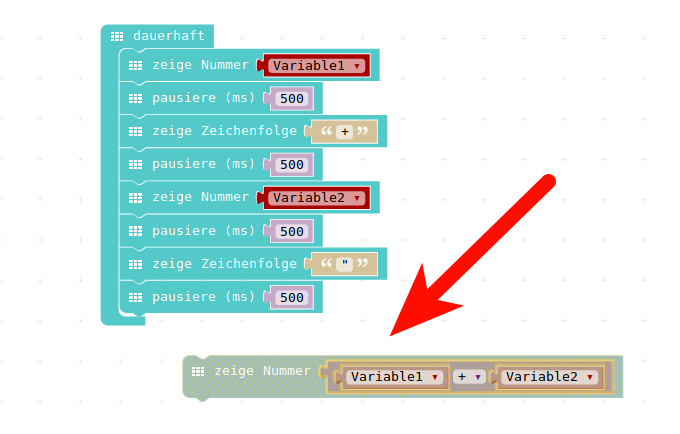{height=90%}

\colB{6cm}

* __Addition__ mitsamt den __Variablen__ 
* wurde in __Zeige Nummer__ eingeklickt

\colEnd

## Zeige Nummer angehängt

\colA{6cm}

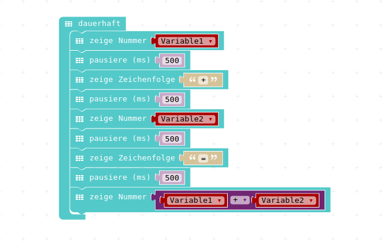{height=90%}

\colB{6cm}

* __"Zeige Nummer"__ 
* wurde unten angehängt

\colEnd

##  Bildschirminhalt löschen

\colA{6cm}

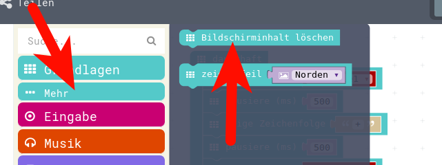{height=90%}

\colB{6cm}

* Aus dem Menu __Grundlagen -> Mehr__
* den Befehl __Bildschirminhalt löschen__ holen
- und noch zweimal "__pausiere ms__" darum

\colEnd

##  Addition Teil 1 fertig

\colA{6cm}

{height=90%}

\colB{6cm}

* unser Rechner __Addition Teil 1__ ist fertig

\colEnd

##  Speichern als Addition

\colA{6cm}

{height=90%}

\colB{6cm}

* Speichern als __Addition__

\colEnd

##  Beim Start Variablen belegen

\colA{6cm}

{height=90%}

\colB{6cm}

* Aus dem __Grundlagen__-Menu : 
* __Beim Start__ holen
* Aus dem Menu __Variablen__ : 
* __Ändere Platzhalter auf 0__ holen

\colEnd

##  Variablen ändern 

\colA{6cm}

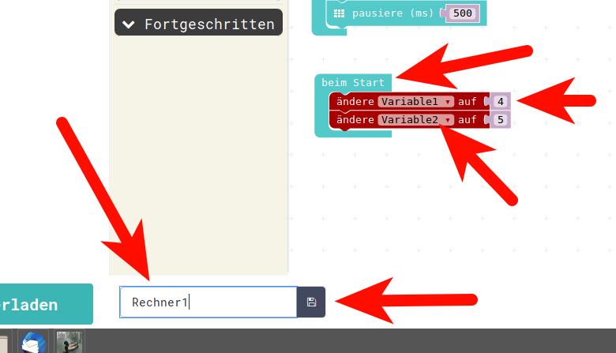{height=90%}

\colB{6cm}

* Variablen-Namen auswählen auf __Variable1__ und __Variable2__
* (Klick auf das __Dreieck__ neben dem Namen der Variable)
* __Werte__ auf __4__ und __5__ ändern
* Programm unter dem Namen __Rechner1__ abspeichern
* Programm in den __Calliope laden__

\colEnd

##  Knopf A gedrückt

\colA{6cm}

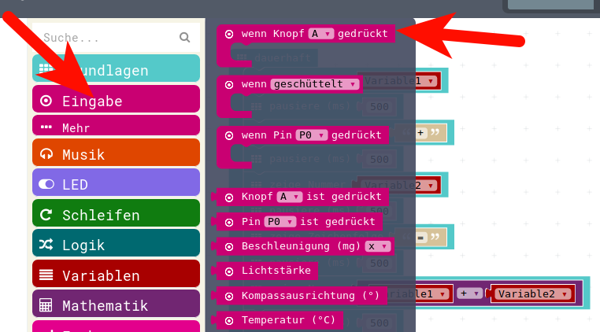{height=90%}

\colB{6cm}

* Aus dem Menu __Eingabe__
* zweimal __wenn Knopf A gedrückt__ 
* auf die __Arbeitsfläche__ holen 

\colEnd

##  Auf Knopf B ändern

\colA{6cm}

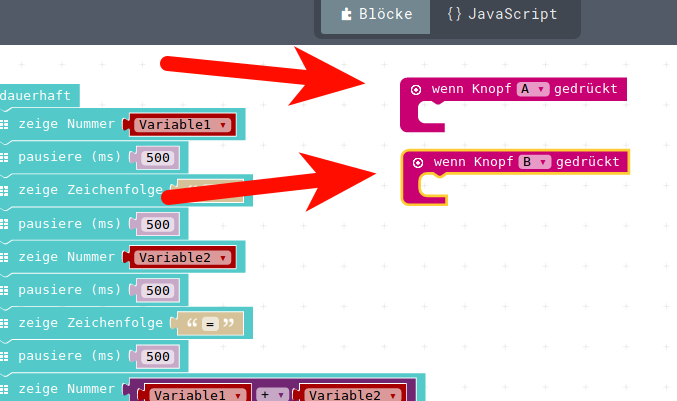{height=90%}

\colB{6cm}

* Den einen Befehl auf:
* __Wenn Knopf B gedrückt__ ändern

\colEnd

##  Ändere Platzhalter UM

\colA{6cm}

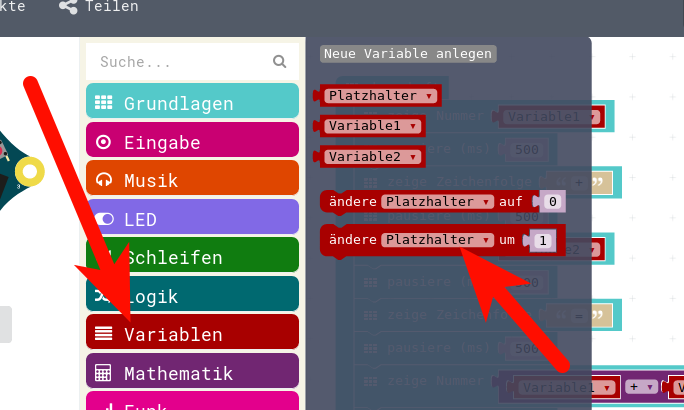{height=90%}

\colB{6cm}

* Aus dem Menu __Variablen__
* 2 mal den Befehl :
* __ändere Platzhalter um 1__ 
* holen und in die beiden 
* __Knopf-Blöcke__ einrasten

\colEnd

##  Ändere Platzhalter um  

\colA{6cm}

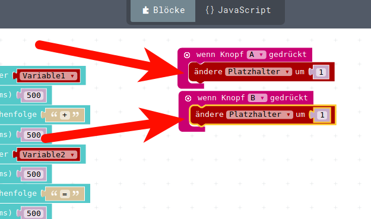{height=90%}

\colB{6cm}

* __Ändere Platzhalter um 1__ 
* in den beiden __Knopf gedrückt__ - Blöcken

\colEnd

##  Variablen verwenden

\colA{6cm}

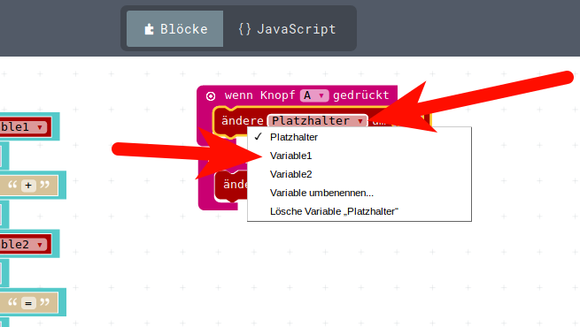{height=90%}

\colB{6cm}

* Mittels Klick auf das __Dreieck__ neben dem Variablen-Namen
* die beiden richtigen Variablen :
* __Variable1__ und __Variable2__ auswählen 

\colEnd

##  Beim Start auf 0

\colA{6cm}

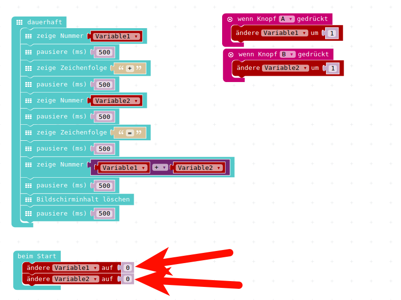{height=90%}

\colB{6cm}

* in __Beim Start__
* die beiden __Variablen__ auf __0__ setzen

\colEnd

##  Rechner 2

\colA{6cm}

{height=90%}

\colB{6cm}

* Das Programm als __Rechner2__ abspeichern
* und in den __Calliope laden__

\colEnd

##  Wenn geschüttelt

\colA{6cm}

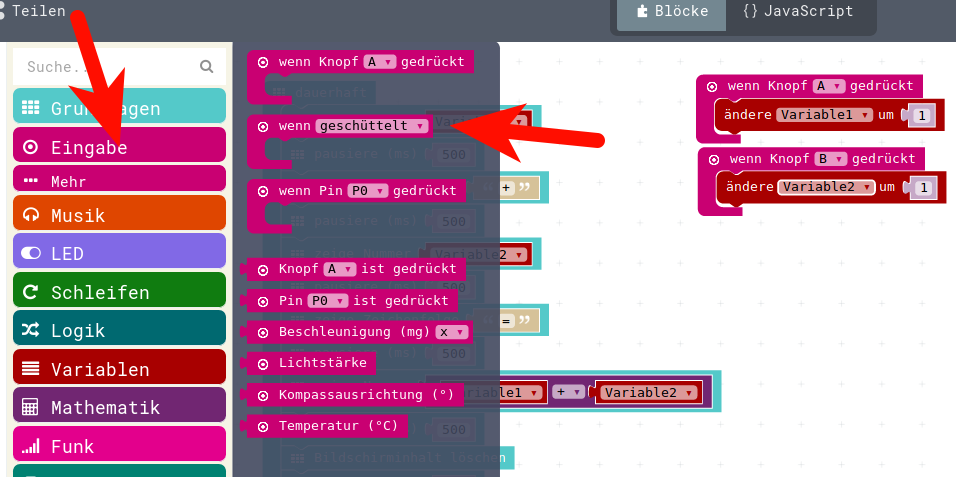{height=90%}

\colB{6cm}

* Aus dem Menu __Eingabe__
* holen wir uns  __wenn geschüttelt__ 
* in den Arbeitsbereich

\colEnd

##  Kopieren auf 0-Setzen

\colA{6cm}

{height=90%}

\colB{6cm}

* Aus dem __beim Start__ - Block
* __kopieren__ wir uns die beiden:
* __ändere Variable auf 0__ - Befehle
* und __klicken__ sie in den : 
* __wenn geschüttelt__ - Block

\colEnd

##  Rechner 3

\colA{6cm}

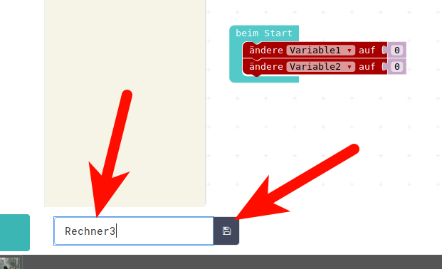{height=90%}

\colB{6cm}

* Wir speichern das Programm :
* Als __Rechner3__
* und laden es in den Calliope

\colEnd

##  Umwandlung in Auf/Ab-Zähler

\colA{6cm}

{height=90%}

\colB{6cm}

* Alles innerhalb des __dauerhaft__ -Startblocks 
* herausziehen

\colEnd

##  Herausgezogen

\colA{6cm}

{height=90%}

\colB{6cm}

* Unten ab __zeige Nummer __
* auch noch wegziehen

\colEnd

##  Oberer Teil : Mülleiemer 

\colA{6cm}

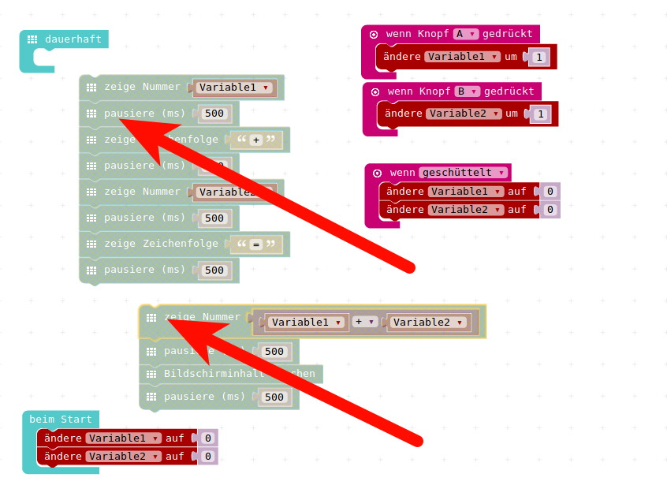{height=90%}

\colB{6cm}

* den ganzen oberen Teil ab
* __zeige Nummer__ bis
* __pausiere ms__ 500 kann direkt in den Müll gezogen werden

\colEnd

##  Oberer Teil : gelöscht

\colA{6cm}

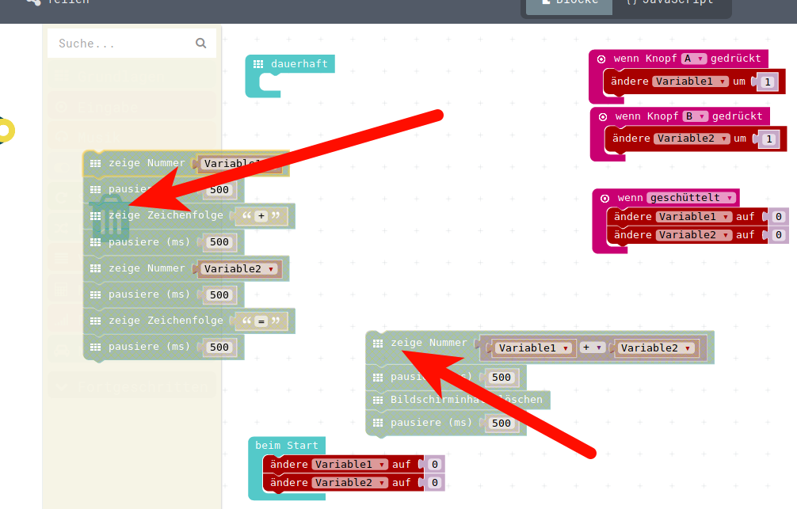{height=90%}

\colB{6cm}

* der ganze obere Teil wurde in den __Mülleimer__ gezogen
* der untere Teile ab __zeige Nummer__ wird wieder
* in den __dauerhaft__ Block eingeklickt

\colEnd

##  Rausziehen Addition

\colA{6cm}

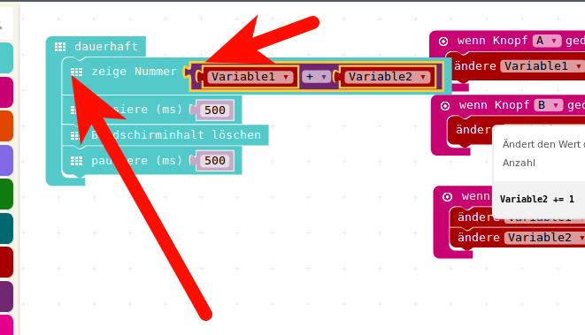{height=90%}

\colB{6cm}

* Nun wird die __Addition__ nochmal rausgezogen

\colEnd

##  Variable zurückschieben

\colA{6cm}

{height=90%}

\colB{6cm}

* Die Variable vorne "nehmen"
* und in __zeige Nummer__ einrasten

\colEnd

##  Variable zurück, Addition : Müll

\colA{6cm}

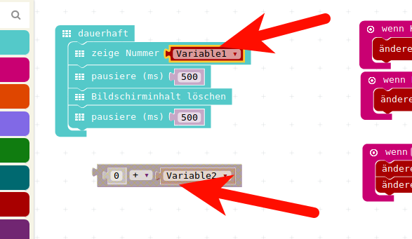{height=90%}

\colB{6cm}

* Die Variable __Variable1__ ist wieder in 
* __zeige Nummer__
* Die __Addition__ kann in den Müll

\colEnd

##  Addition im Müll

\colA{6cm}

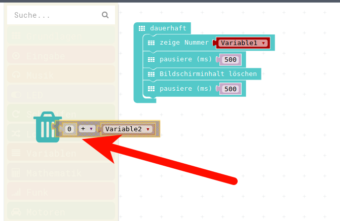{height=90%}

\colB{6cm}

* __Addition__ wird in den __Müll__ geschoben

\colEnd

##  Variablen anpassen/löschen

\colA{6cm}

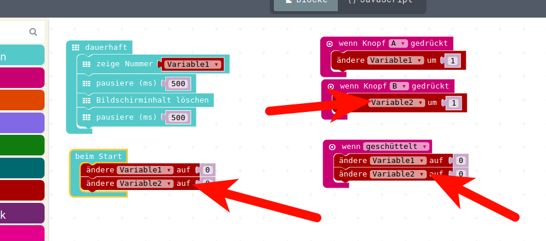{height=90%}

\colB{6cm}

* wir wollen nur noch __Variable1__ haben
* __beim Start__ : den Teil mit Variable2 löschen
* __wenn geschüttelt__ :den Teil mit Variable2 löschen
* __wenn Knopf B__ : Variable auf __Variable1__ ändern

\colEnd

##  Unnötiges löschen

\colA{6cm}

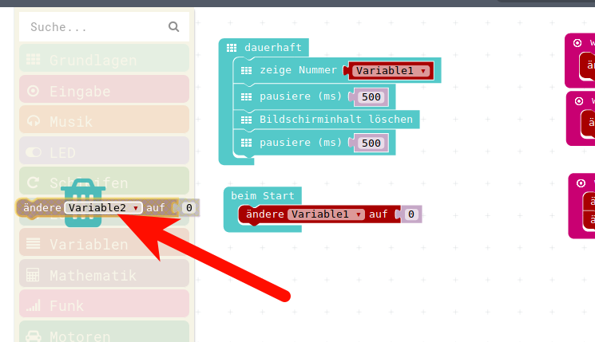{height=90%}

\colB{6cm}

* Alles unnötige kommt in den __Müll__

\colEnd

##  Nur noch Variable 1

\colA{6cm}

{height=90%}

\colB{6cm}

* Nun ist nur noch __Variable1__ benutzt

\colEnd

##  Umbenennen

\colA{6cm}

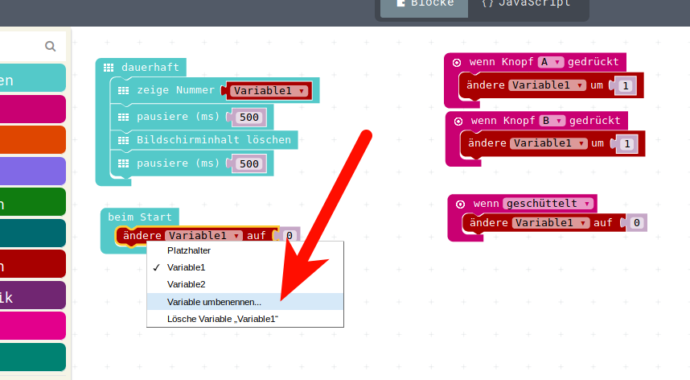{height=90%}

\colB{6cm}

* Durch Klick auf das __Dreieck__
* Kann die Variable __umbenannt__ werden

\colEnd

##  Neuer Namen: Zaehler

\colA{6cm}

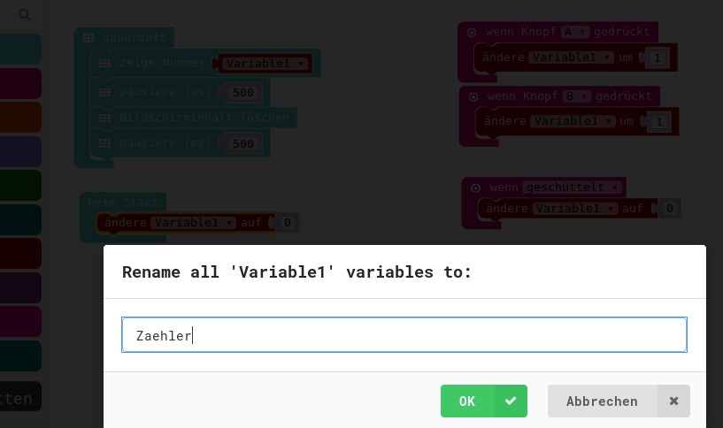{height=90%}

\colB{6cm}

* umbenennen in __Zaehler__

\colEnd

##  Alle Verwendungen umbenannt

\colA{6cm}

{height=90%}

\colB{6cm}

* Durch das Umbenennen sind alle __Variable1__ 
* umbenannt auf __Zaehler__

\colEnd

##  Knopf A : eins abziehen

\colA{6cm}

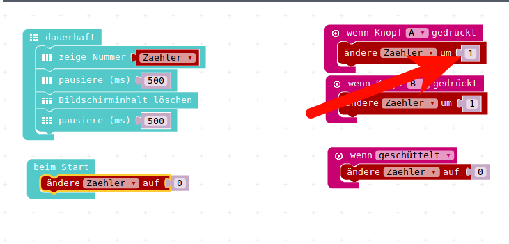{height=90%}

\colB{6cm}

* __ändere Zaehler um -1__

\colEnd

## -1 = eins abziehen

\colA{6cm}

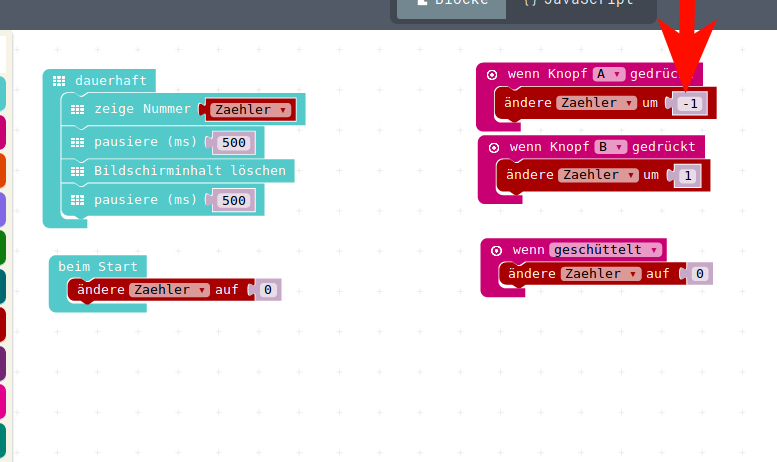{height=90%}

\colB{6cm}

* bei __ändere Zaehler um__
* in das Zahlenfeld eine __-1__ eingeben
* Fertig ist der Auf/Ab-Zähler

\colEnd

##  Speichern

\colA{6cm}

{height=90%}

\colB{6cm}

* Speichern als __Zaehler__
* vom Download-Ordner auf den __Calliope__ programmieren

\colEnd

