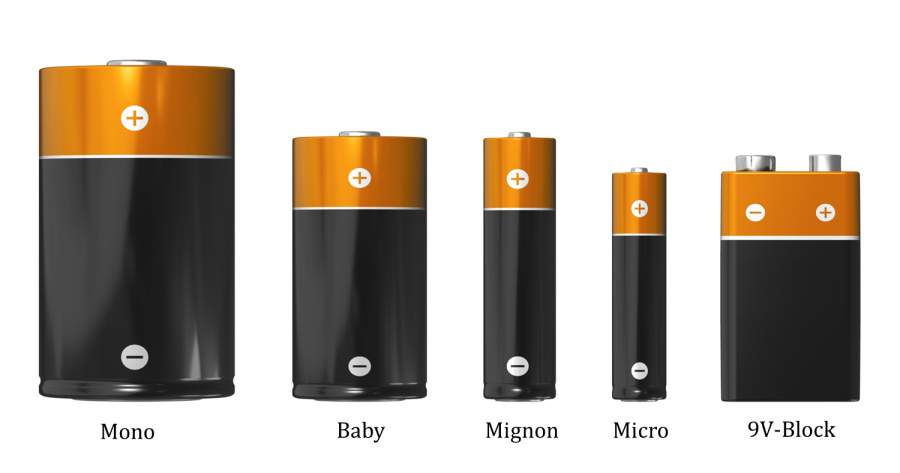

# Elektronik Grundlagen

## Spannungsquelle 

Eine Spannungsquelle die Ihr alle kennt, ist die Steckdose.
  

__ACHTUNG__ : Die Steckdose ist der falsche Weg, um mit Elektronik und Spannung zu experimentieren, warum, da kommen wir gleich noch dazu.

 

Also nehmen wir etwas, das Ihr auch alle kennt, das aber etwas ungefährlicher ist und Ihr vermutlich von Taschenlampen etc kennt: Batterien

Batterien gibt es in unterschiedlichen Ausführungen.

  

Diese Batterien unterscheiden sich jedoch nicht nur in der Grösse und den Bauformen, sie unterscheiden sich auch in den __Spannungen__ , die diese Batterien liefern.
Spannung wird angegeben in __Volt__. 
Das ist die sogenannte __Einheit__.
Vergleiche zum Beispiel : Entfernungen werden in Meter (__m__) oder Kilometer (__km__) angegben, Gewicht wird in Gramm (__g__) oder Kilogramm (__kg__) gemessen bzw. angegeben.
So sagt man die Einheit der Entfernung ist Meter, die Einheit des Gewichts ist Gramm und die Einheit der Spannung ist Volt. 

Die Spannungen von normalen, handelsüblichen Batterien, wie Ihr sie hier seht, reichen von 1.5 Volt bis zu 9 V.

Die Batterie mit 9V liefert damit immerhin schon das 6 fache der kleinsten Batterie!

## Zwei Pole/Anschlüsse

Die Spannungsquellen, die wir anschauen, haben immer zwei Anschlüsse, auch Pole genannt.
Der eine Anschluss wird Plus-Pol genannt (+), der andere Anschluss wird Minus-Pol geannt (-).

Als Schaltbild-Symbol sieht man Batterien oft so:

oder so:
 

oder so:

Der längere Anschluss am Batterie-Symbol ist __immer__ der Plus-Pol.

Normalerweise ist bei Kabeln der  __Plus-Pol__  immer   __ROT__ 
Der  __Minus-Pol__  wird entweder mit  __BLAUEM__  oder  __SCHWARZEM__  Kabel angezeigt.

## Spannung fühlen?
 
 Kann man Spannungen fühlen?
 __JA__ man kann!
 Allerdings sind glücklicherweise die Spannungen mit denen wir arbeiten, so gering, dass wir sie nur mit Tricks fühlen können:
 
 Wer traut sich?
 
 - 1.5 V Batterie mit Hilfskabel oder ähnlichem an die Zunge
 - 4.5 V Batterie mit der Zunge an die Pole
 - 9V Batterie mit der Zunge an die Pole.
 
 WIe man merkt, je grösser die Spannung um so mehr prickelt es.
 
 Was passiert, wenn man grössere Spannungen versucht zu fühlen?
 
 
 
 An der Steckdose sind hierzulande 220 V, das ist fast das 150-fache von unserer 1.5 V Batterie!
 Vergleich: 
 - Ihr versucht eine Packung Mehl auf dem Kopf zu tragen => 1 kg
 - Es setzt sich dieser Mann auf Euren Kopf => 150 kg
 
     
 
 Was passiert, seht Ihr oben bei Globi. Steckdosen sind lebensgefährlich!  
 Darum: __FINGER WEG von der STECKDOSE!__
 
## Vergleich mit Wasser

Beim elektrischen Strom wird oft ein Vergleich mit Wasser gemacht.

- Strom fliesst, Wasser fliesst
- Spannung "fällt ab", Wasser fällt
- usw

Wenn man diesen Vergleich bildlich verwenden will, dann kann man das evt mit Wasserfällen machen.

### Sehr Grosse Spannung

  
  Sehr grosse Spannung!
 
  
 Sehr hoher Wasserfall 
 
 
 Eine typische Freiland Hochspannungs-Leitung hat 110 kV = 110 000 = 110 Tausend Volt.  
 Das ist 500 mal so viel wie in der normalen Steckdose! 
 
 
 
### Grosse Spannung

  
 Grosse Spannung, Steckdose. Zu gefährlich um damit zu experimentieren!
 
  
Ein hoher Wasserfall, da möchte man nicht mit dem Boot runterfallen.

### Niederspannung

 
Das sind Spannungen mit denen wir arbeiten, Niederspannung.  
Das geht für uns von 1,5 V bis maximal 9V oder evt 12V.

Das ist ein kleiner, "handlicher" Wasserfall. 

## Ganz gute Einführung in Strom und Spannung 

Eine ganz gute Einführung in Strom und Spannung gibts in der Sendung mit der Maus

https://www.youtube.com/watch?v=Je22SgH8TCk

## Navigation

* [Zurück ](../02_01_Auffrischen/README.md)
* [Hoch zur Übersicht](../README.md)  
* [Weiter ](../02_03_Elektronik_Verbraucher/README.md)

