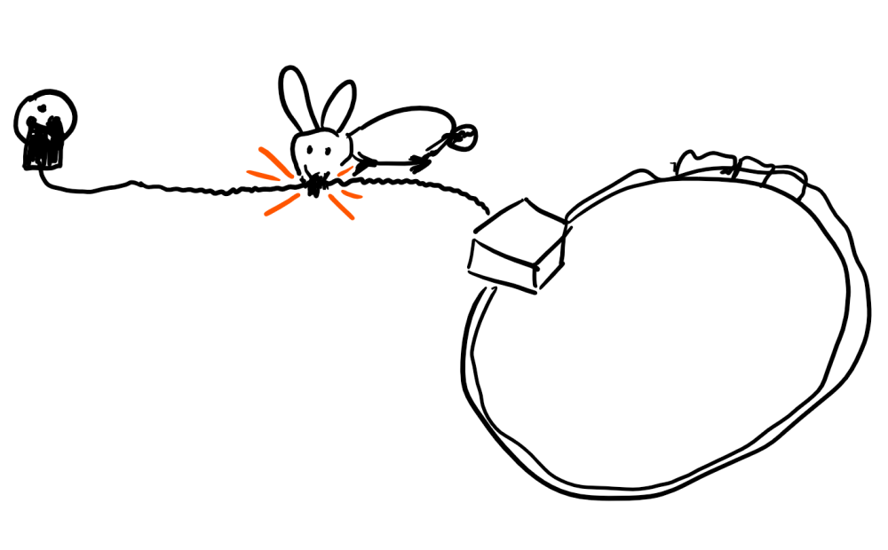
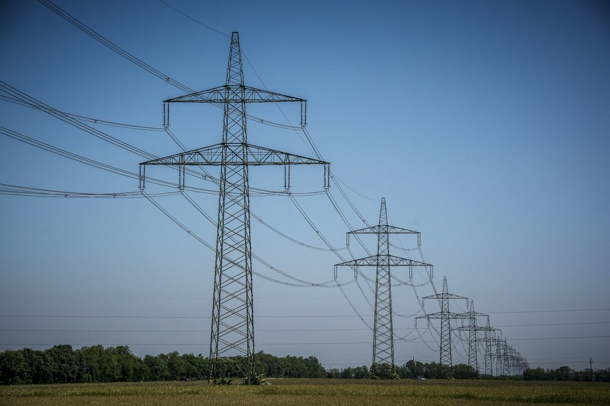
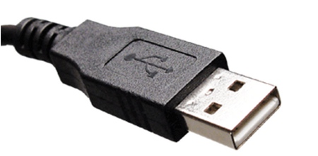

# Elektronik Grundlagen

## Spannungsquelle (1a) 

Eine Spannungsquelle die Ihr alle kennt, ist die Steckdose.

{height=55%} 

## Spannungsquelle (1b) 

{height=55%} 

__ACHTUNG__ : Die Steckdose ist der falsche Weg, um mit Elektronik und Spannung zu experimentieren!

Die Gründe dafür sehen wir gleich.

## Spannungsquelle (2) 

Also nehmen wir etwas, das Ihr auch alle kennt, das aber etwas ungefährlicher ist und Ihr vermutlich von Taschenlampen etc kennt: __Batterien__

Batterien gibt es in unterschiedlichen Ausführungen.

{height=60%}

## Spannungsquelle (3) 

Diese Batterien unterscheiden sich jedoch nicht nur in der Grösse und den Bauformen, sie unterscheiden sich auch in den __Spannungen__ , die diese Batterien liefern.

* Spannung wird angegeben in __Volt__ . 
* Das ist die sogenannte __Einheit__ .

Vergleiche zum Beispiel : 

* Entfernungen werden in Meter (__m__) oder Kilometer (__km__) angegeben, 
* Gewicht wird in Gramm (__g__) oder Kilogramm (__kg__) gemessen bzw. angegeben.

So sagt man : 

* die Einheit der Entfernung ist Meter,   
* die Einheit des Gewichts ist Gramm 
* die Einheit der Spannung ist Volt. 

## Spannungsquelle (4) 

{height=40%}

Die Spannungen von normalen, handelsüblichen Batterien, wie Ihr sie hier seht, reichen von 1.5 Volt bis zu 9 V, eine davon hat sogar 12 V!

Die Batterie mit 9V liefert damit immerhin schon das 6 fache der kleinsten Batterie, die Batterie mit 12 V sogar das 8-fache!!

## Zwei Pole/Anschlüsse

Die Spannungsquellen, die wir anschauen, haben immer zwei Anschlüsse, auch Pole genannt.
Der eine Anschluss wird Plus-Pol genannt (+), der andere Anschluss wird Minus-Pol geannt (-).

Als Schaltbild-Symbol sieht man Batterien oft so:

{height=20%}

oder so:
 

oder so:

Der längere Anschluss am Batterie-Symbol ist __immer__ der Plus-Pol.

Normalerweise ist bei Kabeln der  __Plus-Pol__  immer   __ROT__ 
Der  __Minus-Pol__  wird entweder mit  __BLAUEM__  oder  __SCHWARZEM__  Kabel angezeigt.

## Spannung fühlen?
 
 Kann man Spannungen fühlen?
 __JA__ man kann!
 Allerdings sind glücklicherweise die Spannungen mit denen wir arbeiten, so gering, dass wir sie nur mit Tricks fühlen können:
 
 Wer traut sich?
 
 - 1.5 V Batterie mit Hilfskabel oder ähnlichem an die Zunge
 - 4.5 V Batterie mit der Zunge an die Pole
 - 9V Batterie mit der Zunge an die Pole.
 
 WIe man merkt, je grösser die Spannung um so mehr prickelt es.
 
 Was passiert, wenn man grössere Spannungen versucht zu fühlen?
 
 Zumindest jedes Kind hier in der Schweiz kennt Globi.  
 Da gibt es ein tolles Bild bei __Globi bei der Feuerwehr__.  
 Leider hat mir der Globi-Verlag nicht erlaubt, das hier abzubilden, drum habe ich es halt selbst gemalt.   
 Wie Ihr seht, bin ich kein besonders guter Zeichner...  
(Ein bisschen besser kann ich schon noch, wenn ich mir etwas mehr Mühe gebe...)

Ein kleiner Hase nagt an der Strom-Zuleitung ( 220 V ) für einen Eisenbahn-Trafo:  
  
 

Beim Durchbeissen gibt es einen Blitz (und ein Feuer, das dann Globi als Feuerwehrmann löschen muss)  

 

Nachdem das Feuer gelöscht wird, ist der Hase __tot__ ! :  

 

## Vergleich mit einem Gewicht auf dem Kopf tragen 
 An der Steckdose sind hierzulande __220 Volt__, das ist fast das __150-fache__ von unserer __1.5 V__ Batterie!

Vergleich: 
 - Ihr versucht eine Packung Mehl auf dem Kopf zu tragen => __1 kg__
 
   
 
  
 - Es setzt sich dieser Mann auf Euren Kopf => __150 kg__
 
   
  (https://pixabay.com/de/sumoringer-athlet-ringer-sport-3196755 ,  CC0 Creative Commons)
 
 Was passiert, seht Ihr oben bei Globi. Steckdosen sind lebensgefährlich!  
 Darum: __FINGER WEG von der STECKDOSE!__
 
## Vergleich mit Wasser

Beim elektrischen Strom wird oft ein Vergleich mit Wasser gemacht.

- Strom fliesst, Wasser fliesst
- Spannung "fällt ab", Wasser fällt
- usw

Wenn man diesen Vergleich bildlich verwenden will, dann kann man das evt mit Wasserfällen machen.

### Sehr Grosse Spannung

  
  __Sehr grosse Spannung!__  
   ( https://pixabay.com/de/stromleitungen-energie-stromleitung-804880 , CC0 Creative Commons)
  
 
  
 __Sehr hoher Wasserfall__  
 (https://pixabay.com/de/niagaraf%C3%A4lle-wasserfall-wasserkraft-218591 , CC0 Creative Commons)
 
 
 Eine typische Freiland Hochspannungs-Leitung hat 110 kV = __110 000__ = __110 Tausend Volt.__  
 
 Das ist 500 mal so viel wie in der normalen Steckdose, die schon __tödlich__ ist ! 
 
 
 
### Grosse Spannung

  
 Grosse Spannung, Steckdose. Zu gefährlich um damit zu experimentieren!
 
  
Ein hoher Wasserfall, da möchte man nicht mit dem Boot runterfallen.
(https://pixabay.com/de/kaskade-island-landschaft-berg-1868687 CC0 Creative Commons)

### Niederspannung

 
Das sind Spannungen mit denen wir arbeiten, Niederspannung.  
Das geht für uns von 1,5 V bis maximal 9V oder evt 12V.

Das ist ein kleiner, "handlicher" Wasserfall. 
(https://pixabay.com/de/wasserhahn-brunnen-wasserspender-1684902 CC0 , Creative Commons) 

## Ganz gute Einführung in Strom und Spannung 

Eine ganz gute Einführung in Strom und Spannung gibts in der Sendung mit der Maus

https://www.youtube.com/watch?v=Je22SgH8TCk

Mehr Links auf der  [Übersicht](../README.md) 

## Navigation

* [Zurück ](../02_01_Auffrischen/README.md)
* [Hoch zur Übersicht](../README.md)  
* [Weiter ](../02_03_Elektronik_Verbraucher/README.md)

## Lizenz/Copyright-Info
Für alle Bilder auf dieser Seite, soweit nicht unter dem Bild anders gekennzeichnet,  gilt:

*  Autor: Jörg Künstner
* Lizenz: CC BY-SA 4.0
