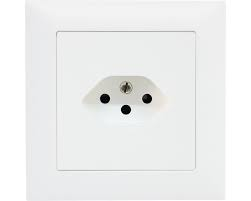
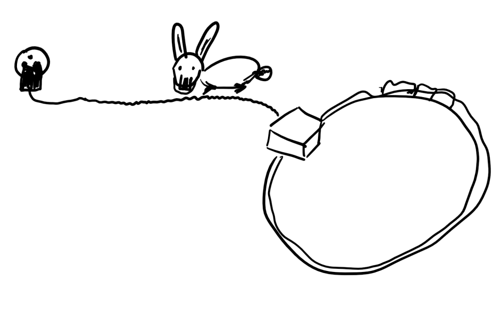
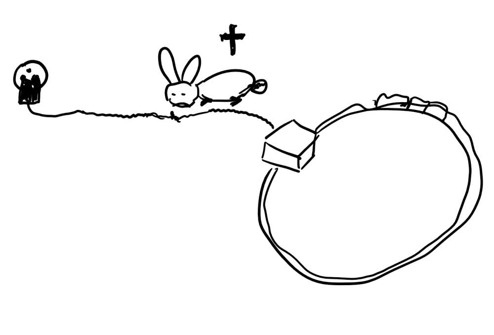

# Elektronik Grundlagen

## Spannungsquelle (1a) 

Eine Spannungsquelle die Ihr alle kennt, ist die Steckdose.

{height=55%} 

## Spannungsquelle (1b) 

{height=55%} 

__ACHTUNG__ : Die Steckdose ist der falsche Weg, um mit Elektronik und Spannung zu experimentieren!

Die Gründe dafür sehen wir gleich.

## Spannungsquelle (2) 

Also nehmen wir etwas, das Ihr auch alle kennt, das aber etwas ungefährlicher ist und Ihr vermutlich von Taschenlampen etc kennt: __Batterien__

Batterien gibt es in unterschiedlichen Ausführungen.

{height=60%}

## Spannungsquelle (3) 

Diese Batterien unterscheiden sich jedoch nicht nur in der Grösse und den Bauformen, sie unterscheiden sich auch in den __Spannungen__ , die diese Batterien liefern.

* Spannung wird angegeben in __Volt__ . 
* Das ist die sogenannte __Einheit__ .

Vergleiche zum Beispiel : 

* Entfernungen werden in Meter (__m__) oder Kilometer (__km__) angegeben, 
* Gewicht wird in Gramm (__g__) oder Kilogramm (__kg__) gemessen bzw. angegeben.

So sagt man : 

* die Einheit der Entfernung ist Meter,   
* die Einheit des Gewichts ist Gramm 
* die Einheit der Spannung ist Volt. 

## Spannungsquelle (4) 

{height=40%}

Die Spannungen von normalen, handelsüblichen Batterien, wie Ihr sie hier seht, reichen von 1.5 Volt bis zu 9 V, eine davon hat sogar 12 V!

Die Batterie mit 9V liefert damit immerhin schon das 6 fache der kleinsten Batterie, die Batterie mit 12 V sogar das 8-fache!!

## Zwei Pole/Anschlüsse (1)

* Die Spannungsquellen, die wir anschauen, haben immer zwei Anschlüsse, auch Pole genannt.
* Der eine Anschluss wird Plus-Pol genannt (+), 
* der andere Anschluss wird Minus-Pol geannt (-).

## Zwei Pole/Anschlüsse (2)

Als Schaltbild-Symbol sieht man Batterien oft so:

{height=20%}

oder so:
 
{height=20%}

oder so:

{height=20%}

## Zwei Pole/Anschlüsse (5)

* Der längere Anschluss am Batterie-Symbol ist __immer__ der Plus-Pol.
* Normalerweise ist bei Kabeln der \textbf{\textcolor{red}{Plus-Pol}} immer  \textbf{\textcolor{red}{ROT}} 
* Der \textbf{\textcolor{blue}{Minus-Pol}} wird entweder mit \textbf{\textcolor{blue}{BLAUEM}} oder __SCHWARZEM__ Kabel angezeigt.

## Spannung fühlen? (1)
 
 Kann man Spannungen fühlen?
 __JA__ man kann!
 Allerdings sind glücklicherweise die Spannungen mit denen wir arbeiten, so gering, dass wir sie nur mit Tricks fühlen können
 
 Wer traut sich?
 
 - 1.5 V Batterie mit Hilfskabel oder ähnlichem an die Zunge
 - 4.5 V Batterie mit der Zunge an die Pole
 - 9V Batterie mit der Zunge an die Pole.
 
 Wie man merkt, je grösser die Spannung um so mehr prickelt es.
 
## Spannung fühlen? (2)

Was passiert, wenn man grössere Spannungen versucht zu fühlen?
 
* Zumindest jedes Kind hier in der Schweiz kennt Globi.  
* Da gibt es ein tolles Bild bei __Globi bei der Feuerwehr__.  
* Leider hat mir der Globi-Verlag nicht erlaubt, das hier abzubilden, drum habe ich es halt selbst gemalt.   
* Wie Ihr seht, bin ich kein besonders guter Zeichner...  
(Ein bisschen besser kann ich schon noch, wenn ich mir etwas mehr Mühe gebe...)

## Spannung fühlen? (3)
Ein kleiner Hase nagt an der Strom-Zuleitung ( 220 V ) für einen Eisenbahn-Trafo:  
  
 

## Spannung fühlen? (4)
Beim Durchbeissen gibt es einen Blitz (und ein Feuer, das dann Globi als Feuerwehrmann löschen muss)  

 

## Spannung fühlen? (5)
Nachdem das Feuer gelöscht wird, ist der Hase __tot__ ! :  

 

## Vergleich : Gewicht auf dem Kopf tragen (1) 
 
* An der Steckdose sind hierzulande __220 Volt__, 
* das ist fast das __150-fache__ von unserer __1.5 V__ Batterie!

Vergleich: 

* Ihr versucht etwas auf dem Kopf zu tragen

## Vergleich : Gewicht auf dem Kopf tragen (2) 

 
\colA{6cm}

 __1 kg__ Mehl auf dem Kopf tragen

 {height=60%}  
 
 
\colB{6cm}

 Ein __150 kg__ schwerer Mann auf dem Kopf
 
  {height=50%} 
\begin{tiny}
  (https://pixabay.com/de/sumoringer-athlet-ringer-sport-3196755 ,  CC0 Creative Commons)
\end{tiny}     
 
\colEnd

## Vergleich : Gewicht auf dem Kopf tragen (3) 

* So wie Ihr ein Kilo Mehl locker auf dem Kopf balancieren könnt sind auch kleine Batterien normalerweise ungefährlich.
* Aber ein 150kg-Mann macht Euch **platt** !
* Ebenso sind Steckdosen auch 150 mal stärker und damit **tabu**!
* Was bei Steckdosen passieren kann, seht Ihr oben bei Globi.  
* Steckdosen sind lebensgefährlich!   
* Darum: __FINGER WEG von der STECKDOSE!__
 
## Vergleich mit Wasser

Beim elektrischen Strom wird oft ein Vergleich mit Wasser gemacht.

- Strom fliesst, Wasser fliesst
- Spannung "fällt ab", Wasser fällt
- usw

Wenn man diesen Vergleich bildlich verwenden will, dann kann man das evt mit Wasserfällen machen.

## Sehr Grosse Spannung (1)

 {height=50%} 

\begin{tiny}
 (https://pixabay.com/de/niagarafälle-wasserfall-wasserkraft-218591 , CC0 Creative Commons)
\end{tiny}     
 __Sehr hoher Wasserfall__  

## Sehr Grosse Spannung (2)

 {height=50%} 
  
\begin{tiny}
(https://pixabay.com/de/stromleitungen-energie-stromleitung-804880 , CC0 Creative Commons)
\end{tiny}     
 __Sehr grosse Spannung!__  
 
 
 Eine typische Freiland Hochspannungs-Leitung hat 110 kV = __110 000__ = __110 Tausend Volt.__  
 
 Das ist 500 mal so viel wie in der normalen Steckdose, die schon __tödlich__ ist ! 
 
 
## Grosse Spannung (1)

 {height=60%} 
 
\begin{tiny}
(https://pixabay.com/de/kaskade-island-landschaft-berg-1868687 CC0 Creative Commons)
\end{tiny}     
Ein hoher Wasserfall, da möchte man nicht mit dem Boot runterfallen.
 
## Grosse Spannung (2)
 {height=60%} 

 Grosse Spannung, Steckdose. Zu gefährlich um damit zu experimentieren!

## Niederspannung (1)

{height=60%}  
\begin{tiny}
(https://pixabay.com/de/wasserhahn-brunnen-wasserspender-1684902 CC0 , Creative Commons) 
\end{tiny}     
Das ist ein kleiner, "handlicher" Wasserfall. 

## Niederspannung (2)

\colA{6cm}
{height=60%} 

\colB{6cm}
{height=60%} 
\colEnd

Das sind Spannungen mit denen wir arbeiten, Niederspannung.  
Das geht für uns von 1,5 V bis maximal 9V oder evt 12V.

## Ganz gute Einführung in Strom und Spannung 

Eine ganz gute Einführung in Strom und Spannung gibts in der Sendung mit der Maus

https://www.youtube.com/watch?v=Je22SgH8TCk

Mehr Links auf der  [Übersicht](../index.html) 

