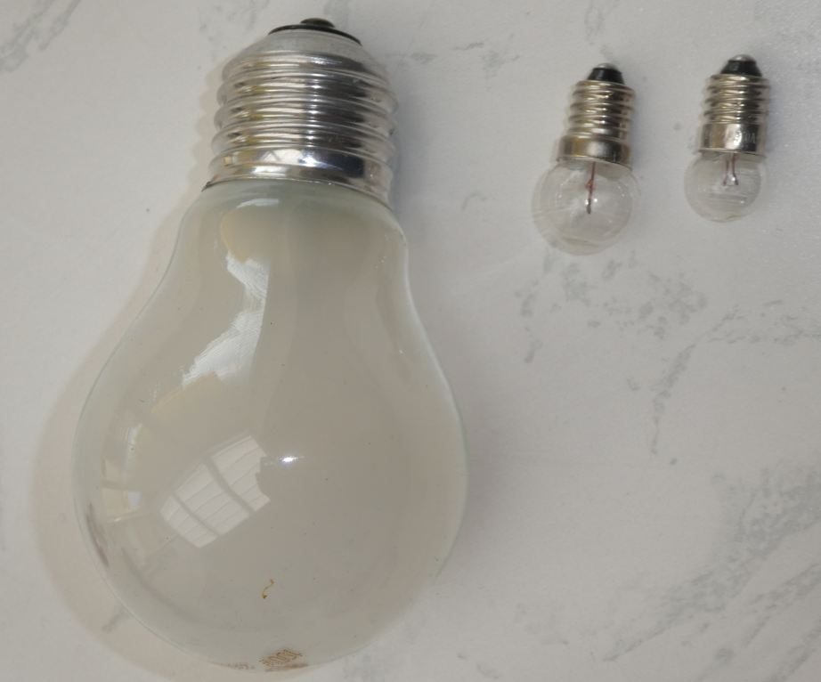
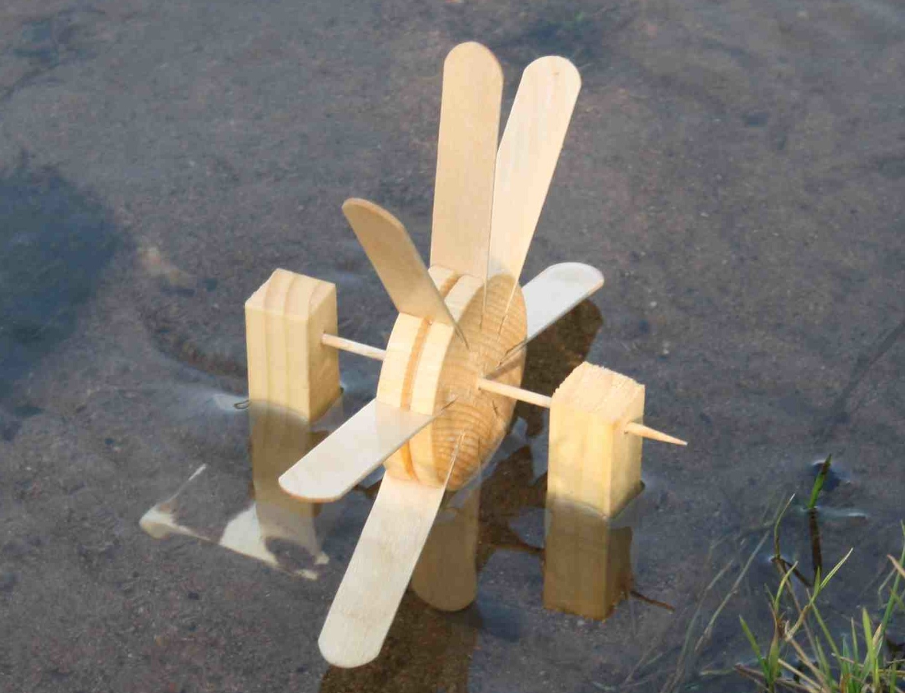

# Elektronik Grundlagen

## Verbraucher 

Eine Spannungsquelle alleine bringt noch gar nichts. 
Man will ja irgendetwas antreiben, sehen, erhitzen ...
Also z.B. 
- Einen Motor im Staubsauger antreiben
- Eine Lampe/Taschenlampe leuchten sehen
- Einen Toaster erwärmen
- ...

Das sind die sogenannten Verbraucher.  
Sie verbrauchen den Strom, den die Batterie liefert.   

Beispiele - für unsere Zwecke - von Verbrauchern:

- Eine kleine Lampe. 
   
- Eine einzelne LED. 
    
- Ein kleiner Servo-Motor 
  
   

## Spannungs - Angaben

So wie bei den Spannungs-Quellen, die es in sehr unterschiedlichen Grössen gibt, muss man auch bei den Verbrauchern auf die Spannungs-Angaben und auf die Grössen achten.
Diese Lampen hier:
  
  sind ausgelegt für Spannungen von 220 V ! ( Achtung, Steckdose! ) bis herunter zu 3 V. 

 
## Vergleich mit Wasser

Um auch hier wieder den Vergleich mit Wasser zu bringen, können wir uns die Verbraucher als Wasser-Räder vorstellen.

So wie bei den Spannungs-Quellen, den Wasserfällen, die es in sehr verschiedenen Grössen gibt, gibt es eben auch Wasser-Räder in sehr unterschiedlichen Grössen.

- Ein sehr grosses Wasserrad  
  

- Ein normales Wasserrad  
  

- Ein kleines Wasserrädchen  
  

