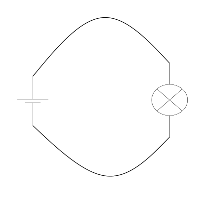

# Elektronik Grundlagen

## Der Stromkreis 

Im Stromkreis   
   
   
 

kommen nun die Spannungsquelle und der Verbraucher zusammen.
In diesem Fall zeichnen wir links die Batterie und rechts die Lampe.   Dafür gibt es aber keine "Vorschrift", man kann die Batterie auch auf der rechten Seite zeichnen.  
Der Pluspol der Batterie wird mit einem Anschluss des Lämpchens verbunden, der Minus-Pol der Batterie mit dem anderen Anschluss.
Bei einem normalen (altmodischen) Glühlämpchen, ist es egal, welchen Anschluss des Lämpchens man mit Plus und welchen Anschluss man mit Minus verbindet.
Bei einigen anderen Verbrauchern ist das nicht egal, darauf kommen wir später noch zurück.

Als Kreis ist es natürlich etwas unpraktisch...
Aber man kann sich - einmal so gezeichnet - den Kreis eben ganz gut vorstellen.
Normalerweise wird das mit geraden Strichen gezeichnet.
 

Wenn der Stromkreis - so wie hier - geschlossen ist, dann leuchtet die Lampe

Wenn der Stromkreis - so wie unten - offen ist, dann leuchtet die Lampe nicht.
Dies sieht man in den Schaltbildern allerdings nicht!

__ALSO__ : 
- Geschlossener Stromkreis: Verbraucher läuft/Lampe leuchtet 
- Offener Stromkreis: Verbraucher läuft nicht/Lampe leuchtet nicht

Das ergibt zusammen einen Stromkreis mit eingebauten Schalter.
Damit kann man anzeigen, dass zusätzlich im Stromkreis ein Schalter zwischen Spannungs-Lieferant und Verbraucher ist, der es ermöglicht den Verbraucher ein- und aus zu schalten.

 
 
## Elemente müssen zusammenpassen

Wenn nun also Spannungs-Lieferant und Verbraucher zusammenkommen ist es sehr wichtig, dass diese zusammenpassen.

### Zu hohe Spannung 
Wir möchten ja weder, dass die zu starke Spannungsquelle unseren Verbraucher zerstört:

 

Das kleine Wasserrad würde wohl den Wasserfall nicht überleben.
 Sehr hoher Wasserfall 
 
### Zu geringe Spannung 
Ebenso möchten wir natürlich, dass sich unser Verbraucher "bewegt", oder leuchtet oder 

Das Wasser aus diesem Mini-Wasserfall wird sicher das grosse Wasserrad nicht antreiben können.

Dieser Fall ist allerdings sowohl bei unserem Wasservergleich als auch beim Arbeiten mit Stromkreisen im Allgemeinen der weniger schlimme Fall:
Unser Verbaucher wird wahrscheinlich einfach gar nicht oder nicht ganz wie erhofft arbeiten.

### Zusammenfassung

Im Stromkreis müssen die Verbraucher und die Spannungs-Quelle die selben Spannungen aufweisen, um sinnvoll zu funktionieren.
Ist die Spannungsquelle zu gross, wird ziemlich sicher irgendetwas zerstört werden. 

## Praktisches Arbeiten

* Wir sortieren Batterien der Grösse nach
* Wir sortieren Batterien der Spannung nach 
* Wir sortieren Verbraucher der Spannung nach
* Wir schauen was passiert wenn Verbraucher und Batterie zusammenpassen
* Wir schauen was passiert wenn der Verbraucher eine höhere Spannung hat als die Batterie
* Wir schauen was passiert, wenn der Verbraucher eine geringere Spannung hat als die Batterie
* Wir schauen was bei einem Kurzschluss der Batterie passiert
* Wir schauen, was bei einer Schmelz-Sicherung passiert, wenn ein Kurzschluss gemacht wird
* Wir stellen uns vor, die Schmelz-Sicherung ist unsere Elektronik (unser Calliope) und wir schliessen an den Calliope einen Verbraucher an und machen dabei einen Kurzschluss...

## Navigation

* [Zurück ](../02_03_Elektronik_Verbraucher/README.md)
* [Hoch zur Übersicht](../README.md)  
* [Weiter ](../02_05_BatterieTester/README.md)

