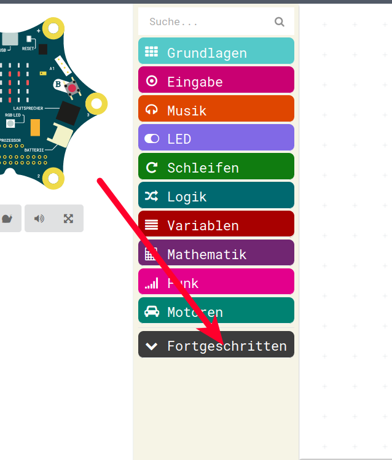
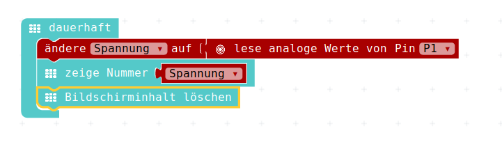

# Arbeiten mit den Pins

Der Grund, warum wir uns überhaupt in den letzen Minuten/letzte halbe Stunde mit Elektronik-/Elektrotechnik-Grundlagen beschäftigt haben ist folgender:

Der Calliope hat schon sehr viele Dinge (die wir auch noch genauer anschauen werden) auf dem Board. Aber manchmal reicht das nicht und man will etwas an den Calliope anschliessen.

Und damit man dabei weder den Calliope noch das was man anschliesst, zerstört, haben wir ein paar Basis-Dinge gelernt.

- Wenn Spannung von Lieferant und Verbraucher nicht übereintsimmen, dann funktioniert es nicht.
- Wenn die Spannung vom Lieferanten höher ist als das, was der Verbraucher "verträgt", dann muss damit gerechnet werden, dass der Verbraucher kaputtgeht.
- Wenn die Spannung vom Lieferant kleiner ist, als das was der Verbraucher braucht/verträgt, dann ist i.A. der Schaden klein, es funktioniert einfach nicht!
- Wenn man an den falschen Stellen Kabel zusammenbringt, dann verursacht man enen Kurzschluss.
- Ein Kurzschluss führt dazu, dass viel Strom fliesst, was im guten Fall nur die Batterie erwärmt, im schlechten Fall geht dabei der Calliope kaputt oder die Batterie wird zu warm und fängt Feuer!

__Also Vorsicht !__

Wir werden nun also die Anschlüsse des Calliope ausprobieren.

## Das offizielle Calliope-Layout

So sieht das offizielle Layout des Calliope aus:  
( https://calliope-mini.github.io/assets/v10/img/Calliope_mini_1.0_pinout_fin.jpg )


## Verwendung der Pins

### Fähigkeiten der Pins

Wenn man die Anschlüsse auf dem Calliope etwas genauer anschaut, dann sieht man an
 
* P0: Digital und Touch
* P1: Digital, Analog und Touch
* P2: Digital, Analog und Touch
* P3: Digital und Touch

### Pins als Ausgang oder Eingang

Wichtig ist an dieser Stelle:  
Die __Pins__ kann man vom Programm aus sowohl als __Ausgang__ schalten, d.h. wir können z.B, eine LED ein und ausschalten, als auch  kann man die __Pins__ als __Eingang__ schalten, sprich man kann vom Programm aus abfragen, ob von aussen eine Spannung angelegt wurde, ob der Eingang mit dem Finger berührt wurde und ähnliches.


## Spannungs-Messer


Wir werden nun Batterien an die Anschlüsse anschliessen und schauen, ob wir die Spannung der Batterie ermitteln können.

__ACHTUNG__ : 

Der Calliope verträgt maximal __3.3 V!__  
Wir dürfen also nur die Batterien bis maximal 3V anschliessen, die Batterien mit 4.5V, mit 9V und die mit 12V sind __tabu__!


## Spannungs-Messer Version 1


Der erste Spannungs-Messer wird sehr einfach:

* Wir lesen den Wert vom Pin, 
* speichern ihn in einer Variable(Platzhalter) 
* und zeigen anschliessend die Variable an. 
* Zum Abschluss wird noch der Bildschirm gelöscht um die Werte voneinander unterscheiden zu können.

### Fortgeschrittene-Funktionen:



### Pin-Funktionen im Menu


### Verfügbare PIN-Funktionen


### Alles zusammen in einer Endlos-Schleife

1.) Auslesen und speichern in einer Variable


2.) Anzeigen und Bildschirm löschen




### JavaScript-Code

<details>
 <summary>Java-Script-Code</summary>

```js
let Spannung = 0
basic.forever(() => {
    Spannung = pins.analogReadPin(AnalogPin.P1)
    basic.showNumber( Spannung )
    basic.clearScreen()
})

})
```
</details>

### Download Hex-Code

[Hex-code](code/mini-BatterieTester_Version1)

Nun kann man also eine Batterie anschliessen: 


So sieht das ganze dann mit Krokodil-Klemmen angeschlossen aus:


## Spannungs-Messer Version 2

Wenn wir nun verschieden Batterien anschliessen (__Achtung__ nur Batterien bis 3V ) dann sehen wir keine sinnvollen Werte.

Okay, Batterien mit kleiner Spannung ergeben einen kleineren Wert, Batterien mit grösserer Spannung ergeben einen grösseren Wert, aber sinnvolle Spannungen scheinen das trotzdem nicht zu sein.

__Was ist falsch?__

Da hilft uns die eingebaute Hilfe-Funktion weiter.

Einfach die Funktion mit der linken Maustaste anklicken und dann mit dem Mauszeiger über der Funktion bleiben. Nach ca 1-2 Sekunden erscheint ein Hilfetext der über der Funktion schwebt:


 
Aha.   
Der Wert wird von 0 - 1023 ausgegeben!  
Aber welcher Wert?  
Nun, wir hatten es schon ein paar mal gesagt/geschrieben:  
Der Calliope verträgt an seinen Pins maximal 3.3 V.  
Das ist damit auch die Antwort:  
Die Spannung 3.3 V wird in unserem Programm mit 1023 ausgegeben, die Spannung 0 V wird mit 0 ausgegeben.


Also sieht das Ganze so aus:


Die dafür notwendige Umrechnung müsst Ihr noch nicht können, nur der Vollständigkeit halber:

```Spannung = gemessener Wert * 3.3 V / 1024```

Da unser Calliope aber eh nicht mit Komma-Zahlen rechnen kann, müssen wir uns etwas behelfen:  

Wir geben die Spannung in Milli-Volt aus.

So wie ein Milli-Meter das tausendste eines Meters ist, ist ein Milli-Volt das tausendste eines Volts.

Und damit, da müsst Ihr mir jetzt halt einfach glauben, wird unsere Rechnung mit einigermassen guter Genauigkeit so heissen:

```Spannung in Millivolt = Wert * 32 / 10```

Das können wir uns einfach aus der Mathematik holen, wir brauchen dazu eine Mal-Rechnung und eine Geteilt-Rechnung, die Ihr evt noch gar nicht in der Schule gehabt habt, sorry.


Der Spannungs-Messer sieht dann so aus:


 

### Download Hex-Code

[Hex-code](code/mini-BatterieTester_Version2.hex)

## Spannungs-Messer Version 3

 
 Wenn wir jetzt per Zeichenkette anzeigen, dass der Wert den wir ausgeben eine Spannung ist und dass wir sie in Milli-Volt anzeigen, dann haben wir schon ein Super Messgerät, das uns Batterie-Spannungen anzeigen kann.
 
 ( __Spannungen__ werden in der Physik mit dem Buchstaben __U__ abgekürzt, damit man nicht immer Spannung = schreiben muss)
 
 So würde das Ganze dann zum Beispiel aussehen:
 

 

### Download Hex-Code

[Hex-code](code/mini-BatterieTester_Version3.hex)
 

## Spannungs-Messer Version 4

 Unser Programm funktioniert wunderbar, hat aber - rein beim Lesen für uns Menschen - eine Unschönheit:
 
 Der allererste Befehl in unserer Endlos-Schleife heisst:  
 Ändere Spannung auf lese analoge Werte von Pin P1.
 
 Wir wollen zwar am Schluss eine Spannung haben, aber wenn wir ehrlich sind, messen tun wir etwas anderes.
 Wir messen Messwerte.
 Und erst durch unsere Rechnung werden daraus Spannungen.
 
 Also machen wir das ganze noch etwas schöner.
 
 Mit der Funktionalität zum Variablen umbenennen geben wir der Variable einen anderen Namen: Wir nennen sie __Messwert__  


Und nun legen wir noch eine neue Variable namens Spannung an:


Und ziehen nun eine Setzen dieser neuen Variable in unseren Code, direkt hinter das Auslesen des Pins:


Nun können wir unser mathematische Berechnung, das ganze grosse Puzzle-Stück rausziehen:


Und im Arbeitsbereich als ganzes Stück ablegen.


 Dann nehmen wir es und klicken es in die Platzhalter/Variablen-Zuweisung ein.
 
 Wir haben jetzt also ein Programm mit 2 Variablen:
 
 * Variable 1 : Der __Messwert__, so wie der Calliope ihn hergibt zwischen 0 und 1023
 * Variable 2 : __Die Spannung__ in Milli-Volt, so wie wir sie mit unserer mathematischen Berechnung errechnet haben.
 


Nun müssen wir noch weiter unten, wo wir die Berechnung "gestohlen" haben und wo momentan eine 0 drin steht unsere neue Variable namens __Spannung__ verwenden, denn das ist das was wir anzeigen wollen.


### Download Hex-Code

[Hex-code](code/mini-BatterieTester_Version4.hex)


## Navigation


* [Zurück](../02_04_Elektronik_Stromkreis/README.md)  
* [Hoch zur Übersicht](../README.md)  
* [Weiter ](../02_06_Wenn-Dann/README.md)


## Lizenz/Copyright-Info
Für alle Bilder auf dieser Seite gilt:

*  Autor: Jörg Künstner
* Lizenz: CC BY-SA 4.0
