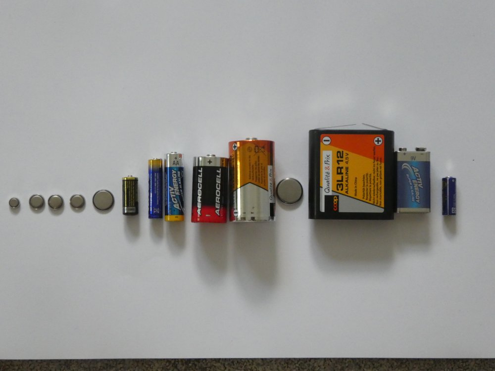
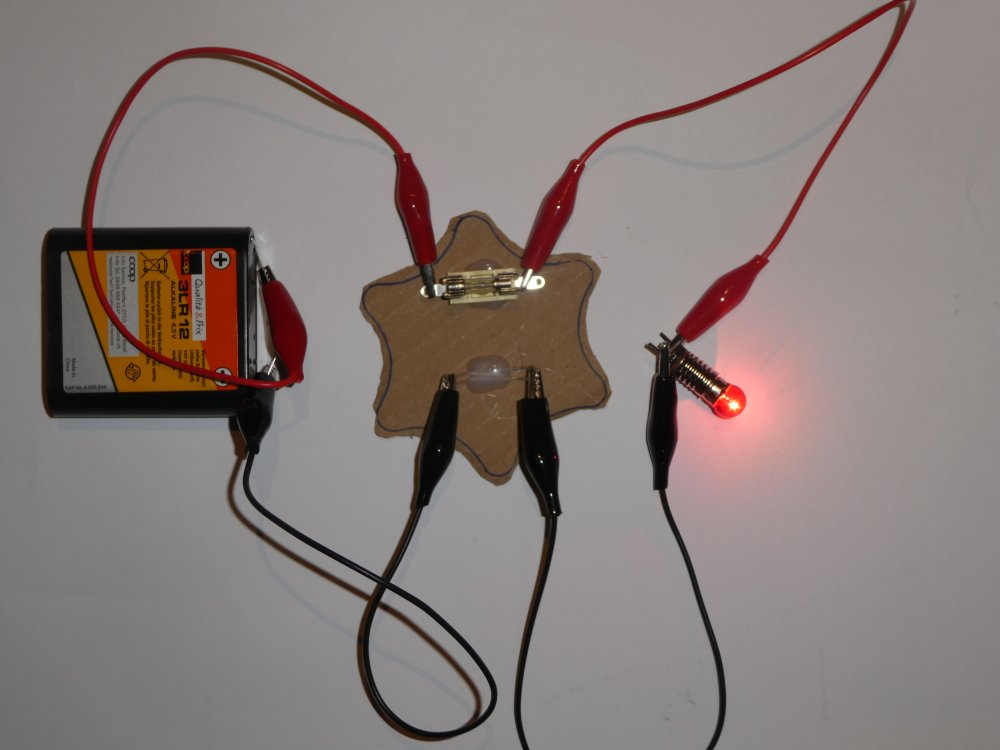

# Praktisches Arbeiten

## Wir nehmen die Batterien

{height=70%}

## Wir sortieren Batterien der Grösse nach

{height=70%}

## Wir sortieren Batterien der Spannung nach 

{height=70%}

Die kleine Batterie ganz rechts hat __12 Volt__ !!!  
Das ist extrem beeindruckend für alle, die das sehen!

## Wir sortieren Verbraucher der Spannung nach

* Verschiedene Lämpchen, LEDs, Motoren, ...
* Der Spannung nach sortieren
* Ist hier als Bild nicht so beeinduckend wie die Batterien, darum ohne Bild

## Was passiert wenn Verbraucher und Batterie zusammenpassen

* Verschiedene Batterien mit verschiedenen Verbrauchern.
* Darauf achten, dass die Spannungen zusammenpassen

## Was passiert wenn Batterie-Spannung kleiner als Verbraucher 

* Wir hängen z.B. eine 5V Glühlämpchen an eine 1.5 V oder eine 3 V Batterie
* Wir hängen eine 5V-LED (z.B. mit eingebauten Vorwiderstand) an 3V CR2032
* Wir hängen einen 5V Motor an eine 1.5 V Batterie

 
## Was passiert, wenn der Verbraucher eine geringere Spannung hat als die Batterie

* Das ist der Teil, der am meisten Spass macht...
* Wir lassen ein paar LEDs und ein paar Glühbirnchen "platzen"
* Zuerst mit geringfügig höheren Spannungen der Batterie, dann kann man schon sehen, dass das der Verbraucher nicht lange aushalten wird...
* Dann mit viel höheren Spannungen (z.B. 9V Batterie an normaler 2V-LED )

## Was passiert bei einem Kurzschluss der Batterie 

* Wir schliessen eine kleine Batterie mit einem Kabel kurz.
* __ACHTUNG__: Üblicherweise wird sehr schnell das Kabel warm!
* Kurzschluss kann selbst bei einer kleinen Batterie zu grosser Hitze und zu Flammen führen.
* __NIEMALS__ mit einem Akku machen, der brennt __SEHR__ schnell!

## Was passiert bei einem Kurzschluss mit dem Calliope 

* Wir schauen, was bei einer Schmelz-Sicherung passiert, wenn ein Kurzschluss gemacht wird
* Wir stellen uns vor, die Schmelz-Sicherung ist unsere Elektronik (unser Calliope) und wir schliessen an den Calliope einen Verbraucher an und machen dabei einen Kurzschluss...

\colA{6cm}

{height=40%}

\colB{6cm}

{height=40%}

\colEnd

Nach dem Kurzschluss, bei dem die Sicherung durchbrennt, ist unser "Calliope", dargestellt durch die kleine Schmelz-Sicherung, kaputt!

## Fazit

* Strom und Spannung können auch bei den Spannungen mit denen wir arbeiten, zerstörerisch sein!
* In der Hobby-Elektronik sind zur Zeit Spannungen von 3.3 V und Spannungen von 5V üblich
* Bauelemente die nur für 3.3 V ausgelegt sind, gehen mit 5V ziemlich sicher kaputt
* Unser Calliope kann, wenn man an den falschen Stellen Kurzschlüsse macht, kaputtgehen.
* Lieber einmal mehr vorsichtig sein und versuchen etwas über das Bauteil, die Spannung herauszufinden, bevor man Dinge verkabelt, die man nicht versteht.
* Kurzschlüsse können auch bei unseren kleinen Spannungen einiges anrichten!

## Lizenz/Copyright-Info
Für alle Bilder auf dieser Seite, soweit nicht unter dem Bild anders gekennzeichnet,  gilt:

* Autor: Jörg Künstner
* Lizenz: CC BY-SA 4.0

  
