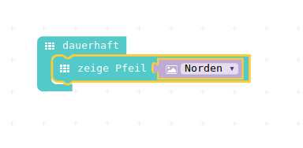
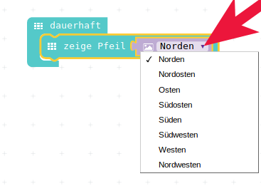
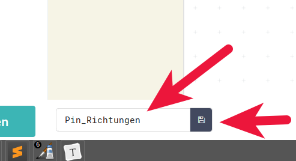

# PINS

## Zeige Pfeil

{height=70%}

## In der "dauerhaft"-Schleife

{height=30%}

* Verschiedende Pfeil-Richtungen ausprobieren

{height=40%}

## wenn Pin gedrückt

{height=80%}

## Fertiges Programm mit Pins

{height=70%}

## Programm speichern

{height=50%}

* Programm speichern
* Programm auf den __Calliope laden__

## Programm ausführen

__Achtung!__ Ihr müsst den Minus-Pol oben links __und__ einen der vier programmierten Pins anfassen!

{height=70%}

