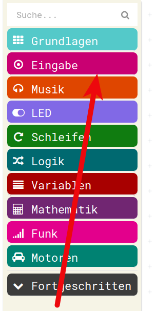
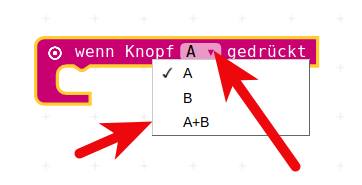
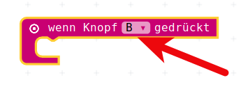

# Teil 2 : Hinweise

## Teil2, die Aufgabe

* Beim __Drücken__ der rechten Taste sollen die beiden Platzhalter miteinander __multipliziert (malnehmen)__ werden.
* Multiplikationen sind im Menu Mathematik
* Das Ergebnis soll und in einer __dritten Ergebnis-Variable__ abgelegt werden. 
* Dieses Ergebnis, die Ergebnis-Variable soll dann auch wieder angezeigt werden.
* (Vielleicht noch mit " = " davor...)

## Teil2, die Hinweise

* Das meiste, was hier gemacht werden muss, wurde gerade auch schon in Teil 1 gemacht, darum hier nur zwei Hinweise:
* Abfragen auf Knopf B gibt es nicht direkt im Menu, das muss man sich aus dem Menu mit Knopf A holen und dann per Drop-Down-Menu umstellen

* Abfragen im Menu Eingabe

* Kein Knopf B, also nehmen wir "Wenn Knopf A gedrückt" auf die Arbeitsfläche

* Dort gibt es auch wieder die Möglichkeit mit dem kleinen Dreieck ein Drop-Down-Menu zu öffnen
* Wir nehmen das __B__ aus dem Menu

* Und haben unser benötigtes "Wenn Knopf B gedrückt"

* Und noch ein Hinweis zum Malnehmen:
* Auch das befindet sich im __Menu Mathematik__

## Navigation

* [zurückweiter zu Teil1 Lösung](../03_02_Teil1_Loesung/README.md)  
* [Hoch zur Übersicht](../README.md)  
* [weiter zu Teil2 Lösung](../03_04_Teil2_Loesung/README.mdm)  

## Lizenz/Copyright-Info
Für alle Bilder auf dieser Seite gilt:

*  Autor: Jörg Künstner
* Lizenz: CC BY-SA 4.0
