# Zufallszahlen  

## Wir wollen einen Würfel bauen

* Beim Schütteln des Calliope
* Eine Zufallszahl erzeugen
* Wie echter Würfel : zwischen 1 und 6
* Die Zahl soll angezeigt werden
* Bei erneutem Schütteln:
* Von Vorne

## Menu Eingabe

__Menu : Eingabe__

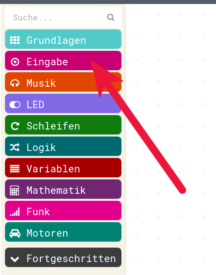{height=70%}

## Wenn geschüttelt

__Wenn geschüttelt__ :

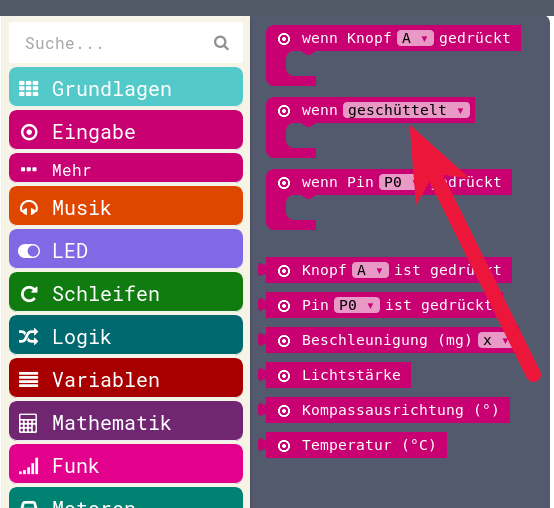{height=80%}

## Start des Programms 

Auf die __Arbeitsfläche__

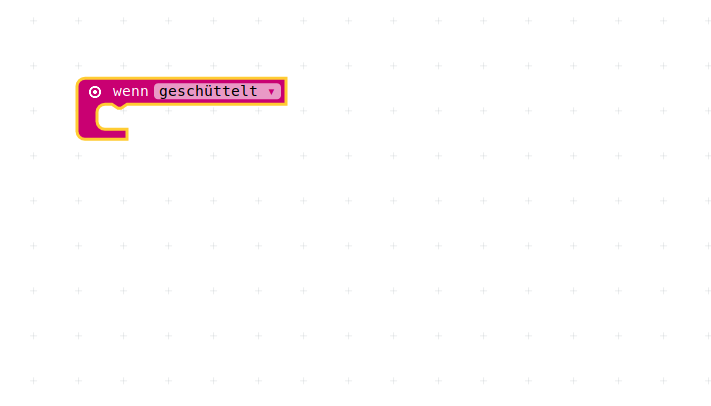{height=60%}

## Zufall: Menu Mathematik

__Menu Mathematik__

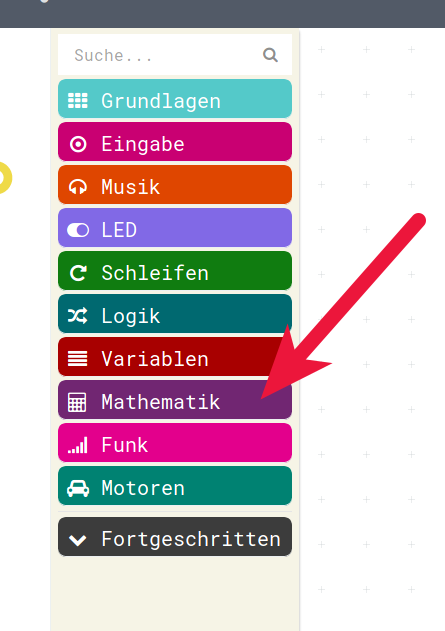{height=70%}

## Menu Mathematik 

__Zufalls-Zahlen__

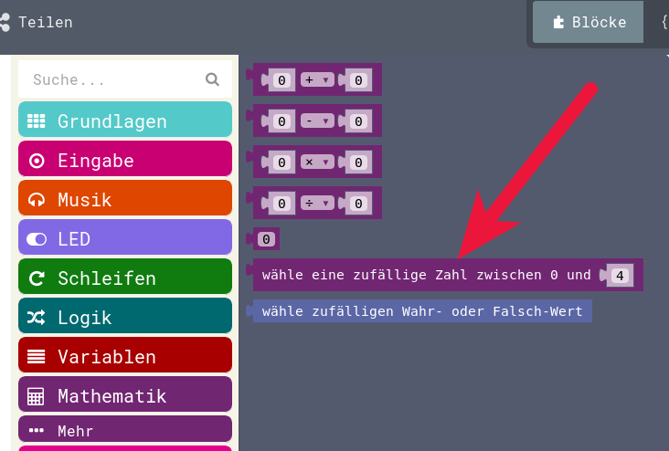{height=70%}

 

## Zufalls-Zahlen ab 0!

* Zufallszahlen beginnen bei 0 !
* Die maximale Zahl ist wählbar 

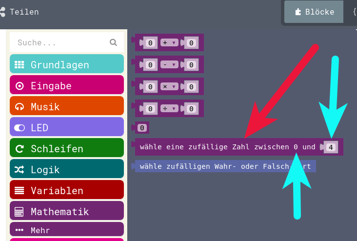{height=70%}

## Im Programm

Auf die __Arbeitsfläche__ gezogen

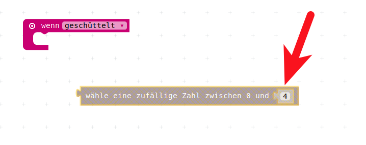{height=60%}

## 1 - 6 : geht nicht

also 0 - 5  und dann später 1 drauf addieren...

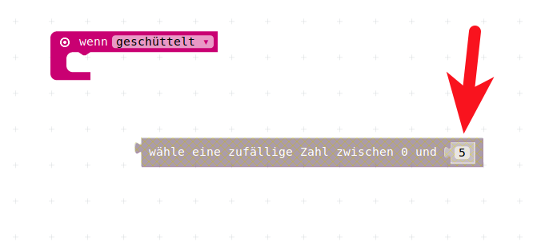{height=70%}

## Variable anlegen

Wir brauchen eine Variable, also legen wir sie an...

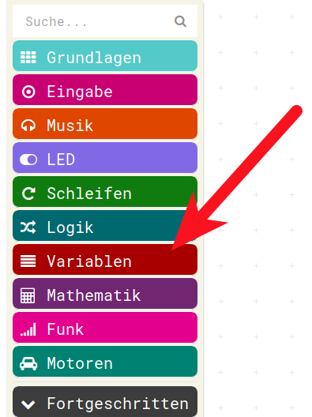{height=80%}

## Im Menu Variablen

__Neue Variable anlegen__

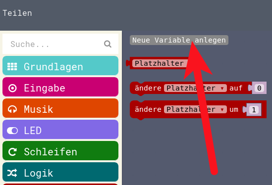{height=40%}

__Benennen__ (zum Beispiel Wuerfel)

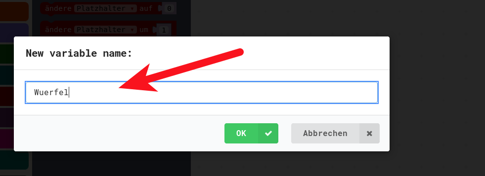{height=40%}

## Variable auf Arbeitsfläche

Wir ziehen aus dem Menu Variablen "ändere Platzhalter" auf die Arbeitsfläche

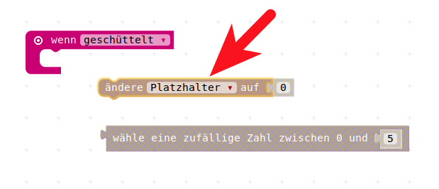{height=40%}

richtige Variable __Wuerfel__ benutzen (am Dreieck auswählen)

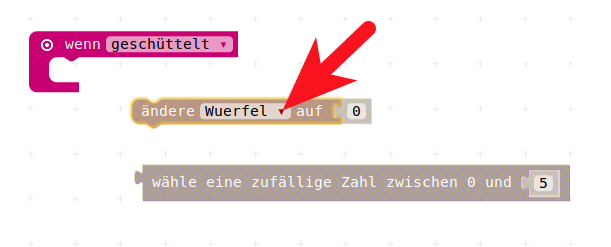{height=40%}

## Zusammenbau 1

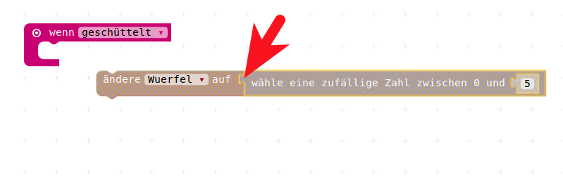{height=40%}

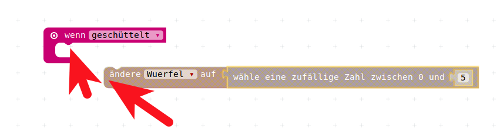{height=40%}

## Zusammenbau 2

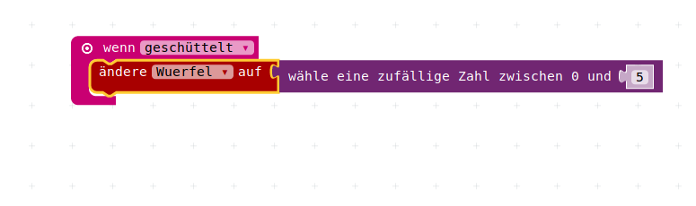{height=40%}

Nun haben wir eine Zufallszahl zwischen 0 und 5 wenn der Calliope geschüttelt wird.

## Wert um 1 erhöhen

Aus dem Menu Variablen holen wir uns __ändere Platzhalter um xxx__  

Wichtig: __um__ , nicht __auf__

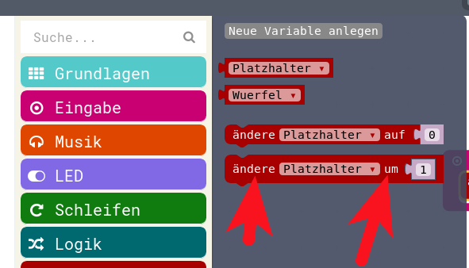{height=50%}

## Auf den Arbeitsbereich

Wir ziehen das auf den Arbeitsbereich:

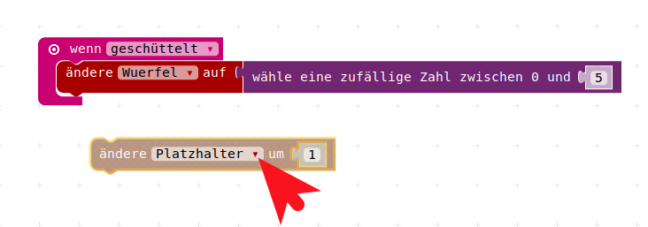{height=40%}

und ändern die Variable auf __Wuerfel__:

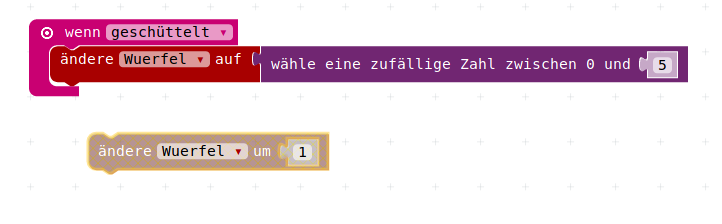{height=40%}

## Zusammenbau 3

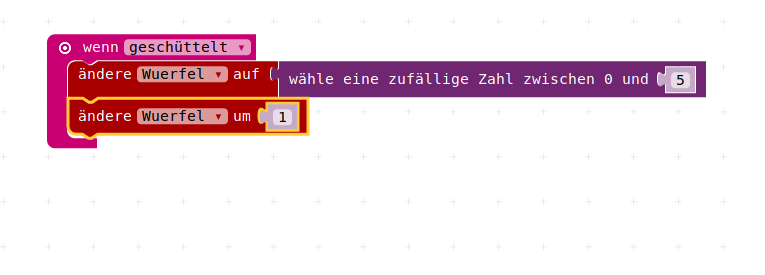{height=40%}

## Variable anzeigen

Aus dem Grundlagen-Menu: 

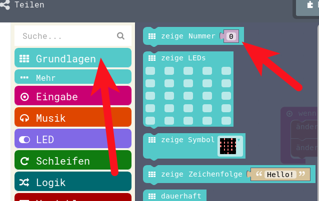{height=50%}

in das Programm

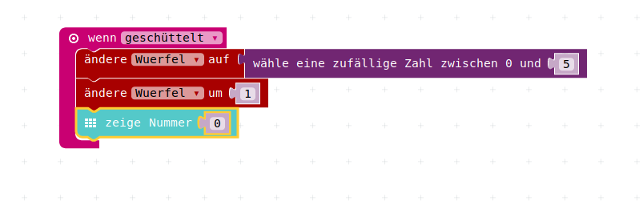{height=30%}

## Variable, nicht die 0, anzeigen

Die __Variable__ holen 

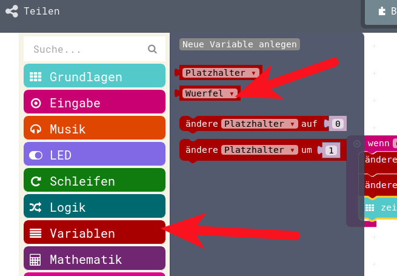{height=40%}

und die 0 damit ersetzen

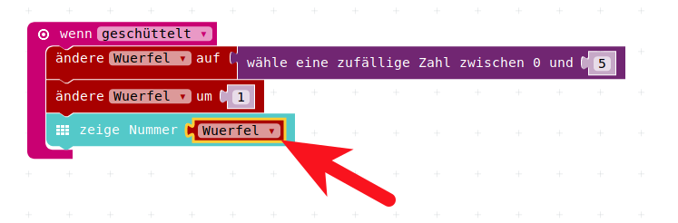{height=30%}

## Im Simulator 

Im Simulator kann man diesen Würfel nun ausprobieren  

Mit der Maus über die Ecken fahren simuliert Schütteln

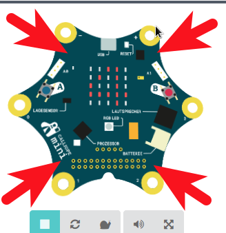{height=60%}

## Wird gewürfelt?

Vor allem im Simulator sieht man nicht, ob die gleiche Zahl nochmal gewürfelt wurde, oder ob das Schütteln nicht erkannt wurde.  

Darum zeigen wir beim Schütteln irgendetwas anderes an, z.B.:

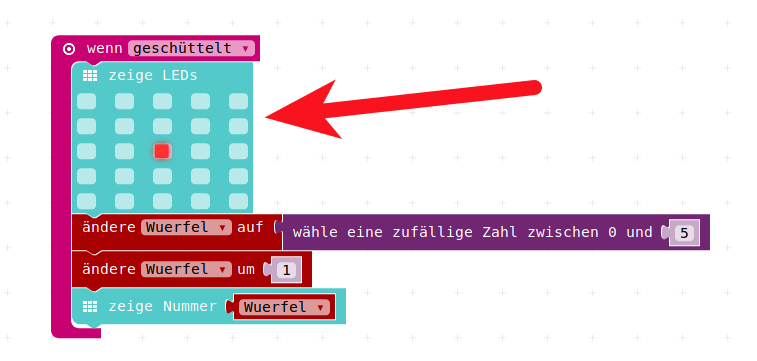{heigth=50%}

## In den Calliope laden

* Spätestens jetzt ist es Zeit, das Programm auch in den Calliope zu laden.
* Das wird hier nun nicht mehr gezeigt...

## Lizenz/Copyright-Info

Für alle Bilder auf diesen Seite/Folien, soweit nicht unter dem Bild anders gekennzeichnet,  gilt:

- Autor: Jörg Künstner
- Lizenz: CC BY-SA 4.0

