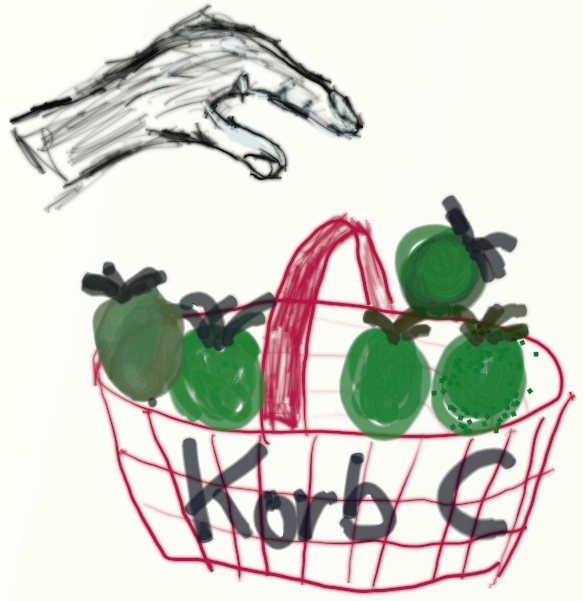
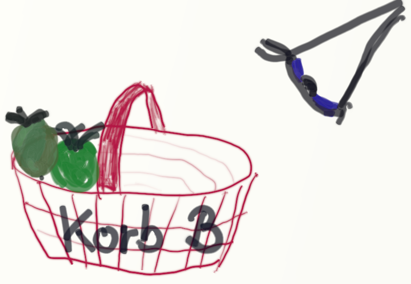

# Wiederholung / Auffrischen 


## Platzhalter / Variablen 

Da Variablen sozusagen der Grundpfeiler beim Programmieren sind, schauen wir uns in dieser Rückblende __nochmal__ genau die Verwendung von Variablen und Ihren Einsatz in einfachen mathematischen Aufgaben an:
 
Platzhalter / Variablen dienen - wie der Name andeutet - dazu, veränderliche Werte aufzunehmen. 
Man will aber den Variablen nicht nur Werte "reingeben", sondern man will dann auch die Variablen wieder "fragen" : Was für einen Wert hast Du denn?
In der Programmierung sagt man:

*  der Variable wird ein Wert __zugewiesen__
* der Wert der Variablen wird __abgefragt__  


### Zuweisung an eine Variable

Vorstellen kann man sich das auch als Zuruf mit dem Megaphon:   
Hey Du, __Variable_A__, merk Dir doch bitte mal die __2__!


Oder man stellt sich die Variable als Obstkorb vor, der mit Äpfeln "belegt" wird:

Korb_A :


Belege den Korb_A mit 2:


In einer "normalen" Programmiersprache : __Variable_A__ = 2  
Zuweisung an __Variable_A__, die Variable steht auf der linken Seite des Gleichheitszeichens, der Wert mit dem die Variable belegt werden soll, steht auf der rechten Seite des Gleichheitszeichens.

Die Zuweisung an eine Variable in unsere Calliope-Programmier-Sprache sieht so aus:


### Abfrage/Benutzen einer Variable

So wie man sich vorher die Zuweisung mit einem Megaphon vorstellen kann, so kann man sich das Auslesen/Benutzen der Variable vorstellen, dass man mit einem altmodischen Hör-Rohr fragt:  
Hey Du, __Variable_A__, was war es, was Du Dir vorher merken solltest? Sag es mir doch bitte.


Oder man stellt sich vor, wie man in den Obstkorb reinschaut, wieviele Äpfel denn dort drin sind, man __fragt__ die __Belegung ab__:

Was ist der Inhalt von Korb_A :


So wie in unserem Korb-Beispiel der Korb nur angeschaut wird, ist das auch beim Programmieren: 

* Der Inhalt des Korbes ändert sich durchs Anschauen nicht
* Der Inhalt der Variable ändert sich durchs Auslesen, durch die Benutzung in einer Formel __nicht__.
 

In einer "normalen" Programmiersprache wird das üblicherweise z.B. so dargestellt:

* Variable_B = __Variable_A__ <br>Der Wert der Variable: __Variable_A__ wird erfragt, sie steht auf der rechten Seite des Gleichheitszeichens.

In unserer grafischen Calliope-Programmiersprache wird das Benutzen der Variable einfach durch das Puzzleteil mit der Variable dargestellt:


Dieses eInzelne Puzzleteil kann man dann irgendwo anstatt festen Werten einklicken, also wenn man z.B. die Rechnung mit der __Variable_B__ von oben nochmals benutzen will:

* __Variable_B__ = __Variable_A__ <br>Der Wert der Variable: __Variable_A__ wird erfragt, sie steht auf der rechten Seite des Gleichheitszeichens.<br>Auf der linken Seite des Gleichheits-Zeichens wird das der Variable __Variable_B__ zugewiesen, <br>die __Variable_B__ wird mit dem selben Wert belegt.

 
 * 


## Ein paar Rechnungen

Nun haben wir also mehrere Darstellungs-Möglichkeiten für Variablen-Belegung und Variablen-Abfrage gesehen:

* "Körbchen"-Darstellung
* Darstellung mit Text
* Grafische Calliope-Darstellung

Damit wollen wir noch ein paar ganz einfache Belegungen, Abfragen und Rechnungen zeigen.

### Korb A mit 2 belegen

__Korb_A = 2__


<hr>

### Korb B mit 1 belegen


__Korb_B = 1__


<hr>

### Korb C = Summe Korb A + B 


__Korb_C = Korb_A + Korb_B__

       


<hr>

### Korb B erhöhen um 1


__Korb_B = Korb_B + 1__


     


oder andere Möglichkeit, die auch leider einfach mit dem Setzen einer Variable zu verwechseln ist:


<hr> 
 
### Was enthält nun Korb C? 

Vorher haben wir den Korb C mit der Summe von Korb A und Korb B belegt haben.  
Das Ergebnis war 3.
Nun haben wir den Korb B um eins erhöht.  
Ist nun der Wert des Korb C auch um 1 erhöht worden?  
__NEIN!__  
Die Berechnung wurde vorher ausgeführt.  
Das Ergebnis ändert sich nicht mehr.  
Der Korb C enthält immer noch die 3.  
Wir schauen nochmal nach :-)


  

<hr>

### Korb A erhöhen um 1

Ebenso können wir nun natürlich Korb A um eins erhöhen

__Korb_A = Korb_A + 1__


     


oder andere Möglichkeit, die auch leider einfach mit dem Setzen einer Variable zu verwechseln ist:


<hr> 

### Korb C = Summe Korb A + B 

Nun können wir nochmal die Berechnung von vorher durchführen: Korb C soll die Summe von Korb A und von Korb B enthalten.

In "normaler" Programmiersprache:  

__Korb_C = Korb_A + Korb_B__

* Korb A enthält 3 Äpfel
* Korb B enthält 2 Äpfel
* Korb C enthält vor der Berechnung schon 3 Äpfel
* Wenn wir nun die Berechnung durchführen, was enthält denn dann Korb C?
    * 5 Äpfel = 3 Äpfel von Korb A und 2 Äpfel von Korb B ? Oder etwa:
    * 8 Äpfel = 3 Äpfel von Korb A und 2 Äpfel von Korb B und die 3 eigenen Äpfel von vorher?
* ?
* ?
* ?
* Lösung: So wie wir die Berechnung formuliert haben: __Korb C = Korb A + Korb B__ ist der vorherige Inhalt von Korb C egal! Er wird quasi vorher ausgeleert! 
   
 Also sieht unsere Korb-Rechnung nun so aus: 
 

       

Und in Calliope-Rechnung sieht das ganz wieder genau gleich wie vorher aus:


## Mathematik 

Ich denke mit der mathematischen Formel beim letzten Mal, das ging etwas zu schnell...

Darum hier nochmal ein paar Details dazu :

__Allerwichtigst__ : Die Formel selbst braucht Ihr nicht zu verstehen, es geht nur darum eine - für Euch unbekannte - Formel in Programm-Code umzusetzen.


Nochmal die Formel vom letzten Nachmittag:  
 
```Spannung in Millivolt = erhaltener Wert * 32 / 10```

Um das in zwei Schritten umsetzen zu können, benutzen wir einen Hilfswert, wir brechen die Berechnung auf:

```Hilfswert  = erhaltener Wert * 32```   <- Teil 1 der obigen Formel, vor dem "Geteilt durch"-Strich 
```Spannung in Millivolt = Hilfswert  / 10```    <- Teil 2 der obigen Formel , das Teilen durch 10

Diese mathematische Formel kann man nun recht einfach auch in zwei Schritten im Calliope umsetzen:


Diese Berechnung sieht nun um einiges einfacher aus, als die Darstellung von der letzten Stunde:


## Spannung / Verbraucher 

Hier nur die wichtigsten Dinge bezüglich Spannung / Verbraucher vom letzten Nachmittag:

* Die Steckdose ist __tabu__ ! 
* Unsere Spannungs-Bereiche liegen zwischen 1.5 Volt und ca 12 Volt, die Steckdose hat __220 Volt__
* Der Calliope arbeitet normalerweise mit 3.3 Volt
* Die Grösse einer Batterie sagt __NICHTS__ über ihre Spannung aus!
* Spannung von Lieferant (Batterie) und Verbraucher (z.B. LED etc) müssen übereinstimmen
* Bei Nichtübereinstimmung kann etwas kaputt gehen, wenn es dumm läuft ist das der Calliope
* Kurzschluss heisst der Pluspol und der Minus-Pol eines Spannungs-Lieferanten werden zusammengehalten/"kurzgeschlossen"
* Beim Kurzschluss geht üblicherweise etwas kaputt, wenn es dumm läuft, ist das der Calliope.


 


## Lizenz/Copyright-Info
Für alle Bilder auf dieser Seite gilt:

*  Autor: Jörg Künstner
* Lizenz: CC BY-SA 4.0

