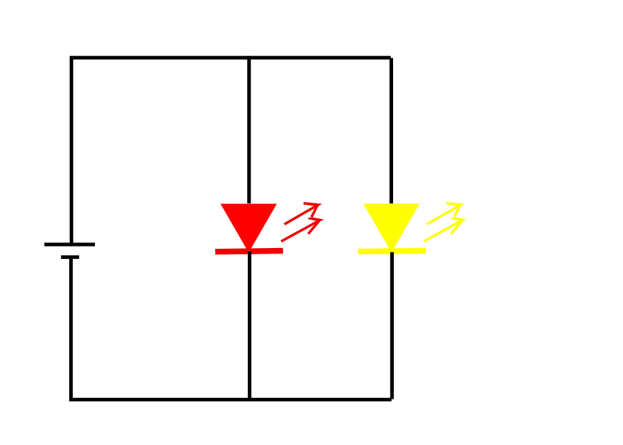
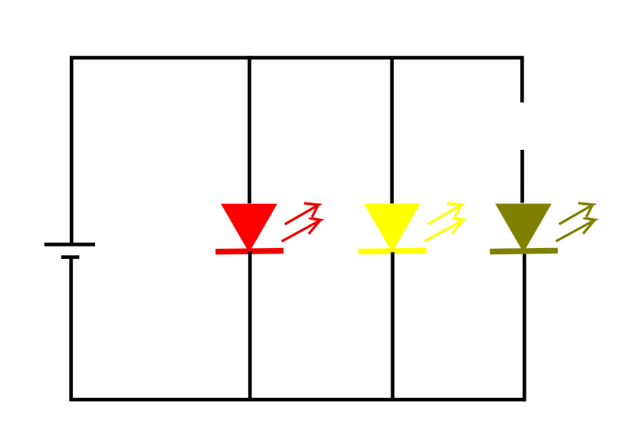
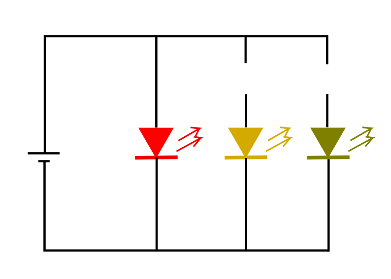
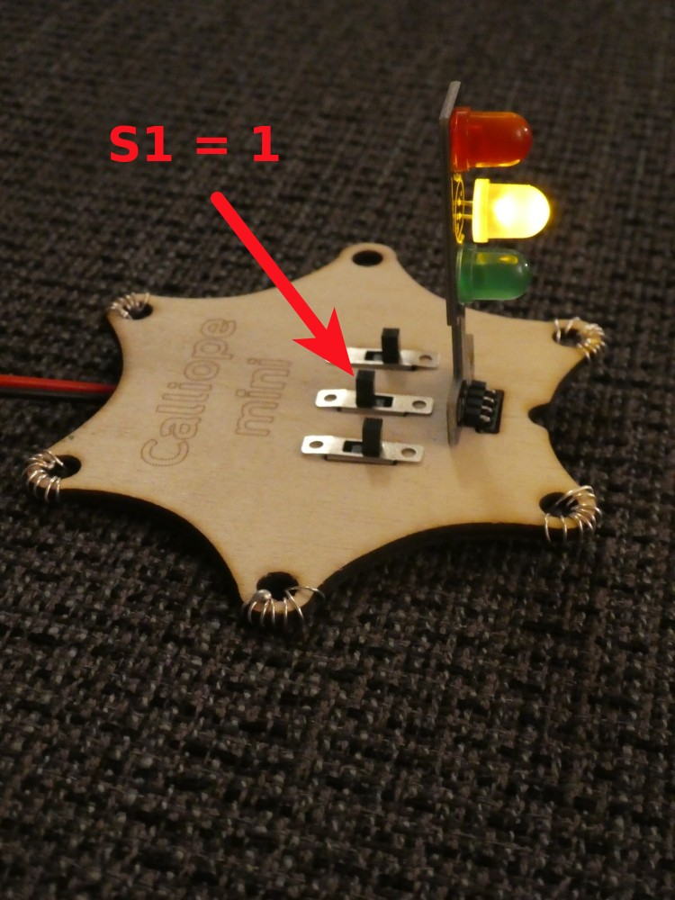
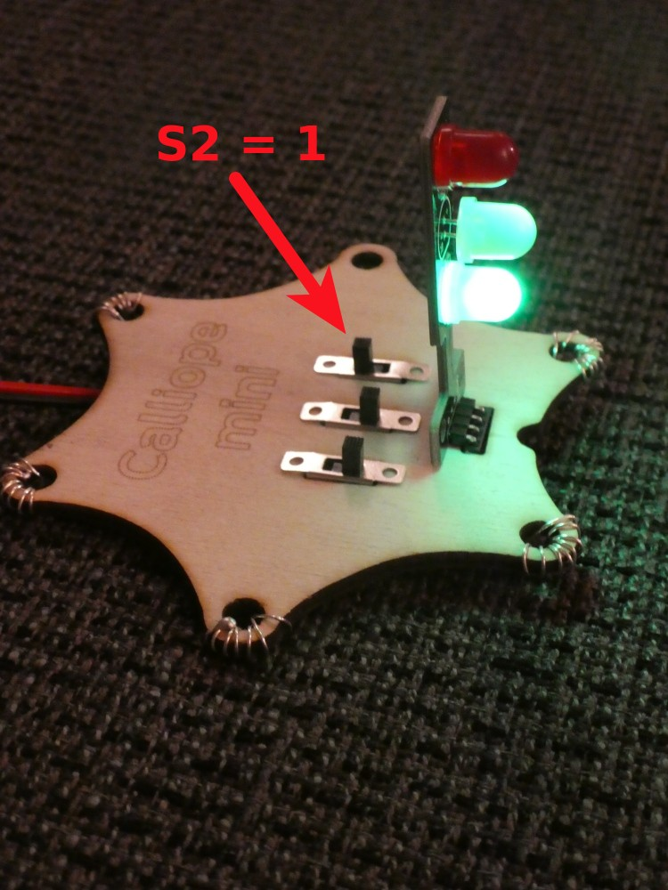
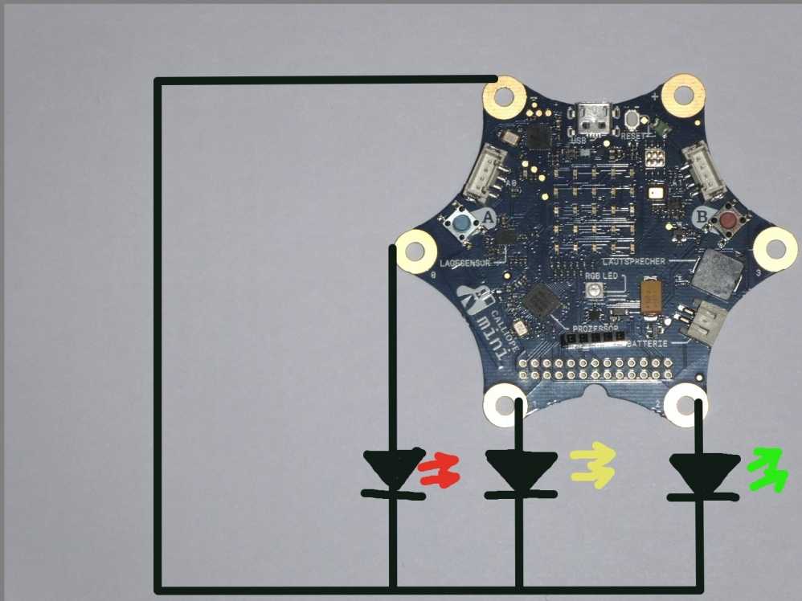
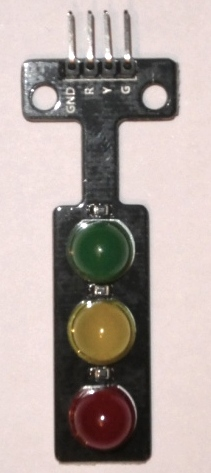

# Wiederholung / Auffrischen Ampel

## Spannung / Verbraucher 1

Hier nur die wichtigsten Dinge bezüglich Spannung / Verbraucher vom letzten Nachmittag:

* Die Steckdose ist __tabu__ ! 
* Unsere Spannungs-Bereiche liegen zwischen 1.5 Volt und ca 12 Volt, die Steckdose hat __220 Volt__
* Der Calliope arbeitet normalerweise mit 3.3 Volt
* Die Grösse einer Batterie sagt __NICHTS__ über ihre Spannung aus!

## Spannung / Verbraucher 2

* Spannung von Lieferant (Batterie) und Verbraucher (z.B. LED etc) müssen übereinstimmen
* Bei Nichtübereinstimmung kann etwas kaputt gehen, wenn es dumm läuft ist das der Calliope
* Kurzschluss heisst der Pluspol und der Minus-Pol eines Spannungs-Lieferanten werden zusammengehalten/"kurzgeschlossen"
* Beim Kurzschluss geht üblicherweise etwas kaputt, wenn es dumm läuft, ist das der Calliope.

## Ampel

* Die Ampel und die Ansteuerung der Pins ging letztes Mal vielleicht ein kleines bisschen (zu?) schnell.
* Darum in diesem Auffrischen das Ganze nochmal Schritt für Schritt

Wir möchten gerne eine Ampel haben, die folgendes ermöglicht:

{height=60%}

## Ohne Calliope 1

{height=80%}

Wir brauchen eine Batterie

## Ohne Calliope 2

{height=80%}

Wir brauchen eine rote LED

## Ohne Calliope 3

{height=80%}

Wir brauchen eine gelbe LED

## Ohne Calliope 4

{height=80%}

Wir brauchen eine grüne LED

## Ohne Calliope 5

{height=80%}

Wir trennen Grün auf

## Ohne Calliope 6

{height=80%}

Wir trennen Gelb auf

## Ohne Calliope 7

{height=80%}

Wir trennen Rot auf

## Ohne Calliope 8

{height=80%}

Wir bauen Schalter ein (S0 - S2)

## Ohne Calliope 9

{height=80%}

Schalter S0 einschalten : Rot 

## Ohne Calliope 10

{height=80%}

Schalter S1 einschalten : Gelb

## Ohne Calliope 11

{height=80%}

Schalter S2 einschalten : Grün

## Ohne Calliope 12

\colA{7cm}

{height=80%}

\colB{5cm}

{height=80%}

\colEnd

Schalter S0 einschalten : Rot 

## Ohne Calliope 13

\colA{7cm}

{height=80%}

\colB{5cm}

{height=80%}

\colEnd

Schalter S1 einschalten : Gelb

## Ohne Calliope 14

\colA{7cm}

{height=80%}

\colB{5cm}

{height=80%}

\colEnd

Schalter S2 einschalten : Grün

## Wie die Ampel funktioniert

* Alle Schalter aus => Alle Lampen aus
* S0 = 0 : Rot aus
* S0 = __1__ : Rot __ein__
* S1 = 0 : Gelb aus
* S1 = __1__ : Gelb __ein__
* S2 = 0 : Grün aus
* S2 = __1__ : Grün __ein__

## Ein Ampel-Zyklus (1)

\colA{7cm}

* Alle Lampen aus
* Rot ein => __Ampel Rot (1)__
* Rotzeit abwarten (z.B. 5 sek) 
* Gelb ein => __Ampel Rot-Gelb (2)__
* Rot-Gelbzeit warten (z.B. 1 sek) 
* Rot aus
* Gelb aus
* Grün ein => __Ampel Grün (3)__
* Grünzeit warten (z.B. 5 sek)
* Grün aus 
* Gelb ein => __Ampel Gelb (4)__
* Gelbzeit warten (z.B. 1 sek)
* Wieder von vorne

\colB{5cm}

{height=60%}

\colEnd

## Ein Ampel-Zyklus (2)

\colA{6cm}

* Alle Lampen aus
* Rot ein => __Ampel Rot__
* Rotzeit abwarten (z.B. 5 sek) 
* Gelb ein => __Ampel Rot-Gelb__
* Rot-Gelbzeit warten (z.B. 1 sek) 
* Rot aus
* Gelb aus
* Grün ein => __Ampel Grün__
* Grünzeit warten (z.B. 5 sek)
* Grün aus 
* Gelb ein => __Ampel Gelb__
* Gelbzeit warten (z.B. 1 sek)
* Wieder von vorne

\colB{6cm}

* S0,S1,S2 =0 => Lampen aus
* S0=1  => __Ampel Rot__
* Rotzeit abwarten (z.B. 5 sek) 
* S1=1  => __Ampel Rot-Gelb__
* Rot-Gelbzeit warten (z.B. 1 sek) 
* S0=0
* S1=0
* S2=1 => __Ampel Grün__
* Grünzeit warten (z.B. 5 sek)
* S2=0 
* S1=1 => __Ampel Gelb__
* Gelbzeit warten (z.B. 1 sek)
* Wieder von vorne

\colEnd

## Ein Ampel-Zyklus (3)

\colA{7cm}

* S0,S1,S2 =0 => Lampen aus
* S0=1  => __Ampel Rot (1)__
* Rotzeit abwarten (z.B. 5 sek) 
* S1=1   => __Ampel Rot-Gelb (2)__
* Rot-Gelbzeit warten (z.B. 1 sek) 
* S0=0
* S1=0
* S2=1 => __Ampel Grün (3)__
* Grünzeit warten (z.B. 5 sek)
* S2=0 
* S1=1 => __Ampel Gelb (4)__
* Gelbzeit warten (z.B. 1 sek)
* Wieder von vorne

\colB{5cm}

{height=60%}

\colEnd

## Ersetzen Hardware

\colA{7cm}

Wir ersetzen Schalter

{height=50%}

\colB{5cm}

Durch den Calliope

{height=50%}

\colEnd

## Ersetzen Software : Schalter S durch Pin P

\colA{7cm}

* S0,S1,S2 =0 => Lampen aus
* S0=1  => __Ampel Rot (1)__
* Rotzeit abwarten (z.B. 5 sek) 
* S1=1   => __Ampel Rot-Gelb (2)__
* Rot-Gelbzeit warten (z.B. 1 sek) 
* S0=0
* S1=0
* S2=1 => __Ampel Grün (3)__
* Grünzeit warten (z.B. 5 sek)
* S2=0 
* S1=1 => __Ampel Gelb (4)__
* Gelbzeit warten (z.B. 1 sek)
* Wieder von vorne

\colB{5cm}

{height=80%}

\colEnd

## Ersetzen Software : Schalter S durch Pin P

\colA{7cm}

* Das Bild auf der rechten Seite
* ist das Programm vom letzten Mal
* es entspricht fast der Anweisung mit den Schaltern 
* Im Programm setzen wir unten Grün auf aus
* In der Schalt-Anweisung:
* Schalten wir oben __ALLE__ aus

\colB{5cm}

{height=80%}

\colEnd

## Anschluss LEDs (1)

{height=70%}

## Anschluss LEDs (2)

{height=70%}

## Anschluss LEDs (3)

{height=70%}

## Anschluss LEDs (4)

{height=70%}

## Anschluss LEDs (5)

\colA{7cm}

{height=70%}

\colB{5cm}

{height=80%}

\colEnd

## Lizenz/Copyright-Info
Für alle Texte und Bilder auf dieser Seite/Folien gilt:

* Autor: Jörg Künstner
* Lizenz: CC BY-SA 4.0
