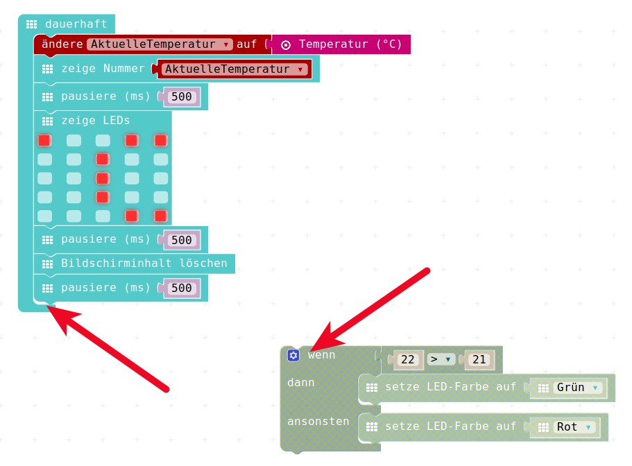
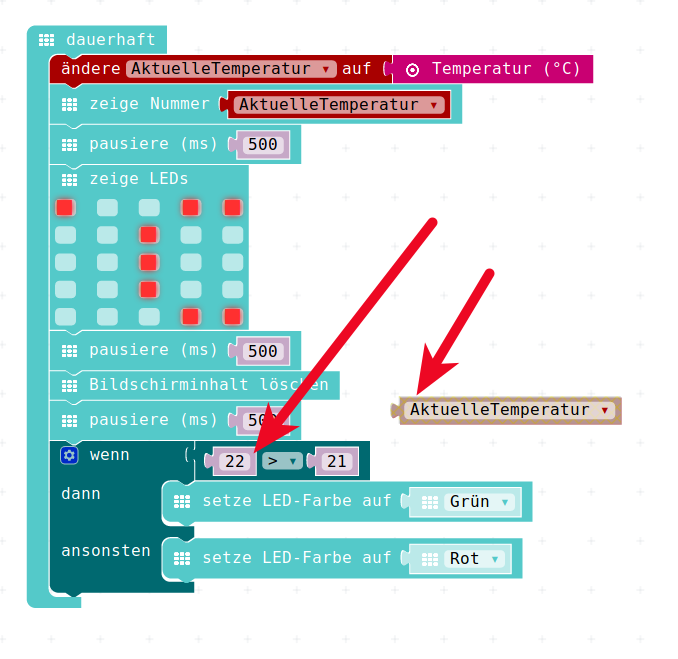
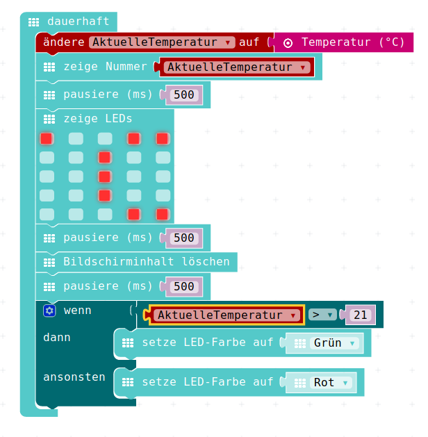

# Die Temperatur-Ampel


## Wiedereinbau Wenn-Dann


Nun können wir aus der Wenn-Dann Übung von vorher und dem kleinen Temperatur-Programm von eben eine kleine Temperatur-"__Ampel__" machen.

Dazu bauen wir das vorher "beiseite" gelegte __Wenn-Dann__ wieder ein.

{height=60%}

## Wiedereinbau Wenn-Dann

{height=60%}


## Verwendung sinnvoller Werte


 
 Wir möchten im ersten Schritt, "__Alles im Grünen Bereich__" anzeigen, wenn die Temperatur eine __gute__ Temperatur hat.
 
 Dazu sagen wir : Alles was grösser 21 °C ist, ist gut. 

{height=60%}


## Verwendung sinnvoller Werte

Das heisst: Wir müssen unsere Wenn-Dann-Konstruktion so umbauen, dass folgender Satz/Aussage abgebildet wird:  

* Wenn die Temperatur grösser als 21 °C ist, 

    * __dann__ soll die RGB-LED grün leuchten, 
    * __ansonsten__ soll sie rot leuchten. 


## Verwendung sinnvoller Werte

* Nun ergeben auch die vorhin "ganz willkürlich gewählten" Werte 22 und 21 etwas Sinn...
* Wir ersetzen die konstante 22 in der Wenn-Dann-Abfrage durch die jetztige Temeperatur.
* Diese befindet sich in der Variable __AktuelleTemperatur__
* Dazu holen wir uns die Variable __AktuelleTemperatur__ aus dem Menu Variablen

## Verwendung sinnvoller Werte

{height=60%}

## Verwendung sinnvoller Werte

{height=60%}


## Verwendung sinnvoller Werte

{height=60%}

Damit lässt sich im Simulator schon mal ausprobieren, wie unsere Temperatur-Ampel reagiert.

## Benutzung im Simulator

Beim Starten ist im Simulator die Temperatur immer 21 °C, das ist nach unseren Wünschen genau die Grenze. 
Erst wenn die __AktuelleTemperatur__ grösser als 21 °C ist, dann wird die Anzeige grün.
Das können wir im Simulator ausprobieren und dann natürlich auch wieder in den Calliope laden um es in der richtigen Hardware mit echten Werten zu testen.


## Download in der Calliope

Jetzt ist der Programm-Code eigentlich gut genug, um eine echte Messung in unserem echten Calliope durchzuführen.

Wir laden das Programm dazu auf den Calliope:

* Dem Ganzen unten einen sinnvollen Namen geben (z.B. Temperatur-Messer_01 )
* Den Speichern-Knopf (Diskette ) drücken
* Das erzeigte und geladene HEX-File im __Download__ - Ordner finden
* Das HEX-File kopieren 
* Den Calliope-Mini anschliessen
* Das HEX-File auf dem Calliope "fallen lassen", "Einfügen", "CTRL-V" * Der Calliope sollte anfangen das neue Programm in seinen Speicher zu übertragen.

\begin{tiny}
(So, das war jetzt aber das letzte Mal eine detaillierte Anleitung zum Laden des Programms in den Calliope, in Zukunft kommt nur noch der Hinweis, dass wir das Programm in den Calliope laden...)
\end{tiny}

## JavaScript-Code

<details>
 <summary>Java-Script-Code</summary>

```js
let AktuelleTemperatur = 0
basic.forever(() => {
    AktuelleTemperatur = input.temperature()
    basic.showNumber(AktuelleTemperatur)
    basic.pause(500)
    basic.showLeds(`
        # . . # #
        . . # . .
        . . # . .
        . . # . .
        . . . # #
        `)
    basic.pause(500)
    basic.clearScreen()
    basic.pause(500)
    if (AktuelleTemperatur > 21) {
        basic.setLedColor(Colors.Green)
    } else {
        basic.setLedColor(Colors.Red)
    }
})

```
</details>

__Download Hex-Code__

[Hex-code](code/mini-TemperaturMesser02.hex)


## Lizenz/Copyright-Info

Für alle Bilder auf diesen Folien/Seiten gilt:

* Autor: Jörg Künstner
* Lizenz: CC BY-SA 4.0

