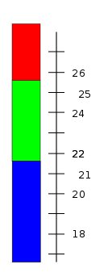
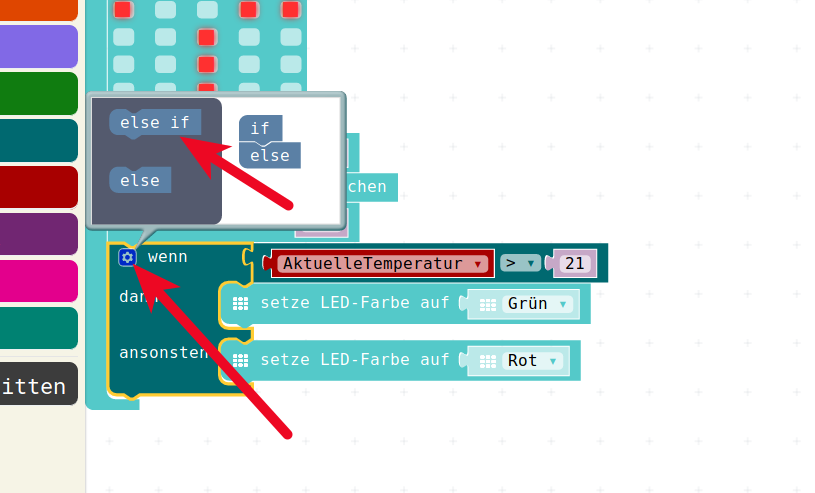
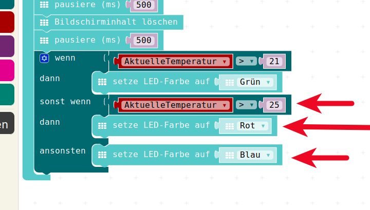
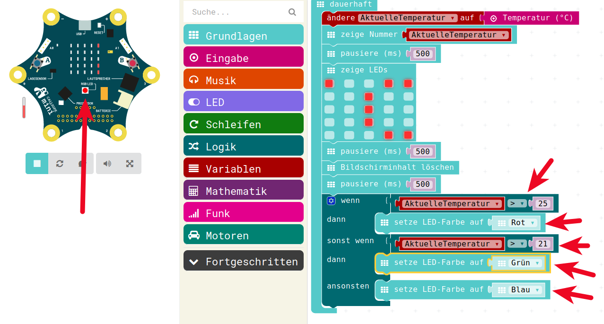

# Die verbesserte Temperatur-Ampel


## Echter grüner Bereich


Nun wollen wir die Temperatur-Ampel etwas verbessern.

* Wir legen einen grünen Bereich zwischen grösser als 21 °C und bis 25 °C fest
* Wenn die Temperatur kleiner/gleich 21 °C ist, soll das Licht blau sein, es ist uns zu kalt (blau wie am Wasserhahn)
* Wenn die Temperatur in unserem "grünen" Bereich ist, dass soll natürlich auch die LED grün leuchten
* Wenn die Temperatur  grösser als 25 °C ist, dann soll die LED rot leuchten (rot wie am Wasserhahn)


## Echter grüner Bereich

{height=60%}


## Wenn-Dann erweitert

Ebenso wie im "echten Leben" kann man auch das Wenn-Dann - Programmier-Konstrukt erweitern.

* __Wenn__ xyz __Dann__ macheDas 
* __Ansonsten Wenn__ abc __Dann__ macheJenes
* __Ansonsten Wenn__ def __Dann__ machedochnochwasanderes
*  __Ansonsten__ MacheEinfachIrgendwas 

Mit solch einem Konstrukt können wir nun unserer Temperatur-Abfrage erweitern um eine zusätzliche Abfrage grösser 25° C  
Und die Farben müssen wir natürlich auch noch anpassen.


## Erweiterung in der Programmier-Oberfläche

Um das Wenn-Dann - Konstrukt in der Programmier-Oberfläche zu erweitern, muss im "Wenn-Dann-Puzzle-Stück" das Zahnrädchen benutzt werden.  
Das öffnet die Tool (= Werkzeug)-Box des Wenn-Dann-Puzzleteils.

 
{height=60%}

## Erweiterung in der Programmier-Oberfläche

Leider merkt man bei diesen Spezialitäten, dass die Programmier-Oberfläche noch nicht an allen Stellen vom Englischen ins Deutsche übersetzt wurde, dann hier kommen plötzlich:

* __if__ anstatt __wenn__
* __else if__ anstatt __sonst wenn__ 
* __else__ anstatt __sonst__
  

{height=60%}

## Erweiterung in der Programmier-Oberfläche

Die Benutzung ist hier auch etwas gewöhnungs-bedürftig:  

* Um unser "Wenn-Dann"-Konstrukt um ein zusätzliches __sonst wenn__ zu erweitern zieht man das __else if__ oben in der Toolbox von der linken Hälfte auf die rechte Hälfte rüber, zwischen das __if__ und das __else__.  
* Dies führt unten zu Erweiterung der Wenn-Dann-Abfrage um eine __Ansonsten Wenn__ - Konstruktion.
* Mann kann auch durchaus noch mehrere dieser __else if__ einbauen, wenn man noch mehr Fälle unterscheiden will.
* Für unsere Zwecke reicht allerdings dieses eine.

## Erweiterung in der Programmier-Oberfläche

{height=60%}


## Einbau der zusätzlichen Abfragen

Nun können wir also in die zusätzlichen Abfragen unsere weiteren Überprüfungen auf Temperatur > 25 einklicken (am Besten die Überprüfung per rechter Maustaste von oben kopieren) und die LED-Farben-Setzen befehle einklicken und die Farben entsprechend ändern.


{height=60%}

Nun können wir das zuerst im Simulator ausprobieren, indem wir die Temperatur ändern und die Farbe der LED beobachten.


## Ein Bug ( ein Fehler) !

* Es geht nicht!  
* Wir bekommen kein __rot__ zu sehen!  
* Was ist falsch?  

Dazu können wir mal versuchen, die Temperatur auf  > 26°C, also z.B. 30°C  einzustellen und dann das Programm anschauen / beobachten.

Dazu eignet sich die __Schnecke__.   
Die lässt das Programm im Simulator im Schneckentempo ablaufen und zeigt jeweils durch Hervorheben an, welcher Schritt gerade ausrchgeführt wird.
 
## Ein Bug ( ein Fehler) !

{height=60%}

Das ist schonmal eine grosse Hilfe und könnte uns bei der Fehlersuche unter die Arme greifen.

## Ein Bug ( ein Fehler) !

Was passiert?  
Auch eine Temperatur von z.B. 30°C, die ja als rot angezeigt werden soll, geht durch das ganze Wenn-Dann-Konstrukt durch.
Wenn irgendeine Bedingung erfüllt ist, dann wird die zugehörige Aktion durchgeführt und dann das Konstrukt verlassen.

* Als erstes wird die gemessene aktuelle Temperatur von 30°C überprüft, ob sie grösser ist als 21 °C.
* 30°C __IST__ grösser als 21°C
* Der Vergleich liefert das Ergebnis __WAHR__
* Also wird die zueghörige Aktion durchgeführt: Setzen der Farbe auf grün 
* Das __Sonst Wenn__ wird gar nicht erreicht und darum dann auch die Überprüfung auf > 25°C erst gar nicht durchgeführt!


## Umbau des Wenn-Dann-Konstrukts

Nachdem wir diesen Fehler gefunden haben, müssen wir unser __"Wenn-Dann"__ - Konstrukt umbauen:

* als erstes Vergleich auf > 25 °C  => ROT
* als zweites Vergleich auf > 21 °C  => GRÜN
* ansonsten => BLAU

Vor dem Umbau spielen wir das hier einmal durch :  

## Vergleich auf "Papier"

gemessener Wert : __30__  

* als erstes Vergleich auf > 25 °C : __WAHR__  => ROT und Ende
* Ergebnis : __ROT__

## Vergleich auf "Papier"

gemessener Wert : __24__  

* als erstes Vergleich auf > 25 °C : __FALSCH__ => Weiter
* als zweites Vergleich auf > 21 °C : __WAHR__ => GRÜN und Ende
* Ergebnis : __GRÜN__

## Vergleich auf "Papier"

gemessener Wert : __19__  

* als erstes Vergleich auf > 25 °C : __FALSCH__ => Weiter
* als zweites Vergleich auf > 21 °C : __FALSCH__ => Weiter
* ansonsten => BLAU
* Ergebnis : __BLAU__


## Neu zusammensetzen

Nun ziehen wir also unsere Vergleichs-Puzzle-Teile und unsere RGB-LED-Farben-Setz-Puzzle-Teile raus:

{height=60%}

## Neu zusammensetzen

und setzen es wie angedacht wieder zusammen.

{height=60%}
 
 Wenn wir nun die Temperatur mit der Maus im Simulator ändern, dann sehen wir, dass die Farb-Anzeige unsere LED wir gewünscht funktioniert.
  

## Download in der Calliope

Jetzt ist der Programm-Code eigentlich gut genug, um eine echte Messung in unserem echten Calliope durchzuführen.

Wir laden das Programm dazu auf den Calliope


## JavaScript-Code

<details>
 <summary>Java-Script-Code</summary>

```js
let AktuelleTemperatur = 0
basic.forever(() => {
    AktuelleTemperatur = input.temperature()
    basic.showNumber(AktuelleTemperatur)
    basic.pause(500)
    basic.showLeds(`
        # . . # #
        . . # . .
        . . # . .
        . . # . .
        . . . # #
        `)
    basic.pause(500)
    basic.clearScreen()
    basic.pause(500)
    if (AktuelleTemperatur > 25) {
        basic.setLedColor(Colors.Red)
    } else if (AktuelleTemperatur > 21) {
        basic.setLedColor(Colors.Red)
    } else {
        basic.setLedColor(Colors.Blue)
    }
})

```
</details>

__Download Hex-Code__

[Hex-code](code/mini-TemperaturMesser03.hex)


## Navigation


* [Zurück](../04_04_TemperaturAmpel/README.md)  
* [Hoch zur Übersicht](../README.md)  


## Lizenz/Copyright-Info
Für alle Bilder auf dieser Seite gilt:

*  Autor: Jörg Künstner
* Lizenz: CC BY-SA 4.0
