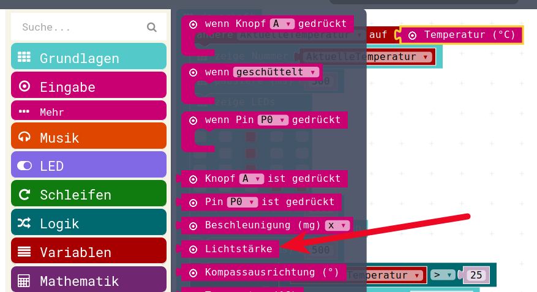
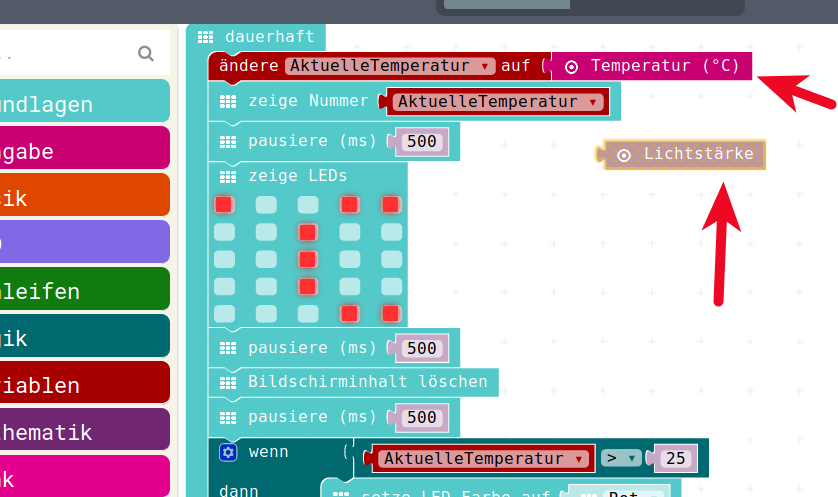
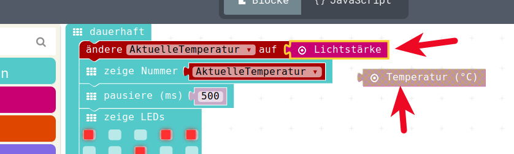
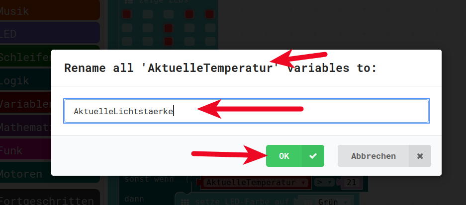
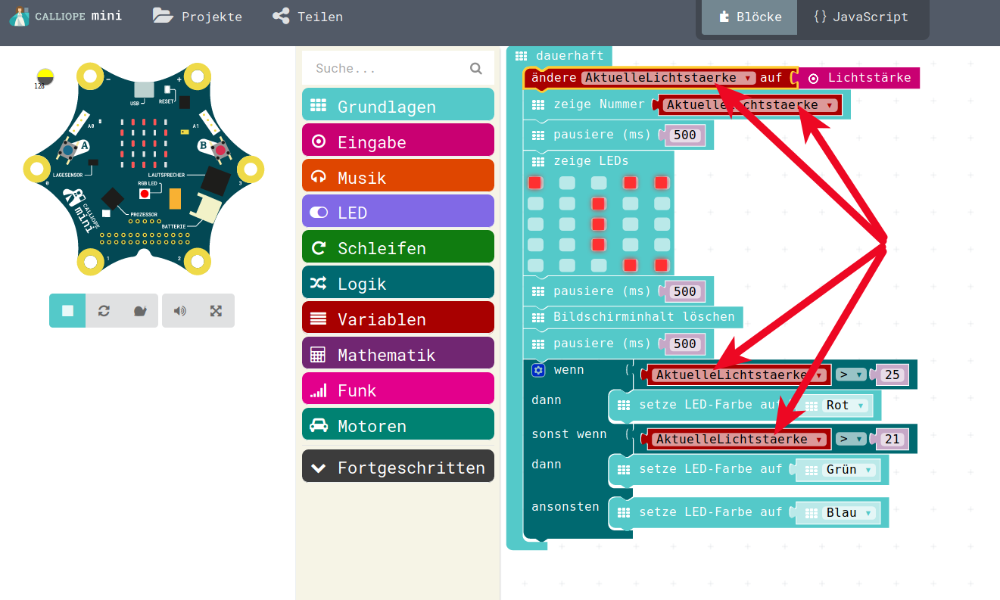
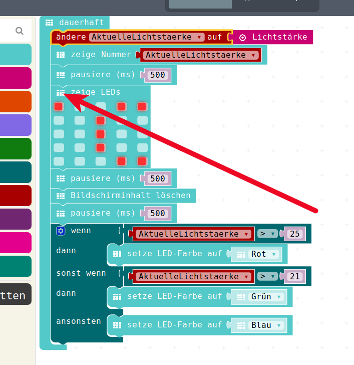
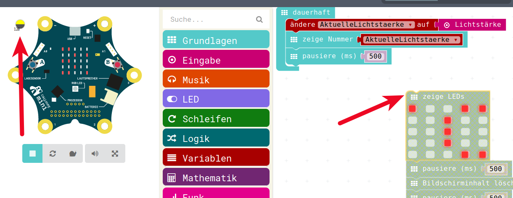

# Der Licht-Sensor


## Sensor/Eingang/Input => Licht


Nun wollen wir etwas mit dem ebenso im Calliope vorhandenen Licht-Sensor experimentieren. 

__Achtung__ : Weil wir faul sind, fangen wir nicht ein ganz neues Programm an, sondern wir verwenden unseren Temperatur-Sensor-Programm als Start-Punkt.  

Wenn wir das Programm dann später aber sichern um es in den Calliope zu laden, 
dann sollten wir ihm einen sinnvollen neuen Namen geben (z.B. LichtSensor01) 
um nicht unser Temperatur-Sensor Programm zu überschreiben!

Nun begeben wir uns also auf die Suche nach dem Licht-Sensor.   
Auch diesen finden wir im Menu Eingabe.

## Sensor/Eingang/Input => Licht

{height=60%}

Diese Input-Variable ziehen wir uns einfach mal auf die Arbeitsfläche, damit wir sie zur Verfügung haben.

## Austausch Temperatur gegen Licht


Nun haben wir die __momentan unbenutzte__ Input-Variable  __Lichtstärke__ auf dem Arbeitsbereich rumliegen.


{height=60%}


## Austausch Temperatur gegen Licht

Diese __tauschen__ wir nun in unserem Programm gegen die Temperatur-Input-Variable aus.  
Wir ziehen die __Temperatur__ aus dem Programm raus in die Arbeitsfläche und klicken dafür die __Lichtstärke__ in das Programm ein

{height=60%}


## Variable umbenennen

* Nun haben wir schon ein theoretisch funktionierendes Programm.  
* Das können wir sogar schon im Simulator anschauen.  
* Aber vorher wollen wir nun doch etwas "sauber machen"  
 
Bei der Programmierung ist fast nichts schlimmer, als Variablen-Namen, die falsch benannt sind.

* Das haben wir jetzt aber gerade gemacht, wir haben ein Programm geschrieben,  
* welches die __Lichtstärke__ misst u
* nd diese in einer Variable namens __AktuelleTemperatur__ ablegt   
* und anschliessend damit weiterarbeitet!  

## Variable umbenennen

Also benennen wir die Variable __AktuelleTemperatur__ in __AktuelleLichtstaerke__ um!

Dazu klicken wir auf das kleine Dreieck neben __AktuelleTemperatur__ mitten in unserem Programm

{height=60%}

## Variable umbenennen

Da öffnet sich dann ein kleines Menu, in dem wir eine andere Variable benutzen können,  
was wir aber gar nicht wollen, sondern wir wollen wirklich die Variable __AktuelleTemperatur__ umbenennen.  
Dazu klicken wir also im Menu auf __Variable umbenennen__ 

Nun öffnet sich ein Fenster, in dem wir die Variable umbenennen können, mein Vorschlag wäre : __AktuelleLichtstaerke__  

{height=60%}

## Alle Verwendungen umbenannt

Hier sehen wir jetzt auch gleich den Vorteil:  
Dadurch dass wir die Variable umbenannt haben, wurden __ALLE__ Vorkommen dieser Variable im ganzen Programm ersetzt 

{height=60%}

## Programm noch aufräumen

Wir bleiben weiterhin faul:

* Wir wollen später noch das __Wenn-Dann__ Konstrukt benutzen.   
* Momentan interessieren uns nur die Messwerte, 
* die wir in der echten Welt 
* mit unserem echten Calliope  
* hier in userem Raum bekommen.
 
Darum räumen wir den ganzen Rest zur Seite.  

## Programm noch aufräumen

__ACHTUNG__: Nicht löschen, nur zur Seite ziehen

{height=60%}

## Sinnvolles Programm

Nun haben wir also ein sinnvolles Programm, das wir zuerst im Simulator testen können (mit der Maus auf den kleinen Licht-Regler und dort das Licht ändern)  

{height=60%}

Wenn das zu unserer Zufriedenheit funktioniert, dann können wir es in den Calliope hochladen.  
__ACHTUNG__: Wie vohin geschrieben, solten wir dem Programm einen sinnvolleren Namen geben, z.B. __LichtMesser01__


## JavaScript-Code

<details>
 <summary>Java-Script-Code</summary>

```js

```
</details>

__Download Hex-Code__

[Hex-code](code/mini-TemperaturMesser01.hex)


## Lizenz/Copyright-Info

Für alle Bilder auf diesen Folien/Seiten gilt:

* Autor: Jörg Künstner
* Lizenz: CC BY-SA 4.0

