# Die Schubladen-Alarm-Anlage


## Messungen, Messwert-Ermittlung

Nachdem wir das Mess-Programm in den Calliope runtergeladen haben, können wir einige Messwerte mit heller und dunkler Umgebung ermitteln.  
Bei mir kamen bei den letzten Messungen in mittlerer Umgebung Messwerte um die 90 raus, beim Abdecken des Calliope mit der Hand, fallen die Werte dann sehr schnell auf ca 60 und kleiner.

## Ziel unserer Mini-Alarm-Anlage 

* Nun wollen wir also eine einfache Schubladen-Alarm-Anlage bauen.  
* Diese soll auf der gemessenen Helligkeit basieren.  
* In der geschlossenen Schublade ist es dunkel
* Das heisst niedere Messwerte
* Wenn die Schublade geöffnet wird, dann wird (ausser in einem dunklen Zimmer...) in der Schublade hell
* Das heisst hohe Messwerte
* Wir wollen also ab einem bestimmten Messwert, den Ihr Euch basierend auf den gerade gemachten Messungen selbst ausdenken könnt, etwas tun
* Wir wollen einen kleinen Alarmton auslösen


## Wiedereinbau Wenn-Dann 

Nun bauen wir das vorher "zur Seite geschobene" Wenn-Dann-Konstrukt wieder ein und hängen es unten in unser Programm rein.  

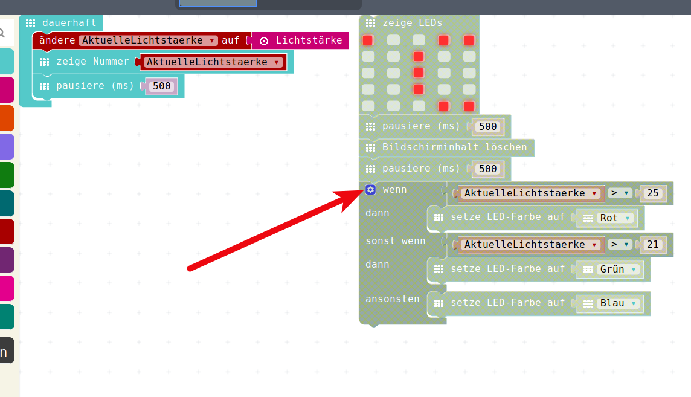

Der Rest (zeige LEDs und pausieren etc) ist "Müll", das brauchen wir wirklich nicht und können es zurück ins Menu schieben, was ja gleichzeitig der Müll-Eimer ist, wenn man irgendwelche Puzzle-Teile aus dem Arbeits-Bereich rauszieht.

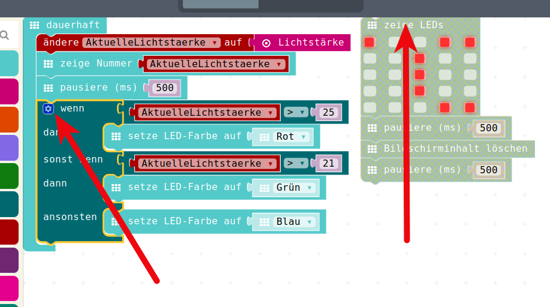


## Tool/Werkzeug-Box bei Wenn-Dann

Das Wenn-Dann-Konstrukt ist ja noch ein Überbleibsel aus unserem Temperatur-Messer und ist so noch nicht sinnvoll einsetzbar.  
Wir wollen 

* gar nicht so viele Entscheidungen haben
* die Vergleiche sind wahrscheinlich noch falsch, 25 und 21 waren Temperatur-Vergleichswerte
* Wir wollen die Reaktion ändern, wir wollen ja keine LED-Farbe ändern sondern einen Ton produzieren.

Zur Änderung des Wenn-Dann-Konstrukts öffnen wir wieder die Werkzeugbox durch das kleine Zahnrädchen.

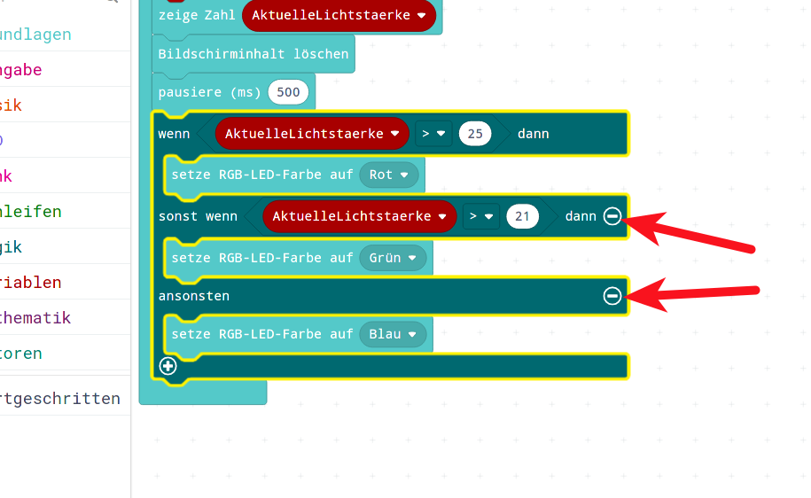

* Dort schieben wir wieder in der Miniatur-Version. 
* Diesmal schieben wir von rechts nach links, das heisst wir machen unser Programm-Konstrukt viel kleiner
* Wir brauchen weder das __SonstWenn__ noch das __Sonst__

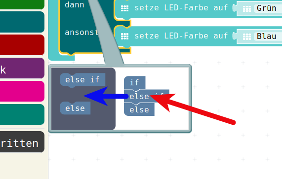

Wenn wir das alles in unserer kleinen Werkzeugbox geschoben haben, 
sieht unser Ergebnis in gross so aus: 
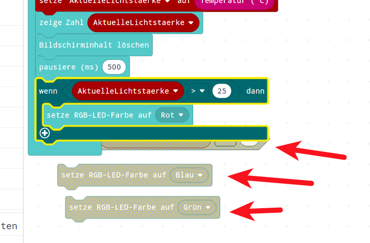

Wenn wir nun noch die jetzt überflüssig gewordenen Teile "entsorgen"  
(in die Mitte, in den Mülleimer schieben) dann haben wir ein kompaktes Zwischenprogramm:
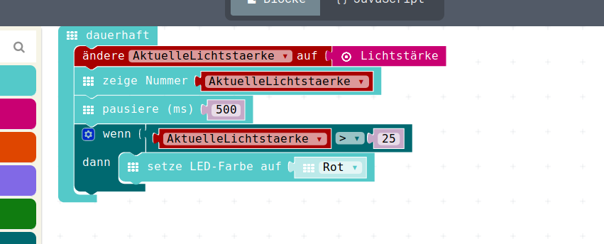

## Musik/Alarmton 

Das Menu Musik habit Ihr ja alle schon gefunden, trotzdem hier nochmal der Hinweis:  
Töne und Melodien befinden sich im Menu Musik:  

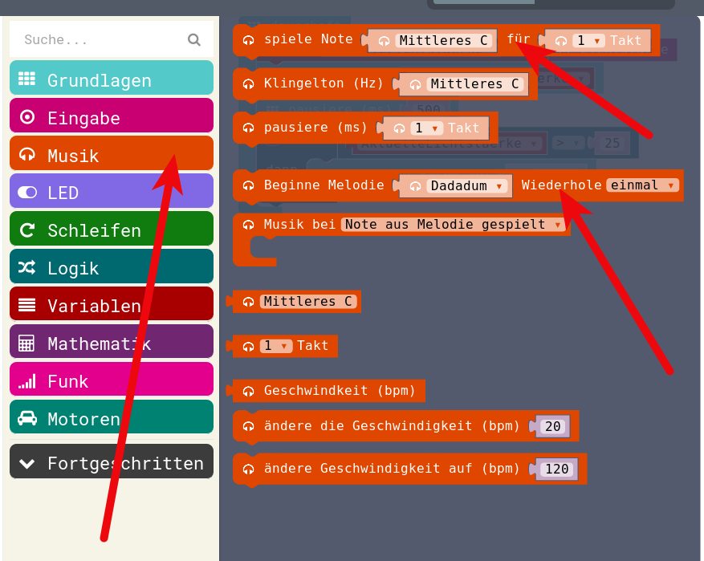

Wir können uns unseren Alarmton entweder aus einer Melodie direkt holen,   
oder aber wir bauen etwas aus Einzeltönen zusammen.  
Für unsere Alarm-Anlage wollen wir das beispielhaft aus einzelnen Tönen zusammenbauen,  
wir wollen ein __Martinshorn__, eine Polizeisirene nachbilden.

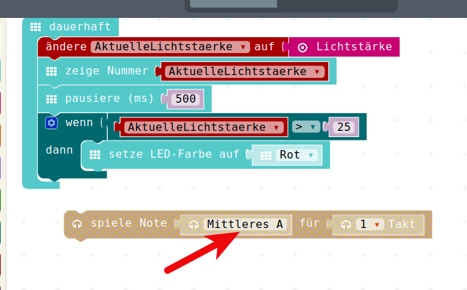

Dafür wird laut Wikipedia eine Quint empfohlen, zum Beispiel ein A und das nächsthöhere D.  
Im Beispiel nehmen wir hier das mittlere A und das hohe D, aber da kann antürlich jeder für sich experimentieren.  
__BITTE__ : Macht die Lautsprecher an Euren Laptops leise, wenn jetzt alle gleichzeitig eine Sirene bauen...

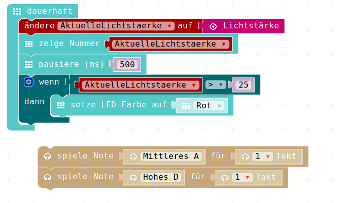

Wenn man die Tonfolge aus den beiden Tönen dreimal kopiert ergibt sich schon ein schöner Martinshorn-Klang:

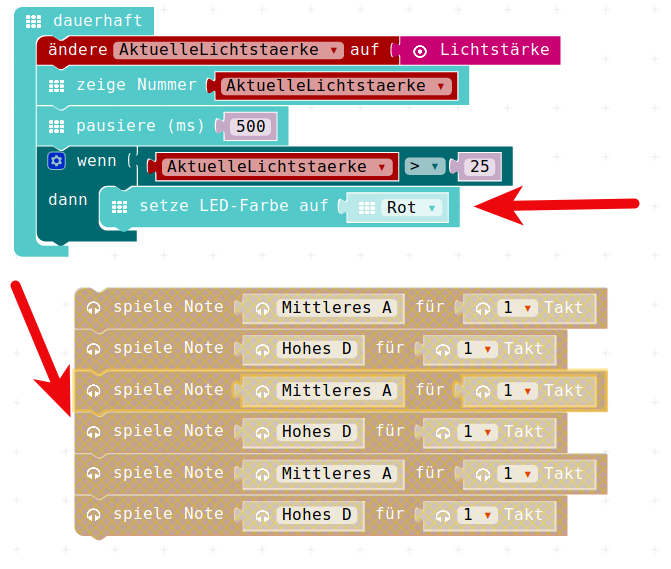

Das könne wir nun in den aktiven Bereich des Programms reinschieben und  
dann müssen wir noch die Lichtstärke auf einen sinnvollen Wert anpassen:  
Bei meinen Messungen ergaben sich - wie gesagt - sinnvolle Werte um die 90  


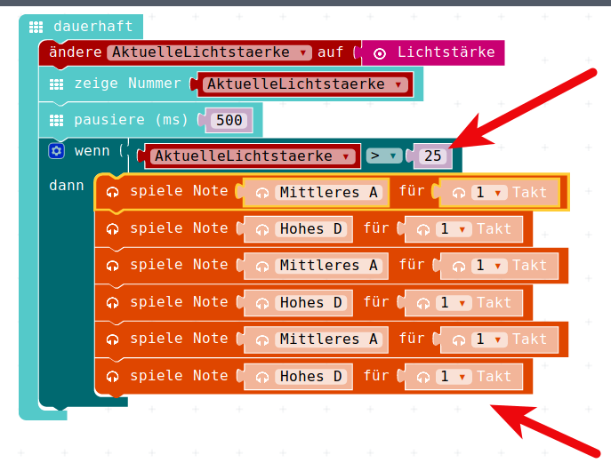

Hier ist jetzt also der Wert auf __meinen__ sinnvollen Wert abgeändert.  
Nun können wir noch die inzwischen unnötige Pause rausmachen:   
(die brauchen wir nicht mehr, die war darin, damit das Display nicht ständig anzeigt,  
aber unser Programm läuft ja erst nach dem Töne machen weiter läuft)  


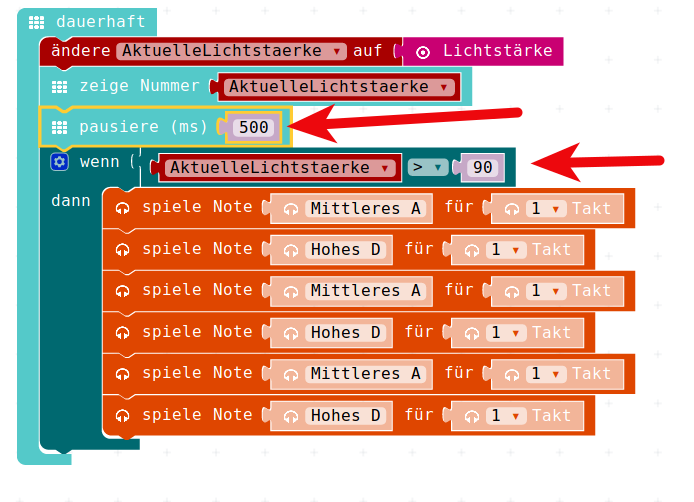

## Das finale Programm 

So sieht nun unser finales Programm aus:   

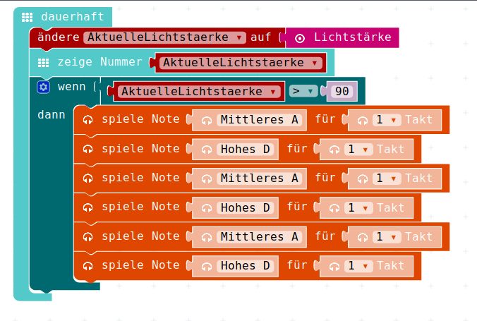


Das können wir nun im Simualtor ausprobieren, indem wir verschiedene Helligkeits-Stufen ausprobieren und dann wollen wir es 
natürlich auch wieder im echten Calliope laufen lassen.  
__ACHTUNG__ : Sinnvoellen, neuen Namen vergeben, z.B. __LichtMesser02__ oder __SchubladenAlarm__ oder ähnliches. 


## JavaScript-Code

<details>
 <summary>Java-Script-Code</summary>

```js
let AktuelleLichtstaerke = 0
basic.forever(() => {
    AktuelleLichtstaerke = input.lightLevel()
    basic.showNumber(AktuelleLichtstaerke)
    if (AktuelleLichtstaerke > 90) {
        music.playTone(440, music.beat(BeatFraction.Whole))
        music.playTone(587, music.beat(BeatFraction.Whole))
        music.playTone(440, music.beat(BeatFraction.Whole))
        music.playTone(587, music.beat(BeatFraction.Whole))
        music.playTone(440, music.beat(BeatFraction.Whole))
        music.playTone(587, music.beat(BeatFraction.Whole))
    }
})

```
</details>

## Download Hex-Code

[Hex-code](code/mini-LichtMesser02.hex)


## Navigation


* [Zurück](../05_01_LichtSensor/README.md)  
* [Hoch zur Übersicht](../README.md)  


## Lizenz/Copyright-Info
Für alle Bilder auf dieser Seite gilt:

*  Autor: Jörg Künstner
* Lizenz: CC BY-SA 4.0
