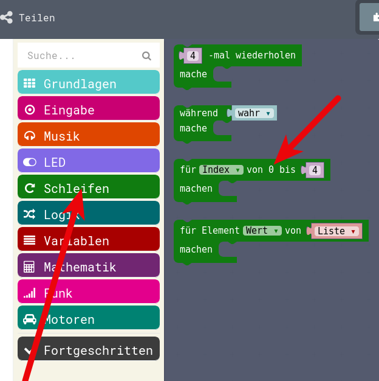
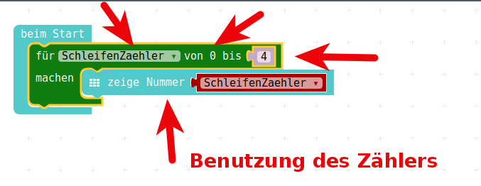

# Schleifen-Programmierung

## Was sind Schleifen

* __Frage__ : Wofür braucht man Schleifen?  
* __Antwort__ : Immer dann, wenn man etwas gleiches wiederholen will!

Beispiel : Man möchte beim Einschalten 5 mal ein Gesicht blinken lassen

Mit den uns bekannten Möglichkeiten:

* __beim Start__-Block holen
* Gesicht malen
* LED-Bildschirm löschen
* Gesicht malen
* LED-Bildschirm löschen
* usw usw ...  (alles in __Grundlagen__)

## Beispiel 1 : Ohne Schleife

Beim Starten 5 mal ein Gesicht blinken lassen

{height=60%}

## Beispiel 1 : Mit Schleife (1)

Wo finden wir Schleifen ?

Hauptmenu: 

{height=70%}

## Beispiel 1 : Mit Schleife (2)

Hier finden wir verschiedene Schleifen.  

Wir interessieren uns zuerstmal für die erste Variante

{height=70%}

 

## Beispiel 1 : Mit Schleife (3)

* Wir ziehen diese __4 mal wiederholen__ - Schleife in den __beim Start__-Block  
* dann überschreiben wir die 4 mit einer 5
* und ziehen ein Gesicht und ein Löschen in den __mache__-Teil der Schleife
* Fertig...  

{height=60%}

## Beispiel 1 : Vergleich

\colA{6cm}

{height=90%}

\colB{6cm}

{height=50%}

\colEnd

## Beispiel 1 : Auswertung

* Welches Programm sieht kompakter aus?
* Welches Programm ist einfacher zu verstehen?
* Welches Programm ist einfacher zu warten, zu ändern?

Damit kommen wir zu Beispiel 2:

## Beispiel 2 : Beim Starten 5 mal ein Herz anzeigen  

Nun kommt unser __Auftrag-Geber__ von __Programm 1__ und sagt:  

* Ach, ich wollte doch lieber ein Herz blinken haben, 
* und das wenn möglich 6 mal.  

Nun wollen wir die beiden Varianten aus Beispiel 1 nehmen und entsprechend verändern.

## Beispiel 2 : Ohne Schleife

Wieviele Änderungen müssen wir machen, wie oft mit der Maus klicken, um aus Programm 1 das Programm 2 zu machen.

\colA{6cm}

{height=70%}

\colB{6cm}

{height=70%}

\colEnd

## Beispiel 2 : Mit Schleife

\colA{6cm}

{height=60%}

\colB{6cm}

{height=60%}

\colEnd

## Beispiel 2 : Auswertung

* Welches Programm sieht kompakter aus?
* Welches Programm ist einfacher zu verstehen?
* Welches Programm ist einfacher zu warten, zu ändern?
* Welches Programm ist fehler-anfälliger?

__MERKE__ : Sobald man anfängt, beim Software-Programmieren etwas zu kopieren, muss man darüber nachdenken, 
ob man das mit einer Schleife den Computer erledigen lassen könnte. 

## Ursprungs-Frage

- __Frage__ : Wofür braucht man Schleifen? 

- __Antwort 2__ : Immer dann, wenn man etwas sehr ähnliches wiederholen will, wobei sich dabei bestimmte Dinge ändern können, die vom Schleifendurchlauf abhängen.
  - Also beim __ersten__ Schleifendurchlauf wird etwas mit einer __1__ gemacht
  - Beim __zweiten__ Durchlauf wird etwas mit einer __2__ gemacht 
  - usw. usw.
- Wir wollen nun einen Zähler bauen.

## Beispiel 3 : Schleife mit Zähler

Nun wollen wir innerhalb des sogenannten "Schleifenkörpers" die Anzahl der Schleifen-Durchgänge anzeigen.

* Dazu benutzen wir die gerade vorhandene Schleife, 
* legen __VOR__ der Schleife eine Variable namens __SchleifenZaehler__ an, 
* diese belegen wir mit 0.

## Beispiel 3 : Schleife mit Zähler

Im Schleifenkörper lassen wir uns den Wert dieser Variable anzeigen (mit "Zeige Nummer") und erhöhen anschliessend die Variable/den Zähler.

{height=40%}

Da wir den Zähler mit 0 vorbelegen und die Schleife 5 mal läuft, bekommen wir durch dieses Programm die Zahlen 0 bis 4 angezeigt.

## Beispiel 4 : Schleife mit eingebautem Zähler

Diese Art der Schleife wird sehr oft gebraucht:  
eine Schleife, die eine bestimmte Anzahl von Durchläufen erlaubt und bei der man die Schleifendurchläufe mitzählt.

Darum gibt es dafür ein extra Programmier-Konstrukt. 

Das ist die sogenannte __Index-For-Schleife__ .

## Beispiel 4 : Schleife mit eingebautem Zähler

Die Index-For-Schleife finden wir ebenso im Menu Schleifen:

{height=60%}

## Beispiel 4 : Schleife mit eingebautem Zähler

Wenn wir diese Schleife benutzen und unser Programm entsprechend umgestalten, sieht es nochmal um einiges einfacher aus:  

{height=60%}

## Vergleich der beiden Schleifen

\colA{6cm}

{height=60%}

\colB{6cm}

{height=60%}

\colEnd

## Lizenz/Copyright-Info
Für alle Texte und Bilder auf diesen Folien/Seiten gilt:

* Autor: Jörg Künstner
* Lizenz: CC BY-SA 4.0

