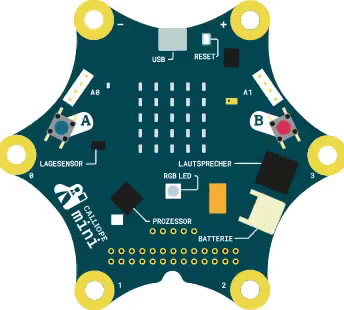
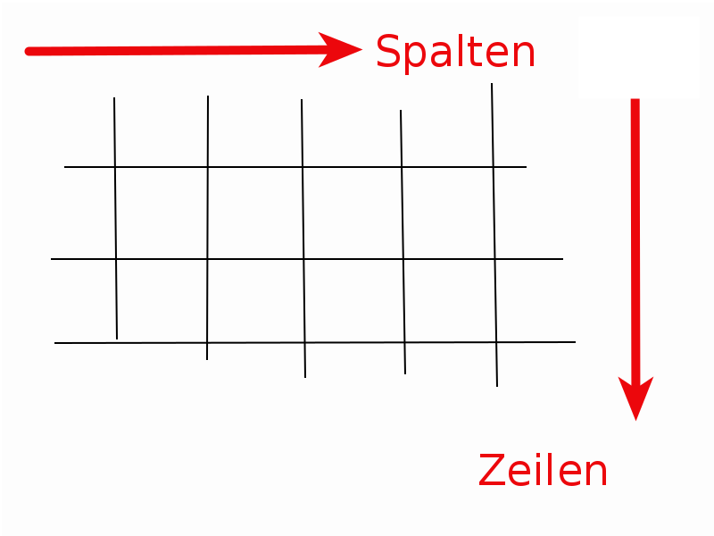
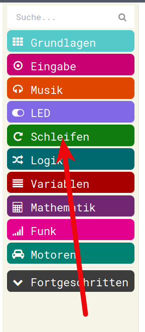

# Schleifen Programmieren

## Komplizierte LED-Muster

Nun möchten wir ein LED-Muster anzeigen, das mehr als 2-3 verschiedene Bilder anzeigt.
z.B. sowas:





## Versuch Nummer 1


Bis jetzt haben wir gelernt:
- Eine Endlos-Schleife ab Start 
- LED-Muster anzeigen
- Warten

Mit diesen Kenntnissen starten wir das Programm


__STOPPPPPPP__

Führt das zum Ziel?  
=>
Ja, aber das geht sicher etwas einfacher oder eleganter...   


## Versuch Nummer 2

Dazu schauen wir uns aus dem Menu __LED__ einmal einen Befehl etwas genauer an:  

__Zeichne  X Wert Y Wert__

Damit kann man einzelne LEDs auf unserem 5 x 5 LED-Bildschirm einschalten.


* Das probieren wir gleich mal im Simulator aus, 
* Wir klicken diesen einen Befehl in die __Dauerhaft__-Schleife ein
* Wir spielen mit den X und Y-Werten
* Wir schauen, was im Simulator passiert.


* Wir können durch Verändern der Werte für X und Y zwischen 0 und 4 jede beliebige LED auf unserem 5 x 5 - Display einschalten.

### Zeilen und Spalten

* Das kommt aus der Mathematik, man bezeichnet im Allgemeinen die Spalten-Richtung mit X 
* und man bezeichnet die Zeilen mit Y



* Spalten, horizontale Richtung, Links-Rechts : __X__ 
* Zeilen, vertikale Richtung, Oben-Unten : __Y__ 


* Vielleicht ist Euch aufgefallen, dass die erste Zeile und erste Spalte durch 0 angesprochen wird, nicht durch 1!
* Das ist in fast allen Programmiersprachen so, dass die 0 die jeweils erste Zeile/Spalte anspricht!

### Versuch 2 final

* Nun beschränken wir uns also auf eine Zeile in unserer LED-Anzeige
* Wir zeichnen einen Punkt nach dem anderen
* Dazu erhöhen wir jeweils den Spalten-Wert 
* Also __X__ !


* Wenn wir nun noch zwischen den Befehlen Warte-Zeiten von ca 200 - 300 ms einbauen und dann am Schluss der Endlos-Schleife den Bildschirm löschen, dann sieht das ganz gut aus.

* Damit haben wir jetzt aber eigentlich noch nichts gewonnen...
* Wir müssten immernoch, um den kompletten "Bildschirm" mit 5 x 5, also 25 LEDs zu füllen, 25 Befehle hinschreiben.
* Und da die Befehle schneller abgearbeitet werden, als die "__Zeige Leds__"-Befehle, müssen wir auch noch das __pausieren__ einbauen
* Aber etwas haben wir "gewonnen" : Wir haben jetzt Befehle eingebaut, die mit Zahlen arbeiten.
* Und aus den letzten Kurs-Nachmittagen haben wir vielleicht gelernt, dass wir __feste Zahlen__ auch durch __Variablen__ ersetzen können...
* Das wollen wir nun tun.
* Und dann innerhalb einer sogenannten Schleife, die benutzte Variable verändern.

### JavaScript-Code Versuch 2

Versuch 2, eine Zeile mit einzelnen LED-Befehlen. 

<details>
 <summary>Java-Script-Code</summary>

```js
basic.forever(() => {
    led.plot(0, 0)
    basic.pause(300)
    led.plot(1, 0)
    basic.pause(300)
    led.plot(2, 0)
    basic.pause(300)
    led.plot(3, 0)
    basic.pause(300)
    led.plot(4, 0)
    basic.pause(300)
    basic.clearScreen()
})

```
</details>

### Download Hex-Code Versuch 2


## Versuch 3 mit Index-Schleife 

( Im Englischen nennt man das die __FOR-Loop__ )

* Wir schauen uns jetzt zuerstmal an, wo wir eine solche Schleife in unserer Programmier-Umgebung bekommen 
* Und wie sie aussieht
* Und dann schauen wir uns an, was die Schleife genau macht.

### Verschiedene Schleifen

* Im Menu Schleifen gibt es unterschiediche Arten von Schleifen



* Was die im Einzelnen machen und unterscheidet, das können wir uns leider jetzt nicht genauer anschauen,
* Wir wollen die __Index-Schleife__


### Der Schleifen-Index

* Diese Index-Schleife ziehen wir uns mal auf die Arbeitsfläche.
* Und dann schauen wir sie uns etwas näher an.
 


* Wenn man die Schleife genauer anschaut, sieht man drei Dinge, die anscheinend veränderbar sind.
     * Neben dem Namen "Index" ist ein Dreieck, das deutet immer darauf hin, dass man etwas verändern kann.
     * Die __4__ hinten ist eine Zahl, die scheint man auch verändern zu können.
     * In der Mitte der Schleife kann man bei __Machen__ anscheinend Befehls-Puzzle-Teile einklicken
* Was macht diese Schleife?
* So wie sie dasteht, fängt sie an, die Variable __Index__ wird mit 0 beschrieben und dann wird durchgeführt, was bei __machen__ eingeklickt wurde.
* Wenn das fertig getan ist, fängt sie wieder oben an, die Variable __Index__ wird __um 1 erhöht__ und dann wird wieder alles durchgeführt, was bei __machen__ steht
* So geht es weiter, bis die __Index__-Variable den __Wert 4__ enthält, dann wird die Schleife noch ein letztes Mal durchgeführt, also alles was bei __machen__ steht wird abgearbeitet und dann ist die Schleife fertig.
* Diese Schleife - so wie sie dasteht -- läuft also __5 mal__!
     * Zuerst mit Index = 0
     * Dann  mit Index = 1
     * Anschliessend mit Index = 2
     * Daraufhin mit Index = 3
     * Schliesslich ein letztes Mal mit Index = 4
     
 * Die __Index__-Variable wird auch __Lauf__-Variable genannt.
 * In dieser Schleife kann man nun also die Anzahl der Durchläufe ändern
 * Und man kann den Namen der __Lauf/Index__-Variable verändern
 * Da wir 5 LEDs in einer Reihe anschalten wollen, passt uns die __4__, die ja __5__ Durchläufe ergibt, ganz gut, die müssen wir also gar nicht ändern.
 * Die Lauf-Variable wollen wir aber umbennen in __Spalte__ 


* Wenn wir die Variable in __Spalte__ umbenannt haben, dann holen wir uns aus unserer Endlos-Schleife (Auch eine Schleife, die läuft aber __IMMER__) unten das Anschalten der LED und die dazugehörige Pause.
* Das Löschen des Bildschirms legen wir mal auch noch zur Seite
* Dafür ersetzen wir den festen Wert __4__ der bei __X__ steht durch die Variable, die wir __Spalte__ genannt haben


* Nun haben wir also eine Schleife.
* Diese läuft von 0-4, also 5 mal
* Die Lauf-Variable heisst __Spalte__
* Diese Laufvariable wird von 0 - 4 durchgezählt 


* Das können wir nun in unsere Gesamt-Programm-Endlos-Schleife einklicken
* Dazu räumen wir diese (1) zuerst leer, wir ziehen den ganzen Block in den Mülleimer
* Unsere neue Index-Schleife ziehen (2) wir nun rein, um sie zur Ausführung zu bringen 
* Unter die Index-Schleife ziehen wir (3) nun noch das Bildschirm-Löschen


* Damit haben wir nun eine schöne erse Index-Schleife programmiert
* Das Ergebnis schauen wir zuerst im Simulator an
* Wenn alles passt, können wir das auch in den Calliope programmieren.


* Diese Schleife  läuft nun  __5 mal__!
     * Zuerst mit Variable __Spalte = 0__, dann wird die LED in Spalte (X) __0__ Zeile (Y) 0 gesetzt
     * Dann  mit Variable __Spalte = 1__, dann wird die LED in Spalte (X) __1__ Zeile (Y) 0 gesetzt
     * Anschliessend mit Variable __Spalte = 2__, dann wird die LED in Spalte (X) __2__ Zeile (Y) 0 gesetzt
     * Daraufhin mit Variable __Spalte = 3__, dann wird die LED in Spalte (X) __3__ Zeile (Y) 0 gesetzt
     * Schliesslich ein letztes Mal mit Variable __Spalte = 4__, dann wird die LED in Spalte (X) __4__ Zeile (Y) 0 gesetzt


### JavaScript-Code Versuch 3

Versuch 3, eine Zeile mit einer Schleife. 

<details>
 <summary>Java-Script-Code</summary>

```js

basic.forever(() => {
    for (let Spalte = 0; Spalte <= 4; Spalte++) {
        led.plot(Spalte, 0)
        basic.pause(300)
    }
    basic.clearScreen()
})
```
</details>

### Download Hex-Code Versuch 3


## Versuch 4, Ganzer Bildschirm

* Nun können wir also mit einer Schleife eine Zeile füllen, durch die Index-Schleife wird die Zeile __spaltenweise__ gefüllt
* Wir wollen aber immnoch den ganzen Bildschirm einzeln mit LEDs füllen.
* Dazu kopieren wir nun die Index-Schleife 4 mal 


* Wir hängen sie viermal untereinander
* Das Bildschirm-Löschen schieben wir dabei nach unten, das wollen wir nur einmal ganz am Schluss haben
* Nun haben wir 5 identischen Zeilenfüller, verwirklicht durch eine Schleife
* Wir müssen nun noch die Zeilen-Nummern anpassen.  


* Wenn wir das gemacht haben, haben wir ein Programm, das den Bildschirm LED für LED füllt 
* Und das ganze durch die schlaue Verwendung einer Schleife, anstatt durch Aneinanderreihen von 25 Led-Setz-Befehlen. 


## JavaScript-Code

Finales LED-Flächen-Füll-Programm   

<details>
 <summary>Java-Script-Code</summary>

```js
let Spalte = 0
basic.forever(() => {
    for (let Spalte = 0; Spalte <= 4; Spalte++) {
        led.plot(Spalte, 0)
        basic.pause(300)
    }
    for (let Spalte = 0; Spalte <= 4; Spalte++) {
        led.plot(Spalte, 1)
        basic.pause(300)
    }
    for (let Spalte = 0; Spalte <= 4; Spalte++) {
        led.plot(Spalte, 2)
        basic.pause(300)
    }
    for (let Spalte = 0; Spalte <= 4; Spalte++) {
        led.plot(Spalte, 3)
        basic.pause(300)
    }
    for (let Spalte = 0; Spalte <= 4; Spalte++) {
        led.plot(Spalte, 4)
        basic.pause(300)
    }
    basic.clearScreen()
})
```
</details>

## Download Hex-Code


## Navigation


* [Zurück](../04_02_Wenn-Dann/README.md)  
* [Hoch zur Übersicht](../README.md)  
* [Weiter](../04_04_TemperaturAmpel/README.md)  


## Lizenz/Copyright-Info
Für alle Bilder auf dieser Seite gilt:

*  Autor: Jörg Künstner
* Lizenz: CC BY-SA 4.0

