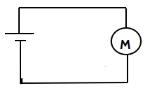
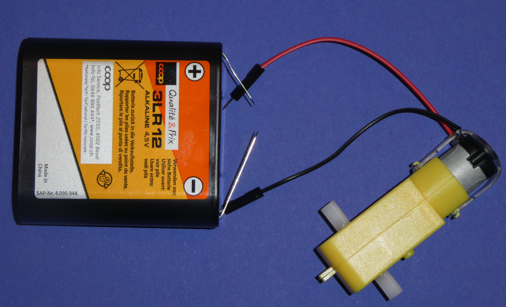
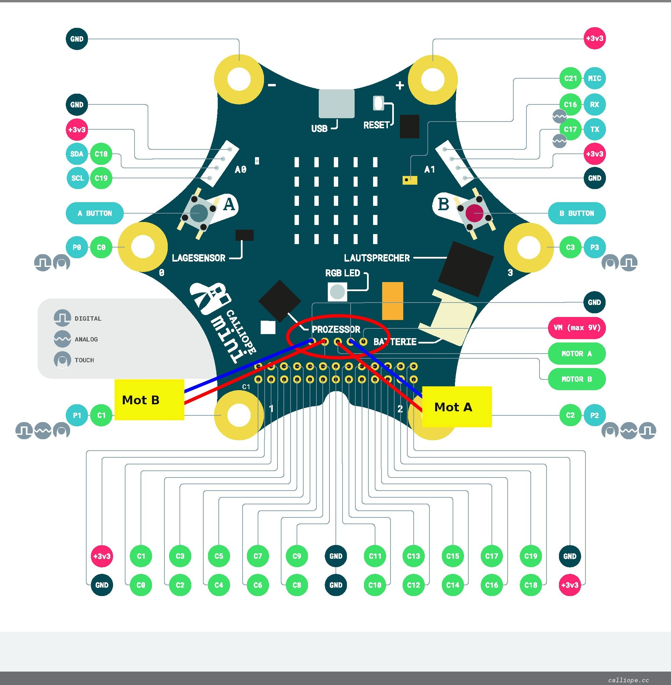
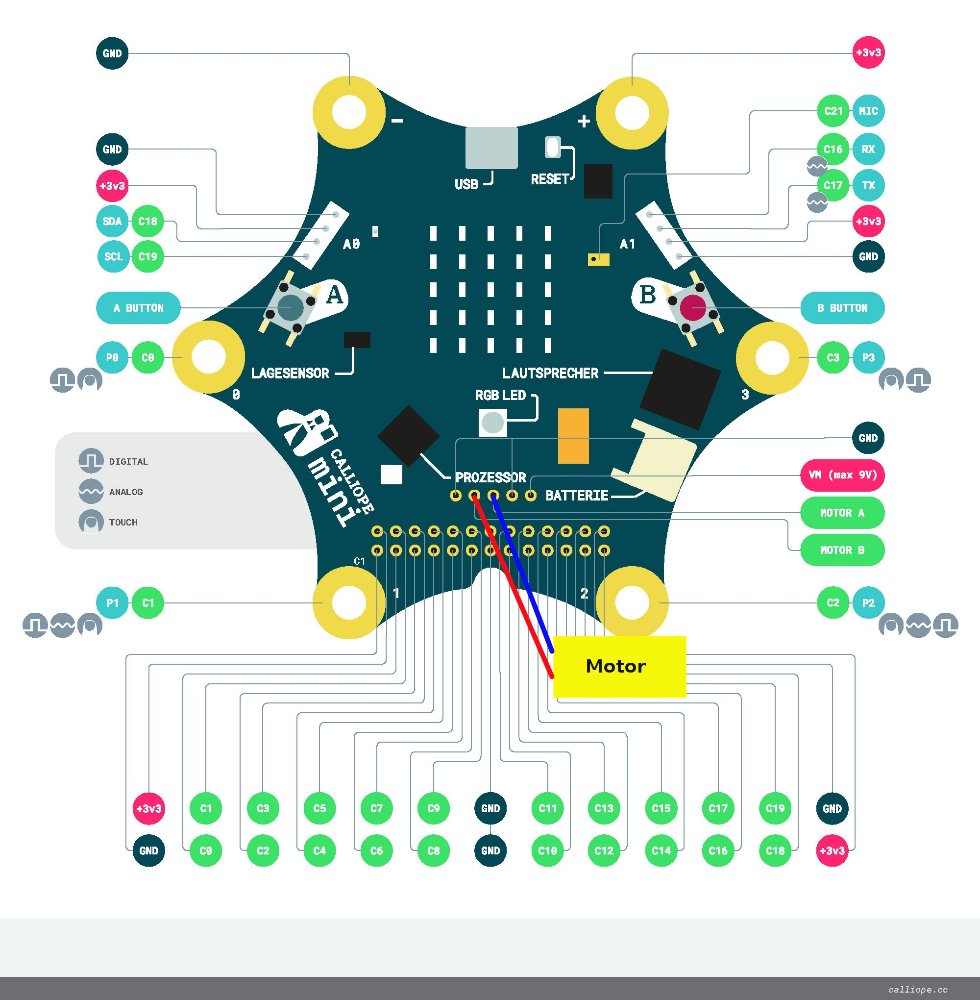
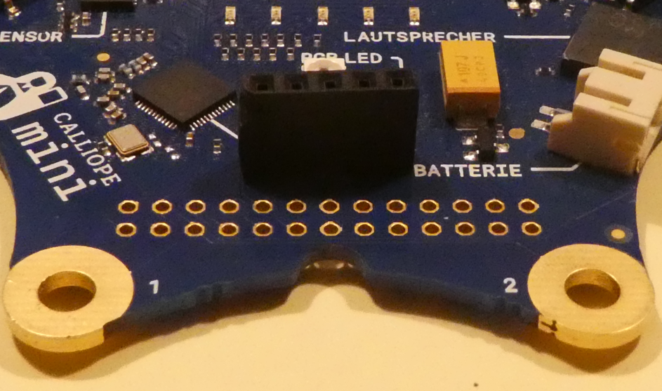
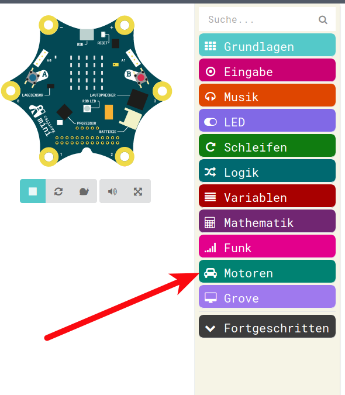
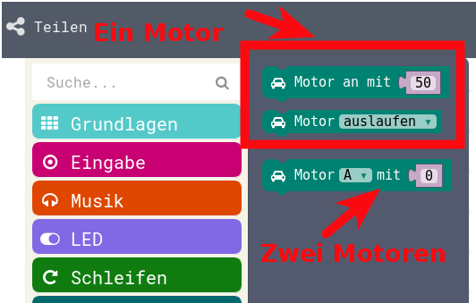
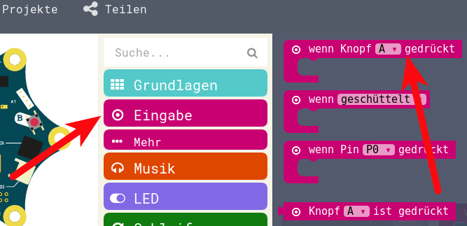
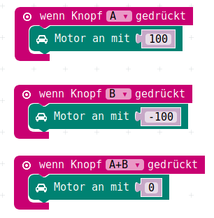

# DC-Motoren

## Einführung 

DC steht für __D__ irect __C__ urrent und heisst Gleichstrom. ( AC steht für __A__ lternate __C__ urrent und heisst Wechselstrom. Die australische Musikgruppe AC/DC heisst also eigentlich Wechselstrom/Gleichstrom) 


Ein __DC__-Motor funktioniert prinzipiell wie gerade beschrieben :

* Ein elektrischer Magnet zieht einen Permanent-Magnet an.  
* Sobald der Permanent-Magnet in die Nähe des elektrischen Magneten kommt, schaltet dieser ab und der etwas weiter entfernte Elektro-Magnet wird eingeschaltet.  
* So geht es in einem fort, immer im Kreis herum.


Der DC-Motor läuft einfach mit einer Batterie, je grösser die Spannung um so schneller dreht sich der Motor.  
Er darf aber nicht mehr Spannung bekommen, als er verträgt!

## Motor ausprobieren

Nun probieren wir einfach mal direkt den Motor an eine Batterie anzuschliessen.
 
So sieht das dann als Schaltbild aus:

{height=60%}

## Batterie ranhalten

Wir halten hier die Kabel nur an die Batterie ran, wir wollen nur wissen ob das so funktioniert.
__Achtung__ : Wie wir am zweiten Nachmittag gelernt haben, ist elektrischer Strom gefährlich. Wir haben aber auch gelernt, dass normalerweise eine Batterie mit 4.5 V uns nicht gefährlich werden kann.
Darum können wir das einfach zusammenhalten!

{height=50%}

## Motor-Anschluss an den Calliope

Der Calliope hat eine zusätzliche elektrische Schaltung mit auf der Platine, die den Anschluss eines Motors überhaupt erlaubt.  
Ein Motor braucht so viel Leistung, dass man den normalerweise nicht direkt an den Mikro-Prozessoren (das sind die "Gehirne" bei unseren Calliopes und anderen Bastel-Platinen) anschliessen darf.  
Der Calliope hat aber die notwendigen "Motor-Treiber" gleich mit eingebaut. Die Schaltung erlaubt sogar den zusätzlichen Anschluss einer stärkeren Batterie (Achtung: bis zu __9V__) so dass man mit dem Calliope sogar Motoren mit bis zu 9V anschliessen und ansteuern kann.

## Ein oder Zwei Motoren

Je nach Verwendungszweck kann man an den Calliope entweder

* 1 Motor anschliessen, der kann dann vorwärts und rückwärts drehen
* 2 Motoren anschliessen, die können dann nur einzeln vorwärts drehen


So sehen die beiden Möglichkeiten zum Anschluss von zwei oder einem Motor aus:

## Zwei Motoren
{height=90%}

## Ein Motor
{height=90%}

## Pfostenstecker 

Um dies zu ermöglichen, müssen wir nun zuerst einmal Pfostenstecker oder Pfostenbuchsen an den Calliope löten. 

So sieht das aus:


{height=60%}

## Pfostenstecker aufgelötet

{height=60%}


## Motor-Programmierung für Calliope

Nachdem wir nun wissen, wie wir einen einzelnen Motor an den Calliope elektrisch anschliessen, wollen wir den Ausgang für den Motor auch mit Software programmieren. 

Im ersten Schritt wollen wir nur ganz einfach den Motor ein- und ausschalten können.  
Dazu wollen wir mit dem linken Knopf ein und mit dem rechten Knopf ausschalten.

## Motor-Menu

Die Motor-Ansteuerung findet sich im Menu Motoren:

{height=60%}

## Motor Befehle

Es gibt nicht viele Befehle zum Steuern von Motoren:

{height=60%}

## Verfügbare Befehle

Wie oben beschrieben, gibt es die Möglichkeit entweder zwei Motoren anszuschliessen, bei zwei Motoren kann man dann 

* Den Motor A oder B auswählen
* Die Geschwindigkeit von 0 - 100 angeben.


Bei Anschluss von nur einem Motor kann man 

* Eine Geschwindigkeit von -100 bis +100 eingeben
* Bremsen oder auf Leerlauf schalten
 
 
## Knopfdruck einschalten

Wir wollen nun - wie beschrieben - nur den einen Motor entweder mit 100 einschalten oder beim Druck des rechten Knopfes mit 0 einschalten, was so viel wie Ausschalten heisst...
 
Mit den Befehlen zum Auswerten der Knöpfe :
 
{height=60%}

## Motor-Ansteuerung

Und den Befehlen zum Ansteuern des Motors :

{height=60%}

## Erstes Motor-Programm

Ergibt das unser erstes Motor-Programm

{height=60%}

Diese Programm können wir leider im Simulator gar nicht nutzen.  
Also müssen wir das Programm auf den Calliope runterladen und dort ausprobieren.

## JavaScript-Code

<details>
 <summary>Java-Script-Code</summary>

```js
input.onButtonPressed(Button.A, () => {
    motors.motorPower(100)
})
input.onButtonPressed(Button.B, () => {
    motors.motorPower(0)
})

```
</details>

__Download Hex-Code__

[Hex-code](code/mini-DC_Motor_01.hex)


## Motor rückwärts

Da wir nun einen Motor angeschlossen haben, können wir nun auch versuchen, den Motor in die andere Richtung laufen zu lassen.

Dazu brauchen wir einen dritten Informations-Eingang, neben Knopf A und Knopf B.

Wir können ja zum Beispiel das Ereignis Knopf A __UND__ Knopf B gleichzeitig gedrückt auswerten.

Dazu bauen wir das Programm um:

* Knopf __A__ => vorwärts
* Knopf __B__  => rückwärts
* Knopf __A UND B__ => Stop

## Mit Motor rückwärts

Wenn wir nun unser Programm im Arbeits-Bereich entsprechend abändern, sieht das nun so aus:


{height=50%}

Auch dieses Programm können wir leider im Simulator nicht nutzen und müssen wir das Programm auf den Calliope runterladen und dort ausprobieren.


## JavaScript-Code

<details>
 <summary>Java-Script-Code</summary>

```js
input.onButtonPressed(Button.A, () => {
    motors.motorPower(100)
})
input.onButtonPressed(Button.B, () => {
    motors.motorPower(-100)
})
input.onButtonPressed(Button.AB, () => {
    motors.motorPower(0)
})


```
</details>

__Download Hex-Code__

[Hex-code](code/mini-DC_Motor_VorRueck.hex)


## Lizenz/Copyright-Info

Für alle Bilder auf diesen Folien/Seiten gilt:

* Autor: Jörg Künstner
* Lizenz: CC BY-SA 4.0

 
