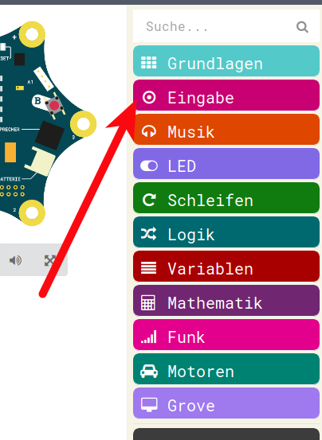
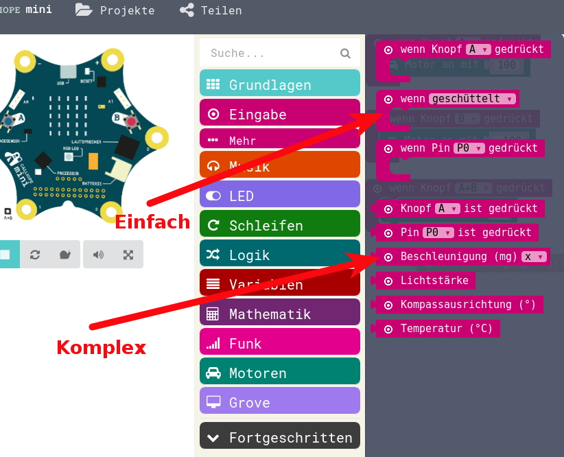

# Motorsteuerung mit Lage-Sensor

## Der Lagesensor

Das funktioniert ja schon mal ganz gut.  
Nun möchten wir mit diesem einfachen Motor-Steuerungs-Programm auch noch eine andere Eingangs-Möglichkeit ausprobieren:

__Den Lage-Sensor!__


Der Calliope hat einen Lage-Sensor eingebaut, der in allen Raumrichtungen funktioniert.  

Also :

* Oben / Unten
* Links / Rechts
* Vorne / Hinten

## Abfragen des Lagesensors

Die Abfragen, um den Lage-Sensor genau auszuwerten, sind recht kompliziert.
Man muss Koordinaten-Systeme verstehen und man sollte Winkelrechnung verstehen.  
Beides ist in Euerem Alter wahrscheinlich noch nicht der Fall.

Zusätzlich zu den genauen Abfrage-Möglichkeiten, die schwierig zu verwenden sind, hat der Calliope aber auch die Möglichkeit, sehr einfach den Lage-Sensor abzufragen.

Das wollen wir nun tun:

* Beim Gerade halten des Calliope soll der Motor aus sein.
* Beim Kippen nach links soll er sich nach vorne drehen
* Beim Kippen nach rechts soll er sich nach hinten drehen.

## Eingabe-Menu

Sowohl die genauen, schwierigeren Befehle als auch die Einfachen befinden sich im Menu Eingabe:

{height=60%}


## Inhalte Eingabe-Menu
{height=80%}


## Wenn geschüttelt 
Nun ziehen wir drei mal das __wenn geschüttelt__ in unseren Arbeits-Bereich:


{height=70%}


## Umwandeln 

Diese wandeln wir nun alle durch Druck auf das Dreieick:

{height=45%}

um in drei verschiedene Reaktionen:

* "nach links neigen"
* "Display nach oben"
* "nach rechts neigen"

## Möglichkeiten 
{height=60%}

## Unser Programm 

Damit sieht unser Programm nun so aus:

{height=75%}

## Fertiges Programm

und wenn wir nun die entsprechenden Befehle von oben nach unten schieben, dann können wir unseren Motor durch kippen steuern.

{height=75%}

## Runterladen in Calliope

Dieses Programm können wir nun auch in den Calliope laden.

Achtung: Zumindest bei manchen Kombinationen von Calliope und Computer (und 
vermutlich angeschlossenem Computer-Ladegerät) hat der Lage-Sensor __NICHT__ richtig funktioniert.

==> 

Bitte steckt in diesem Fall das USB - Kabel aus und betreibt Euren Calliope nur über Batterie.


## JavaScript-Code

<details>
 <summary>Java-Script-Code</summary>

```js
input.onGesture(Gesture.TiltLeft, () => {
    motors.motorPower(100)
})
input.onGesture(Gesture.TiltRight, () => {
    motors.motorPower(-100)
})
input.onGesture(Gesture.ScreenUp, () => {
    motors.motorPower(0)
})

```
</details>

__Download Hex-Code__

[Hex-code](code/mini-DC_Motor_LageSensoren.hex)


