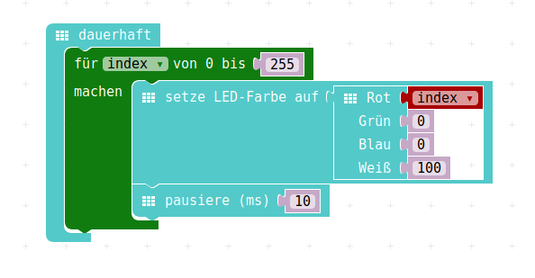
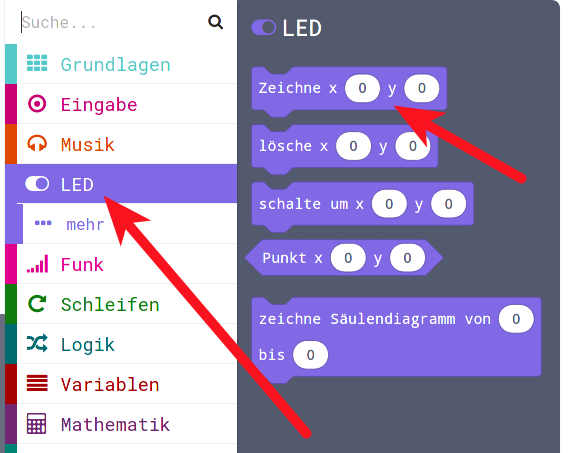
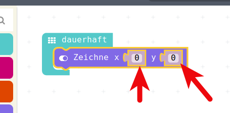

# Nachmittag  4, "Hausaufgaben"

# Aufgabe 1: RGB-LED ansteuern

## RGB-Led mit Schleife 1

Die RGB-LED kann nicht nur die vorgefertigten Farben anzeigen, sondern sie kann die Farben beliebig mischen.

RGB steht für __R__ ot __G__ elb __B__ lau, mit diesen 3 Grundfarben kann man jede Farbe zusammenmischen.

Die Anteile von Rot Gelb und Blau lassen sich von 0 bis 255 verändern.

Da kann man eine Schleife nutzen und verschiedene Farben produzieren.

## RGB-Led mit Schleife 2

Spielt doch mal etwas damit rum, im Menu findet sich das hier:

{height=70%}

## RGB-Led mit Schleife 3

So kann man zum Beispiel damit verschiedene Rot-Töne machen:

{height=70%}

## RGB-Led mit Schleife 4

Eure Aufgabe: __Spielt__ doch damit mal rum, 

* findet schöne Farbverläufe,
* macht mehrere Schleifen,
* was passiert wenn Ihr eine Schleife __innerhalb__ einer anderen Schleife macht?

# Aufgabe 2: LED-Display ansteuern

## Einzelne LEDs ansteuern 1  

Nun schauen wir uns aus dem Menu __LED__ einmal einen Befehl etwas genauer an:  

__Zeichne  X Wert Y Wert__

Damit kann man einzelne LEDs auf unserem 5 x 5 LED-Bildschirm einschalten.

{height=60%}

## Einzelne LEDs ansteuern 2

* Das probieren wir gleich mal im Simulator aus, 
* Wir klicken diesen einen Befehl in die __Dauerhaft__-Schleife ein
* Wir spielen mit den X und Y-Werten
* Wir schauen, was im Simulator passiert.

## Einzelne LEDs ansteuern 3

{height=60%}

* Wir können durch Verändern der Werte für X und Y zwischen 0 und 4 jede beliebige LED auf unserem 5 x 5 - Display einschalten.

## Aufgabe 

__Aufgabe 1:__ 

* Ersetzt eine der beiden Zahlen durch eine Variable
* Baut den Setzen-Befehle in eine index-For-Schleife ein
* Könnt Ihr einzelne Zeilen oder Spalten LED für LED einschalten ?
* Damit man was sieht : __pausieren__ nicht vergessen

__Aufgabe 2:__ 

* Ersetzt die andere der beiden Zahlen auch noch durch eine Variable
* Baut eine zweite Schleife um die andere Variable zu ändern
* Spielt mit den Schleifen rum
* Könnt Ihr eine Schleife in einer Schleife programmieren ?
* Schafft Ihr es, den ganzen 5x5 - LED-Bildschirm mit diesen Befehlen und Schleifen einzuschalten?

Viel Spass beim Tüfteln !

## Lizenz/Copyright-Info
Für alle Bilder auf diesen Folien/Seiten gilt:

* Autor: Jörg Künstner
* Lizenz: CC BY-SA 4.0

 

