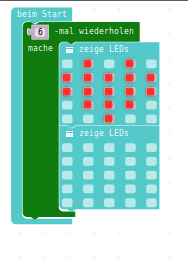
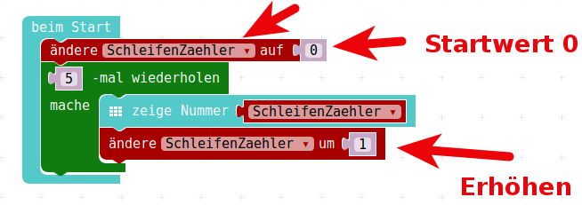
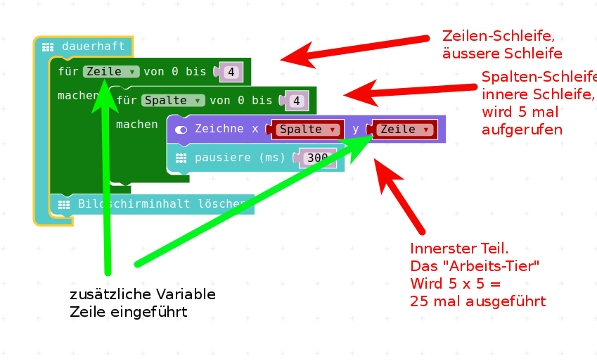

# Auffrischen

## Schleifen-Programmierung

* Frage : Wofür braucht man Schleifen?  
* Antwort 1 : Immer dann, wenn man etwas gleiches wiederholen will!  
* Antwort 2 : Immer dann, wenn man etwas sehr ähnliches wiederholen will, wobei sich dabei bestimmte Dinge ändern können, die vom Schleifendurchlauf abhängen.
    * Also beim __ersten__ Schleifendurchlauf wird etwas mit einer __1__ gemacht
    * Beim __zweiten__ Durchlauf wird etwas mit einer __2__ gemacht 
    * usw. usw.  

## Beispiel 1 : Ohne Schleife

Beim Starten 5 mal ein Gesicht blinken lassen

{height=60%}

## Beispiel 1 : Mit Schleife

{height=60%}

## Beispiel 1 : Vergleich

\colA{6cm}

{height=90%}

\colB{6cm}

{height=60%}

\colEnd

## Beispiel 1 : Auswertung

* Welches Programm sieht kompakter aus?
* Welches Programm ist einfacher zu verstehen?
* Welches Programm ist einfacher zu warten, zu ändern?

Damit kommen wir zu Beispiel 2:

## Beispiel 2 : Beim Starten 5 mal ein Herz anzeigen  

Nun kommt unser __Auftrag-Geber__ von __Programm 1__ und sagt:  

* Ach, ich wollte doch lieber ein Herz blinken haben, 
* und das wenn möglich 6 mal.  

Nun wollen wir die beiden Varianten aus Beispiel 1 nehmen und entsprechend verändern.

## Beispiel 2 : Ohne Schleife

Wieviele Änderungen müssen wir machen, wie oft mit der Maus klicken, um aus Programm 1 das Programm 2 zu machen.

\colA{6cm}

{height=80%}

\colB{6cm}

{height=80%}

\colEnd

## Beispiel 2 : Mit Schleife

\colA{6cm}

{height=60%}

\colB{6cm}

{height=60%}

\colEnd

## Beispiel 2 : Auswertung

* Welches Programm sieht kompakter aus?
* Welches Programm ist einfacher zu verstehen?
* Welches Programm ist einfacher zu warten, zu ändern?
* Welches Programm ist fehler-anfälliger?

__MERKE__ : Sobald man anfängt, beim Software-Programmieren etwas zu kopieren, muss man darüber nachdenken, 
ob man das mit einer Schleife den Computer erledigen lassen könnte. 

## Beispiel 3 : Schleife mit Zähler

Nun wollen wir innerhalb des sogenannten "Schleifenkörpers" die Anzahl der Schleifen-Durchgänge anzeigen.

* Dazu benutzen wir die gerade vorhandene Schleife, 
* legen __VOR__ der Schleife eine Variable namens __SchleifenZaehler__ an, 
* diese belegen wir mit 0.

## Beispiel 3 : Schleife mit Zähler

Im Schleifenkörper lassen wir uns den Wert dieser Variable anzeigen (mit "Zeige Nummer") und erhöhen anschliessend die Variable/den Zähler.

{height=40%}

Da wir den Zähler mit 0 vorbelegen und die Schleife 5 mal läuft, bekommen wir durch dieses Programm die Zahlen 0 bis 4 angezeigt.

## Beispiel 4 : Schleife mit eingebautem Zähler

Diese Art der Schleife wird sehr oft gebraucht:  
eine Schleife, die eine bestimmte Anzahl von Durchläufen erlaubt und bei der man die Schleifendurchläufe mitzählt.

Darum gibt es dafür ein extra Programmier-Konstrukt. 
 
Das ist die Index-For-Schleife, die wir am letzten Nachmittag schon kennengelernt haben.

## Beispiel 4 : Schleife mit eingebautem Zähler

Diese finden wir ebenso im Menu Schleifen:

{height=60%}

## Beispiel 4 : Schleife mit eingebautem Zähler

Wenn wir diese Schleife benutzen und unser Programm entsprechend umgestalten, sieht es nochmal um einiges einfacher aus:  

{height=60%}

## Vergleich der beiden Schleifen

\colA{6cm}

{height=60%}

\colB{6cm}

{height=60%}

\colEnd

## Beispiel 5 : Letzter Nachmittag, Füllen des Displays

Mit diesem Basis-Wissen gerüstet, verstehen wir die Schleife vom letzten Nachmittag nochmal etwas besser und können das End-Ergebnis des letzten Nachmittags sicher noch etwas verbessern.

{height=60%}

## Beispiel 5 : Letzter Nachmittag, Füllen des Displays

Hier haben wir eine Schleife genutzt, in der wir den Schleifen-Zähler mit benutzt haben.  

Die Variable __Index__

* Wir "fragen" also bei jedem Schleifen-Durchlauf die Schleife:  
* "Bei welchem Durchlauf bist Du?"
* Und diesen Wert verwenden wir, um jedesmal eine Spalte weiter zu springen, und dort die LED einzuschalten.

## Beispiel 5 : Fünf fast identische Codestücke

Was wir aber immer noch haben, sind 5 fast gleich aussehende Schleifen.  Und diese 5-fache Wiederholung wollen wir nun durch eine zweite, verschachtelte Schleife ersetzen.

{height=60%}

__Download Hex-Code__
[LED anschalten mit zwei Schleifen](code/mini-FlaecheMitZweiVerschachteltenSchleifen.hex)
 
## Beispiel 6 : "Böser" Auftrag-Geber 1

\colA{6cm}

Nehmt an, Ihr hättet die Schleife noch nicht kennengelernt, und hättet die Aufgabe so fertigprogrammiert, wie wir das letzte mal angefangen haben, mit einzelnen __zeige Leds__-Befehlen:

__Download Hex-Code__
[LED anschalten ohne Schleifen](code/mini-QuadratGanzFuellen_OhneSchleife.hex)

\colB{6cm}

{height=70%}

\colEnd

## Beispiel 6 : "Böser" Auftrag-Geber 2

{height=90%}

## Beispiel 6 : "Böser" Auftrag-Geber 3

Nun kommt der Auftrag-Geber und möchte nun doch lieber anstatt zeilenweise den Bildschirm zu füllen, diesen spaltenweise gefüllt haben.

In dem gezeigten Beispiel müsst Ihr alles neu programmieren.  
23 mal andere Bildschirm-Inhalte von Hand malen.  
(Der erste und der letzte Bildschirm-Inhalt passen)  
Wollt Ihr es versuchen?
 
 Ich würde lieber die Variante mit den Schleifen nehmen und dort nur die zwei Schleifen bzw die beiden Index-Variable vertauschen!
 
## Beispiel 6 : "Böser" Auftrag-Geber 4

{height=60%}
 
__Download Hex-Code__
 
[LED anschalten mit zwei vertauschten Schleifen](code/mini-FlaecheMitZweiVerschachteltenSchleifen02.hex)
 

## Navigation

* [Hoch zur Übersicht](../README.md)  
* [Weiter](../08_02_DC_Motoren/README.md)  

## Lizenz/Copyright-Info
Für alle Bilder auf dieser Seite gilt:

*  Autor: Jörg Künstner
* Lizenz: CC BY-SA 4.0

