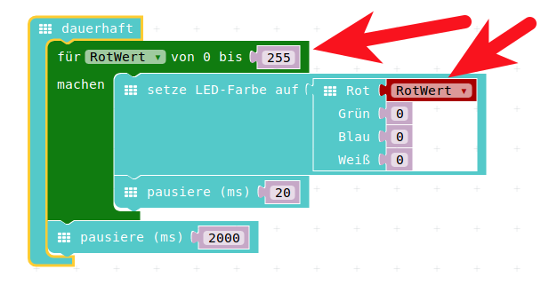
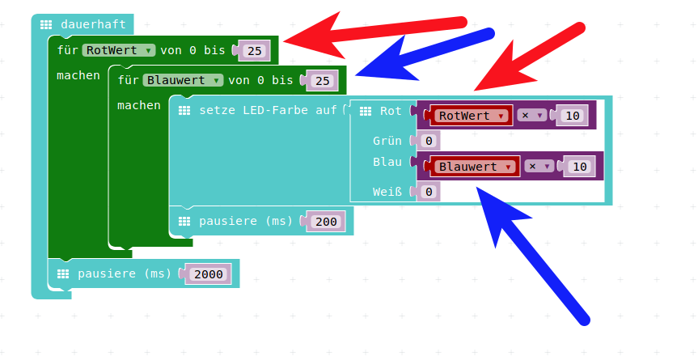

# Auffrischen / Hausaufgabe

# Auffrischen Schleifen

## Schleifen-Programmierung

* Frage : Wofür braucht man Schleifen?  
* Antwort 1 : Immer dann, wenn man etwas gleiches wiederholen will!  
* Antwort 2 : Immer dann, wenn man etwas sehr ähnliches wiederholen will, wobei sich dabei bestimmte Dinge ändern können, die vom Schleifendurchlauf abhängen.
    * Also beim __ersten__ Schleifendurchlauf wird etwas mit einer __1__ gemacht
    * Beim __zweiten__ Durchlauf wird etwas mit einer __2__ gemacht 
    * usw. usw.  

## Beispiel 1 : Ohne Schleife

Beim Starten 5 mal ein Gesicht blinken lassen

{height=60%}

## Beispiel 1 : Mit Schleife

{height=60%}

## Beispiel 1 : Vergleich

\colA{6cm}

{height=90%}

\colB{6cm}

{height=60%}

\colEnd

## Beispiel 2 : Schleife mit Zähler

Nun wollen wir innerhalb des sogenannten "Schleifenkörpers" die Anzahl der Schleifen-Durchgänge anzeigen.

* Dazu benutzen wir die gerade vorhandene Schleife, 
* legen __VOR__ der Schleife eine Variable namens __SchleifenZaehler__ an, 
* diese belegen wir mit 0.

## Beispiel 3 : Schleife mit Zähler

Im Schleifenkörper lassen wir uns den Wert dieser Variable anzeigen (mit "Zeige Nummer") und erhöhen anschliessend die Variable/den Zähler.

{height=40%}

Da wir den Zähler mit 0 vorbelegen und die Schleife 5 mal läuft, bekommen wir durch dieses Programm die Zahlen 0 bis 4 angezeigt.

## Beispiel 3 : Schleife mit eingebautem Zähler

Diese Art der Schleife wird sehr oft gebraucht:  
eine Schleife, die eine bestimmte Anzahl von Durchläufen erlaubt und bei der man die Schleifendurchläufe mitzählt.

Darum gibt es dafür ein extra Programmier-Konstrukt. 
 
Das ist die Index-For-Schleife, die wir am letzten Nachmittag schon kennengelernt haben.

## Beispiel 4 : Schleife mit eingebautem Zähler

Diese finden wir ebenso im Menu Schleifen:

{height=60%}

## Beispiel 4 : Schleife mit eingebautem Zähler

Wenn wir diese Schleife benutzen und unser Programm entsprechend umgestalten, sieht es nochmal um einiges einfacher aus:  

{height=60%}

## Vergleich der beiden Schleifen

\colA{6cm}

{height=60%}

\colB{6cm}

{height=60%}

\colEnd

# Hausaufgabe 1 RGB-Led

## Schleife mit Rot-Anteil

{height=60%}

* Eine Schleife um den Rot-Anteil zu verändern
* Wieviele Schleifendurchläufe sind das?
* Wie lange läuft dieses Programm einmal (inklusive pausieren!) ?

## Zweite Rot-Anteil-Schleife

{height=60%}

* Nochmal eine Schleife um den Rot-Anteil zu verändern
* Wieviele Schleifendurchläufe sind das?
* Wie lange läuft dieses Programm einmal (inklusive pausieren!) ?
* Seht Ihr einen Unterschied?

## Warum diese Änderung 

* Wir sehen kaum einen Unterschied
* Aber wir haben nur 25 anstatt 255 Schleifendurchläufe
* Nun wollen wir Schleifen "verschachteln"
* Wenn wir da auch nur 25 anstatt 255 Durchläufe machen, sehen wir etwas 
* und das in einigermassen sinnvoller Zeit...
* Siehe nächste Seite

## Verschachtelte Schleife 

{height=60%}

* Diesmal zwei verschachtelte Schleifen 
* Die äussere ändert Rot, die innere Blau
* Wieviele Schleifendurchläufe sind das aussen?
* Wieviele Schleifendurchläufe sind das innen?
* Wie lange läuft dieses Programm einmal (inklusive pausieren!) ?

# Hausaufgabe 2 : Display füllen

## Zeichen X Wert Y Wert 

Dazu schauen wir uns aus dem Menu __LED__ einmal einen Befehl etwas genauer an:  

__Zeichne  X Wert Y Wert__

Damit kann man einzelne LEDs auf unserem 5 x 5 LED-Bildschirm einschalten.

{height=60%}

## Simulator ausprobieren 

* Das probieren wir gleich mal im Simulator aus, 
* Wir klicken diesen einen Befehl in die __Dauerhaft__-Schleife ein
* Wir spielen mit den X und Y-Werten
* Wir schauen, was im Simulator passiert.

## Jede LED einschaltbar 

{height=60%}

* Wir können durch Verändern der Werte für X und Y zwischen 0 und 4 jede beliebige LED auf unserem 5 x 5 - Display einschalten.

## Zeilen und Spalten

* Das kommt aus der Mathematik, man bezeichnet im Allgemeinen die Spalten-Richtung mit X 
* und man bezeichnet die Zeilen mit Y

{height=60%}

## Zeilen und Spalten

* Spalten, horizontale Richtung, Links-Rechts : __X__ 
* Zeilen, vertikale Richtung, Oben-Unten : __Y__ 

{height=60%}

* Auch hier wieder - wie oft beim Programmieren : es geht bei 0 los !

## Eine Zeile füllen  

* Nun beschränken wir uns also auf eine Zeile in unserer LED-Anzeige
* Wir zeichnen einen Punkt nach dem anderen
* Dazu erhöhen wir jeweils den Spalten-Wert 
* Also __X__ !

## Schleife mit Variablen

* Mit unserem Schleifen-Wissen können wir das mit Schleifen programmieren
* Das Ergebnis schauen wir zuerst im Simulator an
* Wenn alles passt, können wir das auch in den Calliope programmieren.

{height=60%}

## Finale Schleife mit Variablen

* Diese Schleife  läuft nun  __5 mal__!
     * Zuerst mit Variable __Spalte = 0__, dann wird die LED in Spalte (X) __0__ Zeile (Y) 0 gesetzt
     * Dann  mit Variable __Spalte = 1__, dann wird die LED in Spalte (X) __1__ Zeile (Y) 0 gesetzt
     * Anschliessend mit Variable __Spalte = 2__, dann wird die LED in Spalte (X) __2__ Zeile (Y) 0 gesetzt
     * Daraufhin mit Variable __Spalte = 3__, dann wird die LED in Spalte (X) __3__ Zeile (Y) 0 gesetzt
     * Schliesslich ein letztes Mal mit Variable __Spalte = 4__, dann wird die LED in Spalte (X) __4__ Zeile (Y) 0 gesetzt

## Nächster Versuch, Ganzer Bildschirm

* Nun können wir also mit einer Schleife eine Zeile füllen, durch die Index-Schleife wird die Zeile __spaltenweise__ gefüllt
* Wir wollen aber immnoch den ganzen Bildschirm einzeln mit LEDs füllen.
* Dazu kopieren wir nun die Index-Schleife 4 mal 

{height=60%}

## 4 mal kopiert

* Wir hängen sie viermal untereinander
* Das Bildschirm-Löschen schieben wir dabei nach unten, das wollen wir nur einmal ganz am Schluss haben
* Nun haben wir 5 identischen Zeilenfüller, verwirklicht durch eine Schleife
* Wir müssen nun noch die Zeilen-Nummern anpassen.  

{height=60%}

## Fertiges Programm, Ganzer Bildschirm

* Wenn wir das gemacht haben, haben wir ein Programm, das den Bildschirm LED für LED füllt 
* Und das ganze durch die schlaue Verwendung von Schleifen. 

{height=60%}

## Fünf fast identische Codestücke

Was wir aber immer noch haben, sind 5 fast gleich aussehende Schleifen.  Und diese 5-fache Wiederholung wollen wir nun durch eine zweite, verschachtelte Schleife ersetzen.

{height=60%}

 
## "Böser" Auftrag-Geber 

\colA{6cm}

Nehmt an, Ihr hättet die Schleife noch nicht kennengelernt, und hättet die Aufgabe mit einzelnen zeige LED-Befehlen programmiert:

\colB{6cm}

{height=90%}

\colEnd

## "Böser" Auftrag-Geber 2

Nun kommt der Auftrag-Geber und möchte nun doch lieber anstatt zeilenweise den Bildschirm zu füllen, diesen spaltenweise gefüllt haben.

In dem gezeigten Beispiel müsst Ihr alles neu programmieren.  
23 mal andere Bildschirm-Inhalte von Hand malen.  
(Der erste und der letzte Bildschirm-Inhalt passen)  
Wollt Ihr es versuchen?
 
 Ich würde lieber die Variante mit den Schleifen nehmen und dort nur die zwei Schleifen bzw die beiden Index-Variable vertauschen!
 
## "Böser" Auftrag-Geber 3

{height=60%}
 

## Lizenz/Copyright-Info
Für alle Bilder auf diesen Folien/Seiten gilt:

* Autor: Jörg Künstner
* Lizenz: CC BY-SA 4.0

