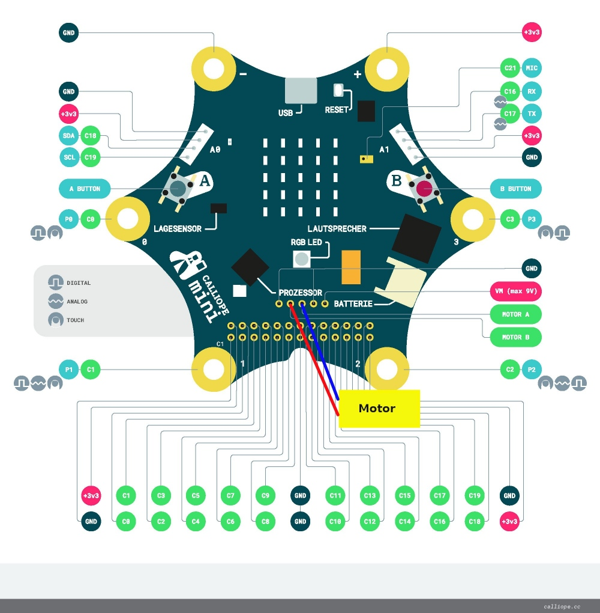
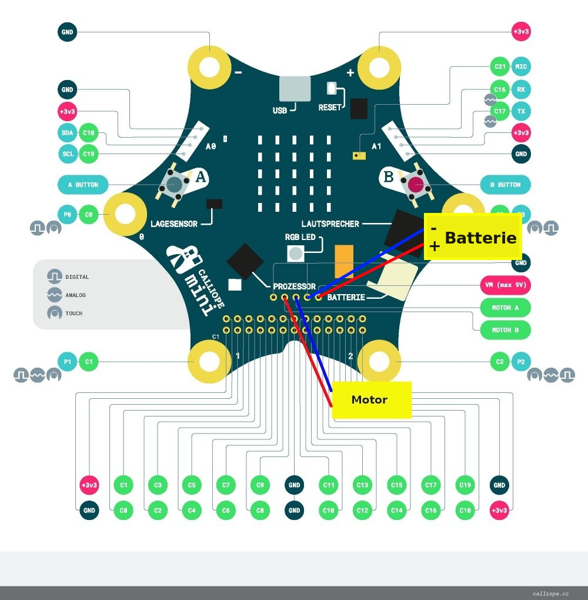

# DC-Motoren Auffrischen

## Ein oder Zwei Motoren

Je nach Verwendungszweck kann man an den Calliope entweder

* 1 Motor anschliessen, der kann dann vorwärts und rückwärts drehen
* 2 Motoren anschliessen, die können dann nur einzeln vorwärts drehen

So sehen die beiden Möglichkeiten zum Anschluss von zwei oder einem Motor aus:

## Zwei Motoren
{height=90%}

## Ein Motor
{height=90%}

## Motor-Programmierung für Calliope

Nachdem wir nun wissen, wie wir einen einzelnen Motor an den Calliope elektrisch anschliessen, wollen wir den Ausgang für den Motor auch mit Software programmieren. 

Im ersten Schritt wollen wir nur ganz einfach den Motor ein- und ausschalten können.  
Dazu wollen wir mit dem linken Knopf ein und mit dem rechten Knopf ausschalten.

## Motor-Menu

Die Motor-Ansteuerung findet sich im Menu Motoren:

{height=60%}

## Motor Befehle

Es gibt nicht viele Befehle zum Steuern von Motoren:

{height=60%}

## Erstes Motor-Programm

Das war unser erstes Motor-Programm

{height=60%}

Dieses Programm können wir leider im Simulator gar nicht nutzen.  
Also müssen wir das Programm auf den Calliope runterladen und dort ausprobieren.

## Anschluss von zusätzlicher Batterie

* Der Calliope erlaubt __für den Motor__ den Anschluss einer zusätzlichen Batterie.
* Deren Spannung wird __NUR__ zum Ansteuern des Motors verwendet
* Die Batterie darf nicht mehr als _9V_ haben
* Sie muss zum Motor passen

## Zusätzliche Batterie 

{height=90%}

## Lizenz/Copyright-Info

Für alle Bilder auf diesen Folien/Seiten gilt:

* Autor: Jörg Künstner
* Lizenz: CC BY-SA 4.0

 
