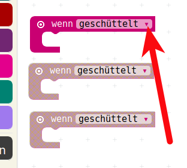
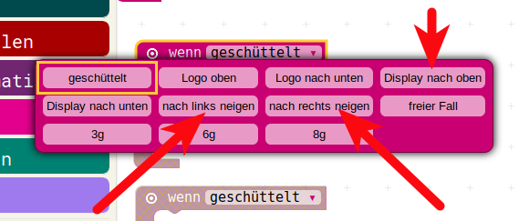
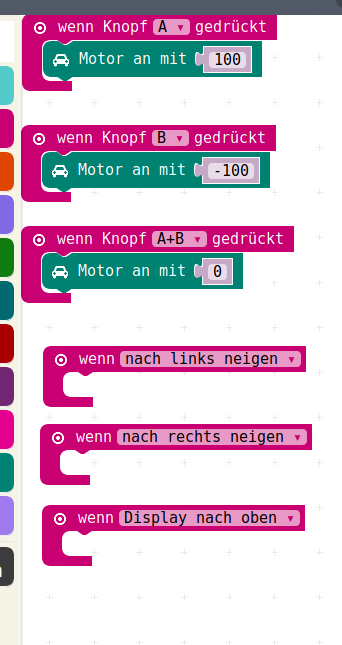
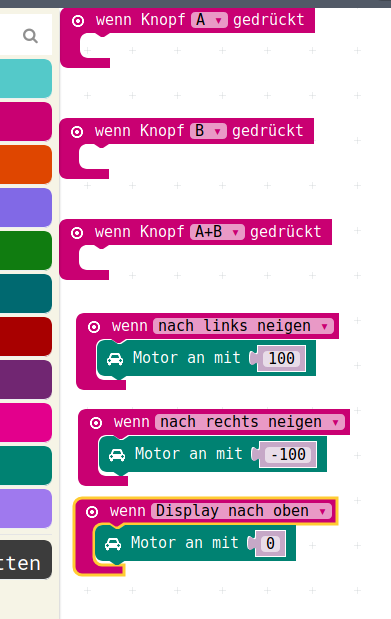

# Lage-Sensor

Das funktioniert ja schon mal ganz gut.  
Nun möchten wir mit diesem einfachen Motor-Steuerungs-Programm auch noch eine andere Eingangs-Möglichkeit ausprobieren:

__Den Lage-Sensor!__


Der Calliope hat einen Lage-Sensor eingebaut, der in allen Raumrichtungen funktioniert.  

Also :

* Oben / Unten
* Links / Rechts
* Vorne / Hinten

Die Abfragen dazu um den Lage-Sensor genau auszuwerten sind einigermassen kompliziert, man muss Koordinaten-Systeme verstehen und man sollte Winkelrechnung verstehen.  
Beides ist in Euerem Alter wahrscheinlich noch nicht der Fall.

Zusätzlich zu den genauen Abfrage-Möglichkeiten, die etwas schwieriger zu verwenden sind, hat der Calliope aber auch die Möglichkeit sehr einfach den Lage-Sensor abzufragen.

Das wollen wir nun tun:

* Beim Gerade halten des Calliope soll der Motor aus sein.
* Beim Kippen nach links soll er sich nach vorne drehen
* Beim Kippen nach rechts soll er sich nach hinten drehen.

Sowohl die genauen, schwierigeren Befehle als auch die Einfachen befinden sich im Menu Eingabe:


Nun ziehen wir drei mal das __wenn geschüttelt__ in unseren Arbeits-Bereich:


Diese wandeln wir nun alle durch Druck auf das Dreieick:



um in drei verschiedene Reaktionen:

* "nach links neigen"
* "Display nach oben"
* "nach rechts neigen"



Damit sieht unser Programm nun so aus:



und wenn wir nun die entsprechenden Befehle von oben nach unten schieben, dann können wir unseren Motor durch kippen steuern.




## JavaScript-Code

<details>
 <summary>Java-Script-Code</summary>

```js
input.onGesture(Gesture.TiltLeft, () => {
    motors.motorPower(100)
})
input.onGesture(Gesture.TiltRight, () => {
    motors.motorPower(-100)
})
input.onGesture(Gesture.ScreenUp, () => {
    motors.motorPower(0)
})

```
</details>

## Download Hex-Code

[Hex-code](code/mini-DC_Motor_LageSensoren.hex)


## Navigation


* [Zurück](../08_02_DC_Motoren/README.md)  
* [Hoch zur Übersicht](../README.md)  
* [Weiter](../08_04_ExternerLautsprecher/README.md)  


## Lizenz/Copyright-Info
Für alle Bilder auf dieser Seite gilt:

*  Autor: Jörg Künstner
* Lizenz: CC BY-SA 4.0

 
