# Funk - Uebertragung 

## Menu Funk

Im Menu Funk findet sich: 

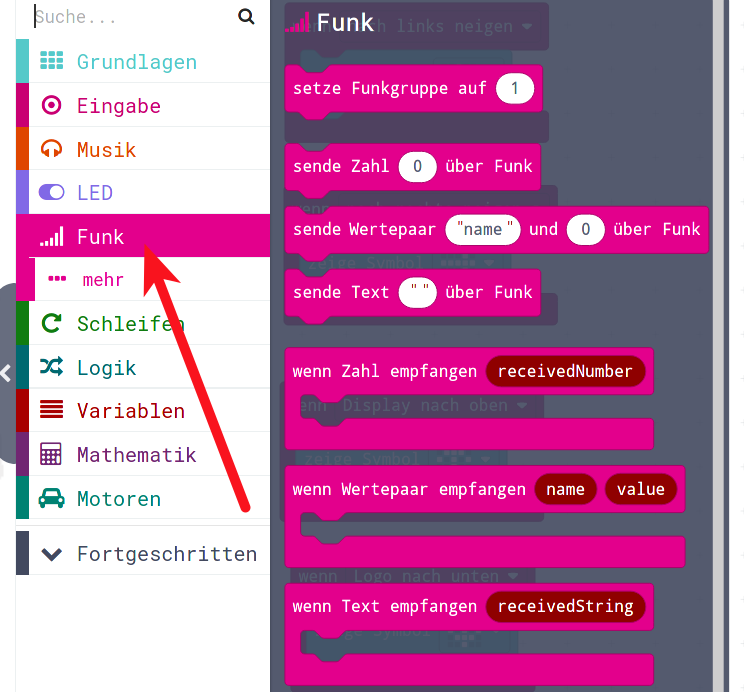{height=70%}


## Zahlen Funken

Wir senden und empfangen zuerst mal Zahlen

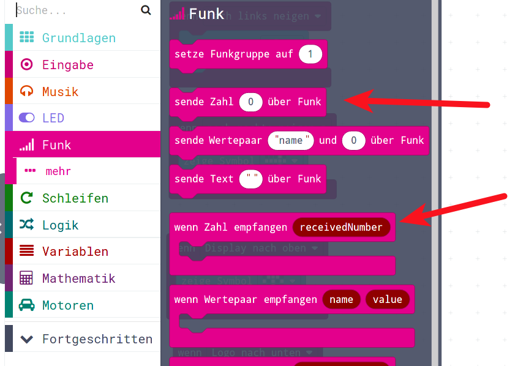{height=70%}


## Simpler Sender/Empfänger

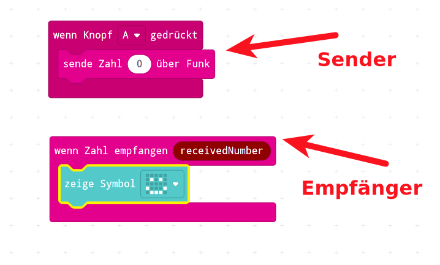{height=70%}

## Simulator kann auch Funk

* Sobald man den Knopf A drückt
* merkt das der Simulator und blendet einen zweiten Calliope ein

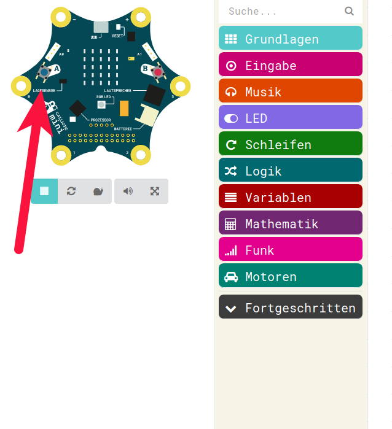{height=70%}

## Zwei simulierte Calliopes 

* Nun sind zwei simulierte Calliopes zu sehen 
* Und der obere ist am Funken 

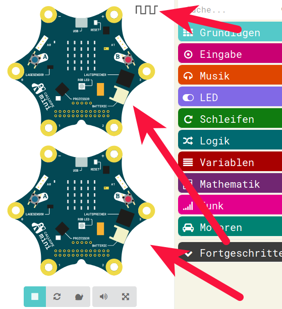{height=70%}


## Nochmal Knopf drücken

* Nun muss man nochmal Knopf A drücken
* damit der andere Calliope das empfangen kann

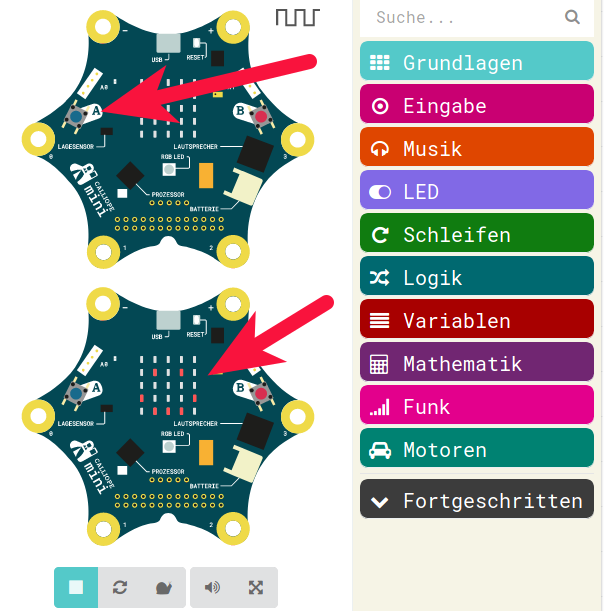{height=70%}


## Anderer Calliope sendet auch

* Drücken auf zweitem Calliope
* bringt den auch zum Senden
* und der erste/obere empfängt 

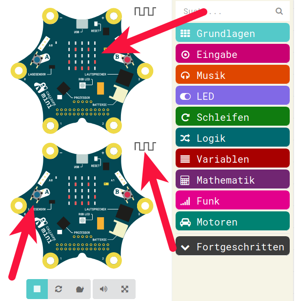{height=70%}


## "Sinnvolle" Inhalte Senden

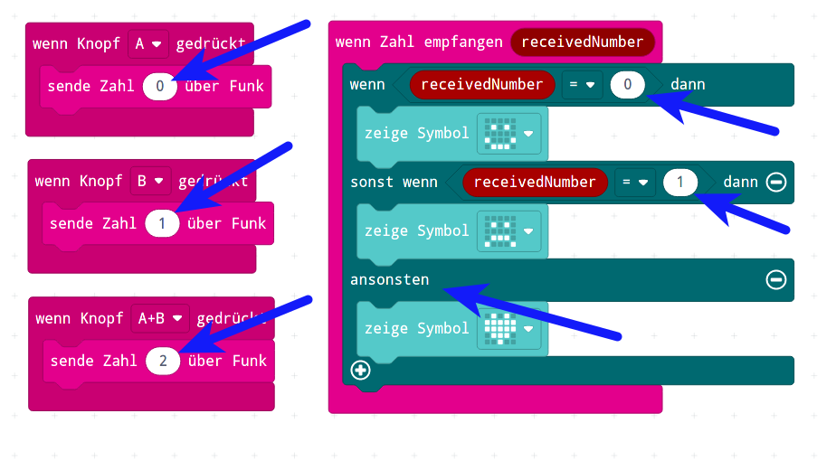{height=70%}

## Mit Nachbarn funken

* Einigt euch auf 3 Zahlen, die Ihr senden wollt ( z.B.  0-2 )
* (am Besten verwendet Ihr das Programm aus diesem Beispiel)
* Jeder kann seinen eigenen Empfangs-Teil mit verschiedenen Symbolen machen
* Dann versucht, Euch gegenseitig was zu senden 
* Klappt das ?
* ...
* ...
* ...
* ????
* Im Simulator gehts doch, oder ?


## Mit Nachbarn funken II

- Nun probiert mal das HEX-File von einem der beiden Computer in beide Calliopes zu programmieren.
- Jetzt gehts?
- Im Simulator gehts auch ?
- Habt Ihr nen Fehler gemacht ?
- Wer von Euch ?
- 
- Antwort: Vermutlich hat keiner von Euch einen Fehler gemacht...


## Mit Nachbarn funken III

* Wer von Euch hat Funkgeräte?
* Können die immer miteinander kommunizieren 
* Können die direkt mit den Funkgeräten von Euren Freunden funken?
* Oder muss man da was einstellen, damit das funktioniert?
* __JA__ : Der Sende und Empfangs-Kanal !
* Beim Calliope heisst das __"Funkgruppe"__
* und befindet sich ganz oben im __Funk__ - Menu  


## Setze Gruppe 

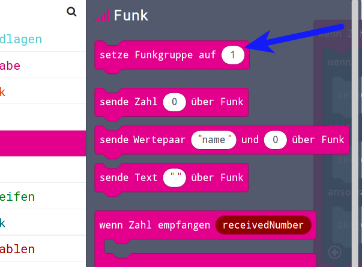{height=70%}


## Erklärung

* Wenn die Funk-Gruppe nicht von Euch im Programm-Lauf gesetzt wird
* dann setzt der Computer das im Hintergrund 
* automatisch auf einen zufälligen Wert zwischen 0 - 255
* d.h. ein HEX-File enthält einen "ausgewürfelten" Kanal
* ein anderes HEX-File enthält einen anderen "ausgewürfelten" Kanal
* darum: Entweder gleiches HEX-File verwenden oder Kanal setzen
* => Setze Funkgruppe XXX beim Start


## Setze Gruppe

Nun bauen wir also das entsprechende __setze Funkgruppe__ - Befehl __beim Start__ 

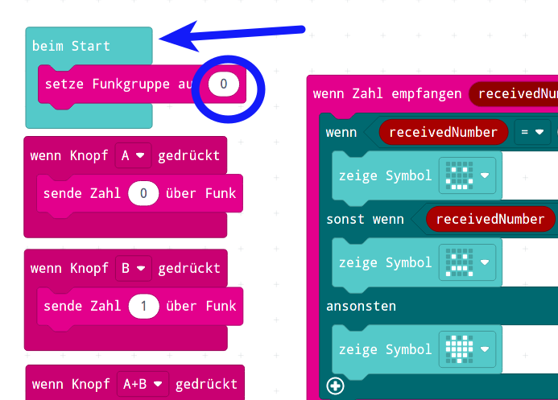{height=70%}

## Zeichenfolgen austauschen

Ebenso kann man - anstatt einzelne Zahlen - ganze Texte von einem Calliope zum anderen schicken

Die beide dafür verantwortlichen Befehle sind 

* __sende Text xxx über Funk__
* __wenn Text empfangen receivedString__


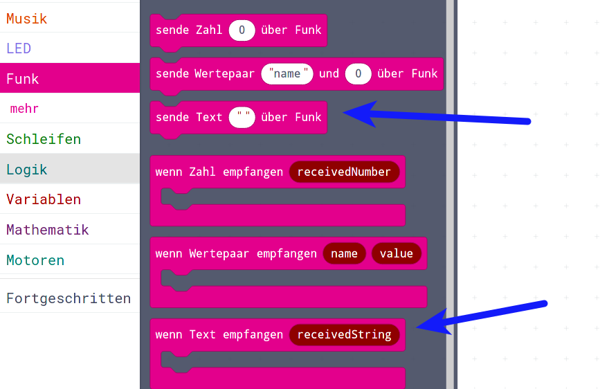{height=70%}


## Texte senden und empfangen

So kann man sich Text-Nachrichten hin und her senden

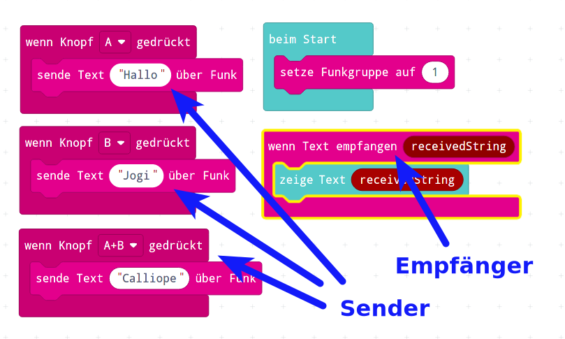{height=70%}

## Variablen und Werte schicken

Und dann gibt es noch die Möglichkeit, ganze Zeichenketten __UND__ gleichzeitig Zahlenwerte zu verschicken und zu empfangen:

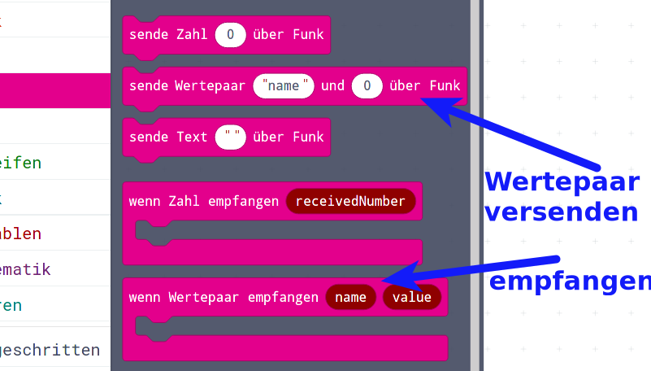{height=70%}


## Variablen und Werte schicken II

In der Praxis kann man das nutzen, um zum Beispiel verschiedene Variablen anhand der Variablen-Namen zu verschicken und gleichzeitig deren Werte zu verschicken.


Beispiel: 

* Ferngesteuertes Auto
* Geschwindigkeit von 0 bis 100 (kein Rückwärts-Gang...)
* Richtung von  -50 (nach links fahren) bis + 50 (rechts fahren) => 0 = gerade aus
* Das heisst, das ferngesteuerte Auto muss in der Lage sein, 2 Variablen zu empfangen
* Einfaches Beispiel :
  * Knopf A startet das Auto mit Geschwindigkeit 80 und Richtung 0
  * Knopf B stoppt das Auto mit Geschwindigkeit 0
* Bitte jedes Kind einen anderen Kanal verwenden, ab Kanal 2 im Uhrzeigersinn jeweils 1 mehr


## Variablen und Werte schicken III

Die Variablen, die das Auto versteht, sind __speed__ und __richtung__


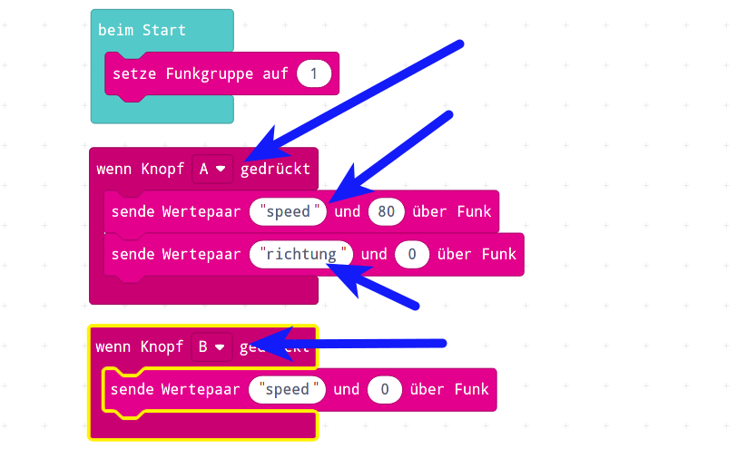{height=70%} 


## Fernsteuerung für das Auto I

Nun wollen wir eine "richtige" Fernsteuerung für das Auto machen:

* Wenn __KEIN__ Knopf gedrückt ist, dann __speed = 0__
* Wenn __Knopf A__ gedrückt ist, dann __richtung = -40__ und __speed = 80__
* Wenn __Knopf B__ gedrückt ist, dann __richtung = 40__ und __speed = 80__ 
* Wenn __Knopf A+B__ gedrückt ist, dann __richtung = 0__ und __speed = 90__


Achtung : Es gibt kein Ereignis :  __Wenn Knopf losgelassen__ Ihr müsst Euch anders behelfen.

* Dauerhaft 0 senden und __Wenn Knopf gedrückt__ dann etwas anderes senden, oder
* Dauerhaft die Tasten abfragen in der Dauerhaft-Schleife und dort die Entscheidungen treffen  


## Fernsteuerung für das Auto II

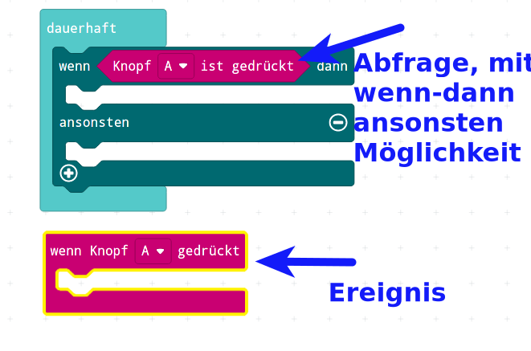{height=60%}


## Fernsteuerung für das Auto III

Nochmal die Aufgabe:

- Wenn __KEIN__ Knopf gedrückt ist, dann __speed = 0__
- Wenn __Knopf A__ gedrückt ist, dann __richtung = -40__ und __speed = 80__
- Wenn __Knopf B__ gedrückt ist, dann __richtung = 40__ und __speed = 80__ 
- Wenn __Knopf A+B__ gedrückt ist, dann __richtung = 0__ und __speed = 90__


## Fernsteuerung für das Auto IV

Mögliche Lösung

 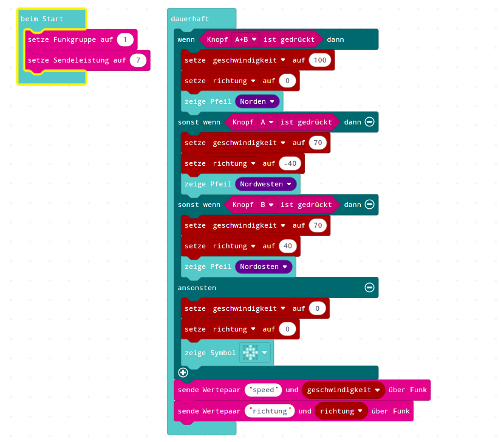{height=80%}


## JavaScript-Code

<details>
 <summary>Java-Script-Code</summary>

```js
let richtung = 0
let geschwindigkeit = 0
radio.setGroup(1)
radio.setTransmitPower(7)
basic.forever(function () {
    if (input.buttonIsPressed(Button.AB)) {
        geschwindigkeit = 100
        richtung = 0
        basic.showArrow(ArrowNames.North)
    } else if (input.buttonIsPressed(Button.A)) {
        geschwindigkeit = 70
        richtung = -40
        basic.showArrow(ArrowNames.NorthWest)
    } else if (input.buttonIsPressed(Button.B)) {
        geschwindigkeit = 70
        richtung = 40
        basic.showArrow(ArrowNames.NorthEast)
    } else {
        geschwindigkeit = 0
        richtung = 0
        basic.showIcon(IconNames.Target)
    }
    radio.sendValue("speed", geschwindigkeit)
    radio.sendValue("richtung", richtung)
})

```

</details>

## Download Hex-Code

[Hex-code](code/mini-Sender_Kanal_1_Knopf.hex)

