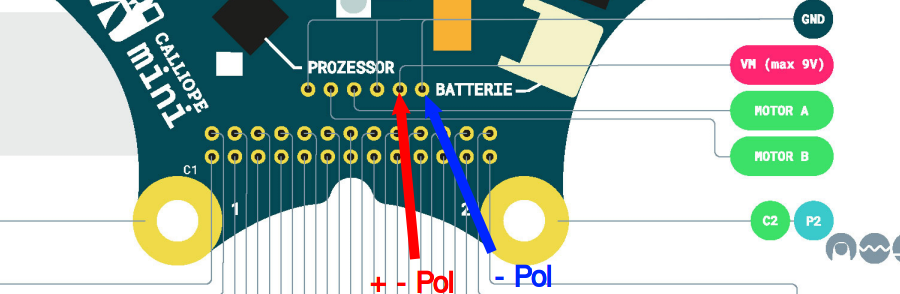

# Zusätzliche Batterie/Externer Lautsprecher

## Zusätzliche Möglichkeiten

Nachdem wir für den Motor die 5-polige Erweiterungs-Leiste  aufgelötet haben, möchte ich noch zwei zusätzliche Möglichkeiten dieser Leiste aufzeigen.
Man kann daran anschliessen:

* Zusätzliche Batterie für die Motoren
* Externer Lautsprecher, für mehr Krach 

## Zusätzliche Batterie für Motor

Der Calliope wird - wie wir gelernt haben - normalerweise mit 2 Batterien a 1.5 Volt betrieben. Das macht zusammen 3 Volt.

Wenn man nun einen Motor anschliessen möchte, der mehr Spannung braucht, dann würde der sich damit kaum bewegen.

Darum haben die Erbauer des Calliope noch eine Möglichkeit vorgesehen, eine zusätzliche Batterie anzuschliessen!  
Diese zusätzliche Batterie 

* ist aber nur zum Betrieb des Motors/der Motoren gedacht 
* sie muss zusätzlich zur normalen Batterie angeschlossen werden
* Sie muss zur Spannung des Motors / der zwei Motoren passen
* sie darf maximal 9V haben

## Anschluss 

Die zusätzliche Batterie wird an den beiden rechten Pins angeschlossen, ganz aussen Plus, daneben Minus.

Auf dem offiziellen Bild des Calliope sieht man das ganz gut:
 
Quelle Bild nächste Seite : 

https://calliope-mini.github.io/assets/v10/img/Calliope_mini_1.0_pinout_fin.jpg:
 
## Offizielles Bild  

{height=95%}

## Detail-Auschnitt
 
 Hier nochmal ein Ausschnitt daraus, mit den Anschlüssen farbig gekennzeihnet:

 {height=60%}
 
## Und in Betrieb

In Betrieb sieht das dann so aus:
 
{height=60%}

## Externer Lautsprecher

Der eingebaute Lautsprecher am Calliope ist schon sehr klein und sehr leise.  

An die Leiste kann man auch einen externen Lautsprecher anschliessen.
 
Dabei kann man entweder einen kleinen, sogenannten Passiv-Lautsprecher anschliessen, dieser braucht keine zusätzliche Stromversorgung.

Oder aber man kann einen sogenannten Aktiv-Lautsprecher anschliessen, das sind die Lautsprecher, wie man sie auch von Computern kennt, diese haben eine zusätzliche Strom-Versorgung.

## Ein alter Passiv-Lautsprecher

{height=60%}
   

## Klinken-Anschluss

In Jedem Fall ist es sinnvoll, das über einen sogenannten Klinken-Stecker zu realisieren, der Anschluss sieht dann so aus:

 {height=60%}

## Klinkenstecker

Damit kann dann ein externer Laustsprecher oder Kopfhöhrer angeschlossen werden. 

Der Klinken-Anschluss sieht so aus:

{height=60%}

## Auf dem Calliope-Schaltbild

Anschluss auf dem offiziellen Calliope-Schaltbild:

 {height=40%}

__ACHTUNG__ :  

Da der Lautsprecher die gleichen Anschlüsse wie die Motoren verwendet, kann man nicht beides gleichzetig in einem Programm machen. Man muss sich also entscheiden, ob man mit seinem Calliope Musik abspielen will, oder ob man Motoren ansteuern will.
 

## Lizenz/Copyright-Info
Für alle Bilder auf diesen Folien/Seiten gilt:

* Autor: Jörg Künstner
* Lizenz: CC BY-SA 4.0

 
