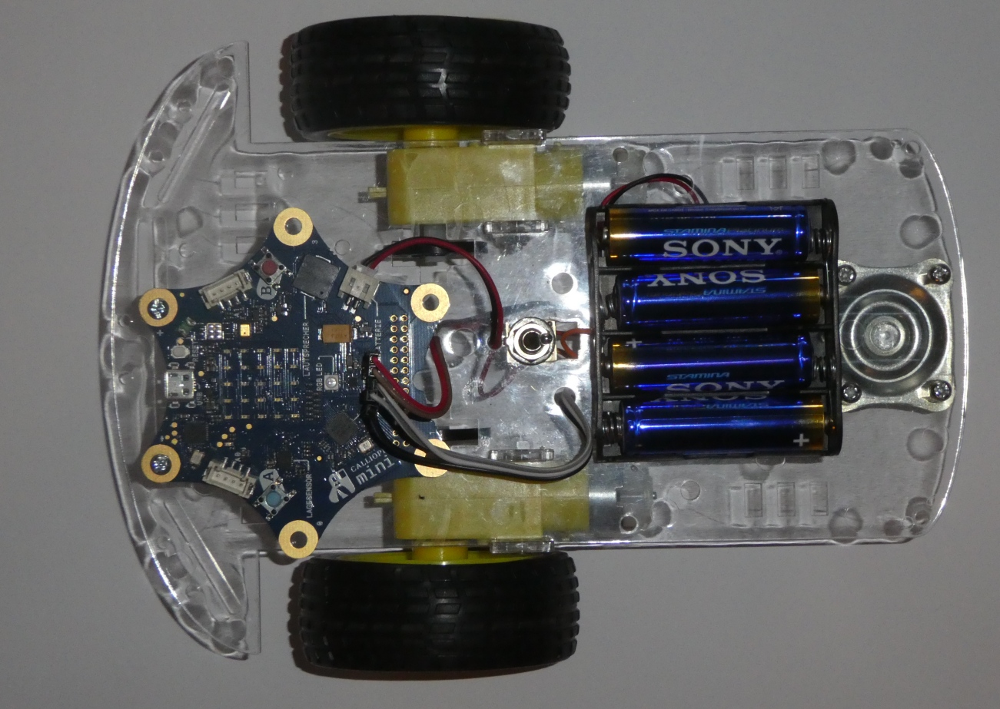
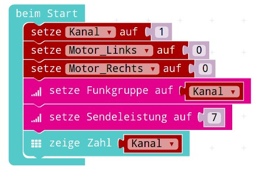
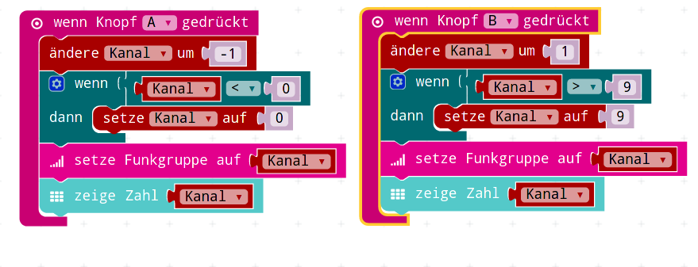
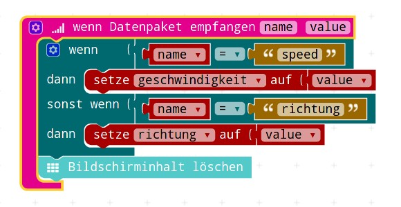
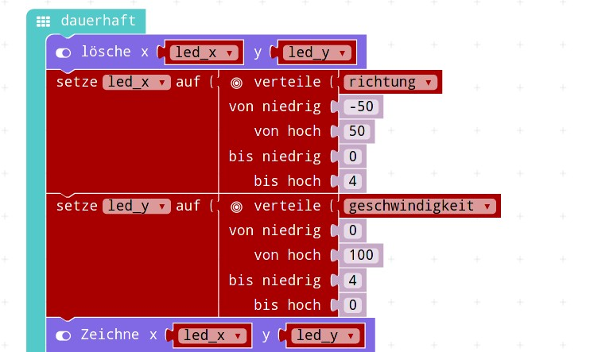
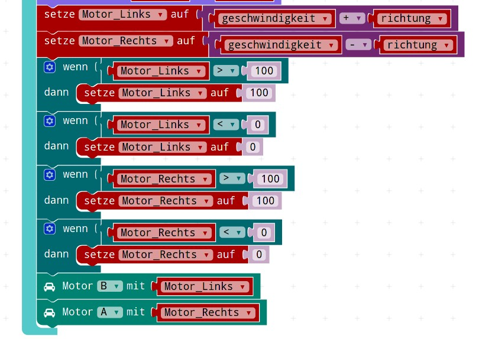

# Der Auto-Funkempfaenger 

## Das Auto mit Empfänger

{height=95%}

## Nachbau des Autos

Wer das Auto "nachbauen" will, hier ein paar Tips:

* Micro:Bit und Calliope können auch miteinander sprechen
* Wichtig ist dabei, den Funk-Kanal festzulegen
* Der Micro:Bit kann keine Motoren (ohne Zusatz-Platine) ansteuern
* Als Funk-Sender funktioniert der prima
* Micro:Bit ist um einiges billger und in der neuen V2 (Nov 2020) rutsch er näher an Calliope

## Der Empfänger selbst

Der Empfänger selbst besteht aus mehreren logischen Blöcken:

* Beim Start: Grundzustand herstellen
* Tastendrücke: Steuerung des Kanals, damit mehrere Kinder mit Ihren Calliopes das Auto steuern können
  (Das könnt Ihr beim Nachbauen weglassen, nehmt einfach einen festen Kanal)
* Empfang und Dekodierung der Nachrichten über Funk
* In der Dauer-Schleife : Anzeige eines LED-Punktes 
* In der Dauer-Schleife : Berechnung von Motor links und rechts
* In der Dauer-Schleife : Überprüfung der Maximalwerte der Motoren
* In der Dauer-Schleife : Ansteuerung der Motoren

## Teil 1 : Beim Start

{height=95%}

## Beim Start : Erklaerung

{height=20%}

* Variable für Kanal und andere Variablen festlegen (initialisieren)
* Funkgruppe auf die gesetzte Kanal-Variable setzen
* Funk-Sendeleistung auf Maximum (sollte auch in die Sender...) 
* Kanal anzeigen

## Teil 2: Kanalwahl mit Tasten

{height=95%}

## Kanalwahl mit Tasten : Erklaerung

{height=20%}

* Knopf A (links) : Ein Kanal runter
* Knopf B (rechts) : Ein Kanal hoch
* Beim Tastendruck die __Variable__ verändern
* Begrenzen auf Minimal (0) oder Maximal (9)
* Kanal mit Hilfe der Variable setzen
* Kanal-(Variable) anzeigen

## Teil 3: Empfangs-Teil

{height=95%}

## Empfangs-Teil : Erklaerung 1

{height=20%}

* Ereignis: Es wird etwas per Funk empfangen
* Überprüfung: War es der Text "speed" ?
* Dann die __geschwindigkeit__ - Variable damit belegen
* Überprüfung: War es der Text "richtung" ?
* Dann die _richtung__ - Variable damit belegen
* Den Bildschirm löschen, damit er in der Dauerschleife anders belegt werden kann

## Empfangs-Teil : Erklaerung 2

{height=20%}

* Wichtig ist : auf dem __FUNKWEG__ müssen die Namen gleich sein!
* Der Sender sendet __"speed"__ und der Empfänger empfängt __"speed"__
* Der Sender sendet __"richtung"__ und der Empfänger empfängt __"richtung"__
* Wie die __Variablen__ auf Sende- und Empfangsseite heissen ist egal !
* Diese müssen nicht gleich sein, aber eben auf dem Übetragungsweg

## Teil 4: Dauerschleife LED-Anzeige

{height=95%}

## LED-Anzeige : Erklärung

{height=20%}

* Die aktuelle LED-position wird gelöscht 
* Dann werden die Bereiche der Geschwindigkeit 0-100
* und der Richtung -50 bis +50
* Auf die 5 möglichen LED-Positionen 0 - 4 
* __abgebildet__, das wird mit der __Verteile__ - Funktion gemacht
* Und dann die LED an der neuen Position gesetzt

## Teil 5 : Motor-Werte und Ansteuerung

{height=95%}

## Motor-Werte und Ansteuerung : Erklärung

{height=20%}

* Die Variablen für die Motorstärke werden berechnet
* Wenn die Richtung __negativ__ ist, soll nach __links__ gefahren werden
* Dann muss der __rechte__ Motor __stärker__ und 
* der __linke__ Motor __schwächer__ eingeschaltet sein
* Das wird mit der Addition/Subtraktion von Geschwindikeit und Richtung erreicht
* Nach Begrenzung der Werte auf 0 bis 100 werden die Werte in die Motoren geschrieben

 
## Download Programm

* [Hex-code](code/mini-Empfaenger_Kanal_0_bis_9_MitMotor.hex)
* [Javascript-code](code/Empfaenger_Kanal_0_bis_9_MitMotor.js)
