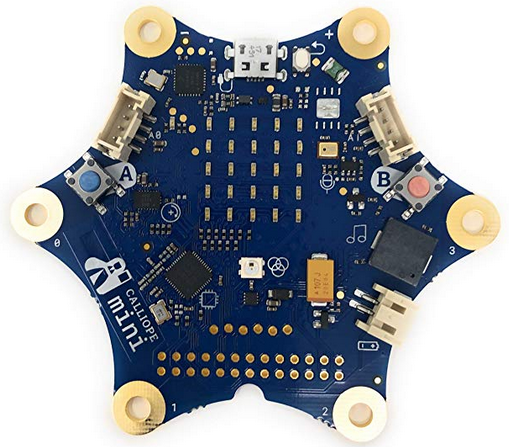

# Warum Calliope

## Zielgruppe

Vor Auswahl eines Konzepts:

* welche Zielgruppe ?
* welche generellen Ziele? 

unter folgenden Gesichtspunkten sind die folgenden Seiten zu sehen:

* Nicht nur am Handy / Computer konsumieren sondern auch 

* Selbst gestalten
* "Computer"-Sprache kennenleren
* Interesse für Computer und Basteln wecken
* Interesse für Programmieren wecken
* Ab ca 9 Jahre
* Wenn möglich in der Schule nutzbar, in den Unterricht intergrierbar 

## Grundüberlegungen

* Umsetzung rein in __Software__
* Möglichst ohne Installation 
* Auf verschiedenen Betriebsystemen nutzbar
* vermutlich Browser-Basiert

oder

* Umsetzung mit Software __und Hardware__
* Zusätzlicher Hardware-Bedarf
* Noch höhere Anforderungen an Material und Budget
* Dafür mehr Integration in die reale Welt möglich 
* Kinder/Schüler können das evt mit nach Hause nehmen
* Je nach Konzept : Einstieg in Robotik 

## Software-Konzepte

* Scratch

* Hour of Code

* Blocky <https://developers.google.com/blockly/>

* uvm, siehe z.B.:
  <https://www.codingkids.de/machen/programmieren-fuer-kinder-11-tolle-ideen>

   

## Scratch

\colA{6cm}

{height=80%}

\colB{6cm}

<https://scratch.mit.edu/>

* Block-Basiert
* Sehr einfach zu lernen
* Doch sehr mächtig
* Browser-Basiert, seit Version 3 auch auf iPad nutzbar
* viele Anleitungen und Hilfen
* meines Erachtens __DIE__ bekannteste Block-Programmiersprache

\colEnd

## Hour of Code/code.org

\colA{6cm}

{height=80%}

\colB{6cm}

<https://hourofcode.com/de/learn>

* Verschiedene "Missionen"
* Fast komplett selbständig durchführbar
* Unterschiedliche Interessengebiete
  * Minecraft !
  * Star-Wars !
  * Flappy - Birds -Spiele  
* komplett browser-basiert
* Sehr toller Startpunkt für "Nur-SW"

\colEnd

## Konzepte mit Hardware

* Arduino
* Raspberry Pi
* BBC Micro:Bit
* Calliope
* Sino:Bit
* Kniwwelino
* Oxo-Card
* EduArdu
* mBot (und andere Robotik-Plattformen)

## Arduino (1)

\colA{6cm}

{height=40%}

{height=40%}

\colB{6cm}

* Der __Urvater__ von __massentauglichen__ Microcontroller-Platinen
* Extrem viel zusätzliche Hardware
* Sehr billig (Clone ab ca 8 CHF)
* Super Einstieg in Welt der Elektronik, Programmieren
* Programmierung mit textueller Programmiersprache
* Einfache Entwicklungs - Umgebung, braucht Installation 
* ab ca 11-12 Jahren
* ohne Zusatz-Hardware "nutzlos"

\colEnd

## Arduino (2)

\colA{6cm}

{height=70%}

\colB{6cm}

Die integrierte Entwicklungs-Umgebung war mit einer der Hauptfaktoren für den riesen Erfolg des Arduino.

Bis dahin gab es schon einige ähnliche Boards, aber keine so einfach zu installierende und funktionierende Entwicklungs-Umgebung.

Sehr viele neuere Platinen kommen vom Hersteller mit Unterstützung für die Arduino-Entwicklungs-Umgebung.

\colEnd

## Raspberry Pi

\colA{6cm}

{height=80%}

\colB{6cm}

* Ein kompletter __Linux__-Rechner
* __massentauglicher__ Einplatinen-Rechner
*  Viel zusätzliche Hardware, Software 
* Sehr billig ( Zero ab ca 8 CHf , Raspi 3 B+ ca 40 CHf)
* Viele verschiedene Programmiersprachen
* braucht Installation 
* ab ca 12-13 Jahren
* ohne Zusatz-Hardware und Monitor/Tastatur "nutzlos" (in "unserem" Sinne)

\colEnd

## BBC Micro:Bit

\colA{6cm}

{height=40%}

{height=40%}

\colB{6cm}

* 2015 von der BBC vorgestellt für Schulen
* Zielgruppe: Schüler ab 11-12
* Viele Informationen, grosses "Öko-System" 
* "Vater" des Calliope, ähnliche Hardware
* Programme zum Teil direkt austauschbar
* Viele Hardware-Addons verfügbar
* passt sehr gut in den Lehr-Betrieb
* Billig, ca 20 CHF 

\colEnd

## Calliope (1)

\colA{6cm}

{height=80%}

\colB{6cm}

* 2017 auf Basis des BBC Micro:Bit in Deutschland entwickelt
* Ziel: schon ab der dritten Klasse in die Schule
* Änderungen
    * Sternform => weniger Kurzschluss-Gefahr
    * Microfon und Lautsprecher
    * Motor-Treiber um Motoren anzuschliessen
    * RGB-Led
    * Grove - Konnektoren
    

\colEnd

## Calliope (2)

\colA{6cm}

\colB{6cm}

* 2018 erste Schulen in Deutschland ausgerüstet
* Deutschsprachiges Lehr-Material verfügbar
* Erweiterbarkeit durch Grove-System, keine Steckplatinen
* Kleinere Community verglichen mit BBC Micro:Bit
* Software-Features "hinken" hinterher
* Fast Alles in Deutsch => junge Zielgruppe
* Teurer als BBC Micro-Bit ( 45-50 CHF)

\colEnd

## Sino:Bit

\colA{6cm}

{height=80%}

\colB{6cm}

* Versuch einer chinesischen Makerin, den Calliope für chinesische Verhältnisse zu adaptieren
* Hardware sehr ähnlich zu Calliope
* viel grösseres LED-Display
* Programmierung derzeit "nur" über die Arduino-Programmierumgebung möglich
* Keinerlei englisch-sprachige Community 

\colEnd

## Kniwwelino

\colA{6cm}

{height=40%}

{height=40%}

\colB{6cm}

* Initiative aus Belgien
* Arduino und Block-basierte Entwicklung
* WIFI-basiert 
  * umständlicher Start mit WIFI-Koppeln
  * Wireless Übertragung
* Wenig Sensoren etc
* Sehr günstig :  12 €
* Kaum Community

\colEnd

## OxoCard v1

\colA{6cm}

{height=40%}

{height=40%}

\colB{6cm}

* Initiative aus der Schweiz
* Bislang wenig zusätzliches Material
* Das hier ist die OXO-Card V1
* Es gibt eine OXO-Card V2

\colEnd

## OxoCard v2

\colA{6cm}

\colB{6cm}

- Das hier ist die OXO-Card V2
  - Inklusive WIFI
  - Farbige LEDs

* Programmierung via Arduino oder Blockly

- Keinerlei Erfahrung meinerseits

- Community scheint noch überschaubar zu sein

\colEnd

## EduArdu

\colA{6cm}

{height=70%}

\colB{6cm}

* Initiative aus Bulgarien
* Basiert auf Arduino
* sehr viele sinnvolle Sensoren integriert
* Programmierung mit Arduino-IDE
* Programmierung über Blöcke
* sehr günstig, tolle Hardware
* Englische/Bulgarische Doku

\colEnd

## mBot

\colA{6cm}

\colB{6cm}

* Robotik-Bausatz (exemplarisch)
* Ziel Robotik, wenig allgemein 
* Programmierung Arduino-IDE
* Programmierung via Blöcke 
* über 100 CHf

\colEnd

## Fazit

* Sehr viele Konzepte, SW only und Hardware
* Entscheidung für Hardware
* Sehr viele Angebote
* Sehr tolle Bastel-Plattformen, extrem geeeignet für Fortgeschrittene
* Für Anfänger und Lehre, Angebot überschaubarer
* Für Lehre : sicher Micro:Bit der "Gewinner"
   * Grosse Community
   * Sehr viel Infos
* Für Lehre im deutschsprachigen Raum:
* Calliope der "Gewinner"
   * Viel Lehrmaterial
   * Täglich mehr
   * Grosse Community
   * ...

## Lizenz/Copyright-Info

Für alle Texte und Bilder auf diesen Folien gilt:

* Autor: Jörg Künstner
* Lizenz: CC BY-SA 4.0

